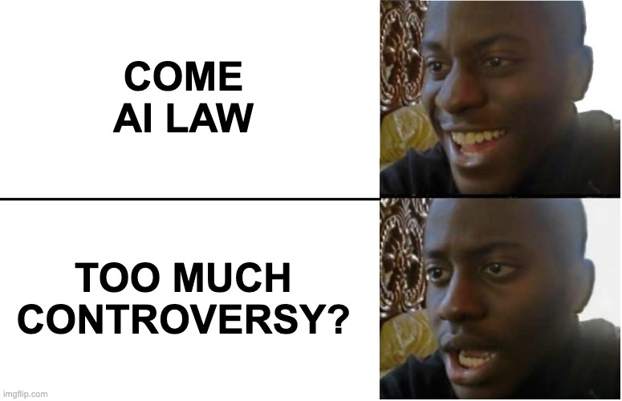

Hello, romi0x!

Today, I will explain the **Artificial Intelligence Development and Trust-Based Foundation Act** (referred to as the "AI Basic Law"), which is a South Korean law set to be implemented in January 2026.

## 1. Overview of South Korea's AI Basic Law

The **AI Basic Law** is a South Korean legislation aimed at promoting AI technology development and establishing a regulatory framework based on trust. It is the first law of its kind to be fully implemented globally, drawing international attention (the EU's AI law is set to be implemented in August 2026). This law aims to establish legal standards for regulation and promotion, as AI technology is becoming increasingly important across various industries.

## 2. Global AI Legislation Status

AI-related legislation is being actively developed around the world. The **EU** implemented the **EU AI Act**, the world’s first comprehensive AI regulation, on August 1, 2024. The **United States** has also laid the legal groundwork through the **National Artificial Intelligence Initiative Act 2020** and the **AI Innovation Act**. South Korea has passed the **AI Basic Law**, with the law set to come into effect on January 22, 2026. This law, along with the EU AI Act, has garnered international attention as a significant step in the regulation and promotion of AI technology.

## 3. Main Purposes of South Korea's AI Basic Law

The AI Basic Law has two main objectives:

First, to **promote AI technology and related industries** through the establishment of a government support system. The Minister of Science, Technology, and Information will develop a basic plan every three years to foster the development of AI technology, support small businesses and startups, and facilitate the construction and operation of AI data centers.

Second, to **strengthen regulations** on AI systems, including **high-impact AI** and **generative AI**. High-impact AI refers to systems that can have significant effects on life, health, property, and basic rights, particularly in industries such as **energy, healthcare, transportation, and lending**. Operators of these systems are required to establish transparency, safety, and risk management measures, and they will be subject to penalties such as fines for non-compliance.

## 4. Key Issues and Controversies

The key issues related to the AI Basic Law’s enforcement regulations include ① the definition of high-impact AI, ② watermarking obligations, and ③ government investigation powers.

### 1) Definition of High-Impact AI

- **High-Impact AI**: An AI system that can have significant effects on life, health, property, or basic rights.
- **Generative AI**: AI systems that generate various outputs such as text, images, etc.
- **AI Industry**: The industry that provides AI technology or related services.
- **AI Operators**: Entities such as corporations, individuals, or organizations engaged in the AI industry.

There has been criticism regarding the vague definition of **high-impact AI** in the AI Basic Law. High-impact AI is primarily meant to refer to systems that can have significant impacts on industries like **energy, healthcare, transportation, and lending**. However, there is a lack of clear criteria for determining which AI systems fall under this category. For example, there is debate over whether AI used solely for credit score calculation in the lending industry should be classified as high-impact AI. Some businesses argue that high-impact AI should be categorized based on its **usage** rather than its function.

### 2) Watermarking Obligations

- **Transparency Requirements (Article 31)**:
    - When providing products or services that use high-impact or generative AI systems, businesses must clearly inform users in advance. If an AI-generated output is provided, it must be marked as such, and users must be made aware of this, especially when the output closely resembles reality. Failure to comply can result in a fine of up to 30 million Korean won.
- **Safety Requirements (Article 32)**:
    - AI systems must identify and assess potential risks throughout their entire lifecycle (from development to disposal), and mitigation measures must be in place. AI systems that perform significant computations must adhere to stricter safety standards. In the event of a risk, businesses must have a response system and continuously monitor the system. Reports on compliance must be submitted regularly to the Minister of Science and ICT.

Concerns have been raised that the watermarking obligation could negatively affect creative activities, such as in the production of movies, webtoons, and animations. If watermarking is required for every AI-generated background image, it may diminish the quality and creative freedom in content production.

### 3) Excessive Government Investigation Powers

The AI Basic Law grants the government the authority to review or certify high-impact AI businesses in advance. However, there are concerns about **privacy breaches** and **cybersecurity threats** arising from excessive investigations. It is necessary to establish clear guidelines to prevent unwarranted fact-finding or excessive verification.

## 5. Comparison with the EU AI Act

The **AI Basic Act** (K-AI Act) and the **EU AI Act** differ significantly in terms of regulatory targets, scope, and enforcement mechanisms. The EU AI Act classifies AI into **four risk levels**, applying granular and tiered regulations accordingly. In contrast, Korea’s AI Basic Act regulates only **high-impact AI** and **generative AI**. The EU AI Act also stipulates much stricter penalties, including **fines of up to 7% of global turnover**, setting it apart from Korea’s approach.

| Category | EU AI Act | K-AI Act |
| --- | --- | --- |
| **Legislative Purpose** | Human-centered, protection of fundamental rights, promotion of trustworthy AI | Advancement of AI technologies and industries, securing global competitiveness |
| **Legislative Philosophy** | **Risk-based approach**, focused on preemptive regulation | **Promotion-oriented approach**, flexible regulatory structure |

The EU aims to protect **fundamental rights**, promote **market integration**, and ensure **technological reliability**, applying risk-differentiated regulation. In contrast, the K-AI Act focuses on the **growth potential of the AI industry**, emphasizing **technology development and ecosystem activation** through a more flexible regulatory framework.

- **EU AI Act: Comprehensive & Sophisticated Classification System**
  - AI systems are classified into **four levels of risk** (prohibited, high-risk, limited risk, minimal risk)
  - High-risk AI must meet requirements such as **pre-market conformity assessment**, **technical documentation**, **log retention**, and **human oversight**
  - Examples: remote biometric identification, monitoring of students/workers, credit scoring, insurance pricing systems
- **K-AI Act: Focus on High-Impact & Generative AI**
  - Primarily manages "high-impact AI" and "generative AI," though specific definitions remain ambiguous
  - Emphasizes **voluntary and flexible regulation** via guidelines and executive decrees rather than strict legal mandates

## 6. Future Challenges and the Need for Input

The AI Basic Law is met with both positive expectations and critical concerns. On one hand, it is meaningful in that it provides a legal foundation for promoting AI technology and industry. On the other hand, there is criticism that the definition of high-risk AI is vague, and that important areas such as personal data and copyright protection remain insufficient. Therefore, it is important that relevant stakeholders actively participate in the process of drafting enforcement ordinances and guidelines to help supplement and refine the law’s specific contents.

The author believes that one of the persistent issues is that policy always lags behind the pace of technological advancement. That said, hastily introducing laws and systems without proper preparation can also be dangerous. Once policy is in place, regulation inevitably follows—and in turn, this could end up hindering technological growth. Especially in a field like AI, where rapid transformation and innovation are essential, overly restrictive regulations may cause the country to fall behind in global competition.

So here’s a question for you, the reader:

**“Is it possible for regulation to keep up with the speed of technology?”**

**“If not, should we allow technology to progress first and address problems afterward?”**

**“Between technological advancement and public safety, which should take priority?”**

## Reference

https://www.kisa.or.kr/20201/form?postSeq=241&page=1
https://www.skshieldus.com/blog-security/security-trend-idx50
https://v.daum.net/v/20250418162437559
https://www.lawtimes.co.kr/LawFirm-NewsLetter/204461
https://zdnet.co.kr/view/?no=20241226170834
https://www.kita.net/board/totalTradeNews/totalTradeNewsDetail.do?no=85889&siteId=1