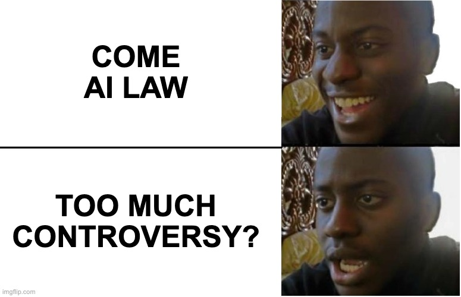
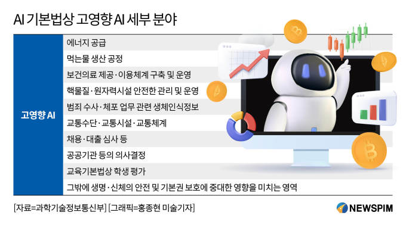

안녕하세요! romi0x입니다!

오늘은 내년 1월 시행예정인 [**인공지능 발전과 신뢰 기반 조성 등에 관한 기본법(인공지능기본법)**](https://www.law.go.kr/%EB%B2%95%EB%A0%B9/%EC%9D%B8%EA%B3%B5%EC%A7%80%EB%8A%A5%20%EB%B0%9C%EC%A0%84%EA%B3%BC%20%EC%8B%A0%EB%A2%B0%20%EA%B8%B0%EB%B0%98%20%EC%A1%B0%EC%84%B1%20%EB%93%B1%EC%97%90%20%EA%B4%80%ED%95%9C%20%EA%B8%B0%EB%B3%B8%EB%B2%95/(20676,20250121))에 대해 알아보겠습니다.

## 1. 인공지능기본법 개요

**인공지능기본법**은 2026년 1월 22일 시행을 목표로 제정된 대한민국의 법률로, AI 기술의 발전을 지원하고 신뢰를 기반으로 한 규제 체계를 구축하는 데 중점을 두고 있습니다. 최초로 전면 시행되는 AI 기본법으로 전 세계의 주목을 받고 있습니다.(EU는 2026년 8월 시행 예정) AI 기술이 다양한 산업 분야에서 중요한 역할을 하게 됨에 따라 규제와 진흥을 위한 법적 기준을 마련하는 목적을 가집니다.

## 2. AI법 글로벌 현황

전 세계적으로 AI 관련 법제화가 활발히 진행되고 있습니다. **EU**는 2024년 8월 1일, 전 세계 최초로 포괄적인 AI 규제를 도입한 **EU 인공지능법**을 시행했으며, **미국**은 **국가 인공지능 구상법 2020**과 **미국 인공지능 진흥법** 등을 통해 AI 관련 법적 틀을 마련했습니다. 대한민국도 **인공지능기본법**을 통과시켰고, 2026년 1월 시행을 앞두고 있습니다. 이는 AI 기술의 규제 및 진흥을 위한 중요한 법적 시도로, EU AI법과 함께 국제적으로 큰 관심을 받고 있습니다.

## 3. AI 기본법의 주요 목적

인공지능기본법은 크게 두 가지 주요 목적을 가지고 있습니다.

첫째, **AI 기술 및 관련 산업 진흥**을 위해 정부 차원의 지원 체계를 수립하는 것입니다. 과학기술정보통신부 장관은 3년마다 AI 기술 발전을 위한 기본 계획을 수립하고, 중소기업과 창업을 지원하며, AI 데이터 센터 구축과 운영 등을 통해 산업 발전을 돕습니다.

둘째, **고영향 AI**와 **생성형 AI**를 포함한 AI 시스템에 대한 규제를 강화하는 것입니다. 고영향 AI는 생명, 신체, 재산, 기본권에 심각한 영향을 미칠 수 있는 시스템으로, 주로 **에너지, 의료, 교통, 대출** 산업에서 중요한 역할을 합니다. 이러한 시스템을 운영하는 사업자는 투명성, 안전성, 위험 관리 방안을 마련해야 하며, 이를 위반할 경우 과태료 등의 처벌을 받습니다.

## 4. 주요 쟁점과 논란

](ai_act_ko/image2.png)

[https://zdnet.co.kr/view/?no=20241226170834](https://zdnet.co.kr/view/?no=20241226170834)

AI 기본법 시행령 관련 핵심 쟁점은 ①고영향 AI의 정의 ②워터마크 표시 의무화 ③정부의 조사 권한입니다.

### 1) 고영향 AI의 정의

- 고영향 인공지능: 생명, 신체, 재산, 기본권 등에 심각한 영향을 미칠 수 있는 인공지능 시스템
- 생성형 인공지능: 텍스트, 이미지 등 다양한 결과물을 생성하는 인공지능 시스템
- 인공지능 산업: 인공지능 기술 또는 관련 서비스를 제공하는 산업 전반
- 인공지능 사업자: 인공지능 산업에 종사하는 법인, 개인, 기관 등 주체

AI 기본법에서 규정한 **고영향 AI**의 정의는 다소 모호하다는 지적을 받고 있습니다. 고영향 AI는 주로 **에너지, 의료, 교통, 대출** 등 분야에서 중요한 영향을 미칠 수 있는 AI 시스템을 의미하지만, 실제로 어떤 AI 시스템이 이에 해당하는지에 대해 구체적인 기준이 부족합니다. 예를 들어, AI가 신용 점수 산출에만 사용되는 경우, 대출 산업에서도 이를 고영향 AI로 분류할지에 대한 논란이 있습니다. 일부 기업들은 고영향 AI를 **사용 방식**에 따라 구분해야 한다고 주장하고 있습니다.

### 2) 워터마크 표시 의무화

- **투명성 확보 의무 (제31조)**
    - 고영향 또는 생성형 AI 시스템을 사용하는 제품이나 서비스를 제공할 경우, 해당 사실을 이용자에게 사전에 명확히 고지해야 한다. 생성형 AI가 생성한 결과물임을 명시해야 하며, 현실과 유사한 가상 결과물을 제공할 경우에도 사용자가 인지할 수 있도록 고지 또는 표시해야 한다. 이를 위반할 경우 3천만 원 이하의 과태료가 부과된다.
- **안전성 확보 의무 (제32조)**
    - AI 시스템의 개발부터 활용, 폐기까지 전 생애주기에 걸친 위험을 사전 식별하고 평가하여 완화 대책을 마련해야 한다. 일정 기준 이상의 연산량을 사용하는 AI 시스템은 강화된 안전성 기준이 적용된다. 위험 발생 시 대응 체계 구축 및 지속적인 모니터링 체계 확보가 필수이며, 이행 결과는 과학기술정보통신부장관에게 정기 보고해야 한다.

AI가 영화, 웹툰, 애니메이션 등의 제작에 활용될 때 **워터마크 표시 의무화**가 창작 활동에 부정적인 영향을 미칠 수 있다는 지적도 있습니다. AI가 배경 이미지를 생성하는 등 보조 도구로 사용될 때, 워터마크를 일일이 부착해야 한다면 콘텐츠 품질과 창작 자유를 저하시킬 수 있다는 우려가 제기되고 있습니다.

### 3) 정부의 조사 권한

AI 기본법은 정부에게 고영향 AI 사업을 사전 검토하거나 인증할 권한을 부여합니다. 그러나 이 과정에서 **개인 정보 유출**이나 **사이버 보안 위협** 등이 발생할 수 있다는 우려가 있습니다. 과도한 사실 조사나 검증이 이루어지지 않도록 기준을 마련할 필요성이 제기되고 있습니다.

## 5. EU AI법과의 비교

AI 기본법과 **EU AI법**은 규제 대상, 범위, 제재 방식에서 차이를 보입니다. EU AI법은 AI를 위험도에 따라 **4가지 유형**으로 분류하여 세분화된 규제를 적용하는 반면, 한국의 AI 기본법은 **고영향 AI**와 **생성형 AI**에만 규제를 두고 있습니다. 또한 EU AI법은 훨씬 더 엄격한 처벌을 규정하고 있으며, 제재가 **전 세계 매출의 최대 7%**에 해당하는 과징금 부과가 가능하다는 점에서 차이가 있습니다.

| 항목 | EU AI법 | K-AI법 |
| --- | --- | --- |
| **제정 목적** | 인간 중심, 기본권 보호, 신뢰할 수 있는 AI 확산 | AI 기술 및 산업 진흥, 글로벌 경쟁력 확보 |
| **입법 철학** | **위험 기반 접근(Risk-based approach)**, 사전 규제 중심 | **진흥 우선 접근**, 유연한 규제 구조 |

EU는 **기본권 보호**와 **시장 통합**, **기술 신뢰성 확보**를 주요 목표로 삼고 있으며, 기술의 위험도를 기준으로 규제를 차등 적용합니다. 반면 K-AI법은 AI 산업의 **성장 잠재력**에 주목하고 있으며, **기술 개발과 생태계 활성화**에 방점을 둔 유연한 규제 구조를 추구합니다.

- **EU AI법: 포괄적·정교한 분류체계**
  - AI 시스템을 **4단계 위험 수준**(금지, 고위험, 제한적 위험, 최소 위험)으로 분류
  - 고위험 AI는 **사전 적합성 평가**, **기술문서화**, **로그 보관**, **인간 감독 의무 등**을 갖춰야 함
  - 예: 원격 생체인식, 학생·근로자 감시, 신용평가, 보험 가격 책정 시스템 등
- **K-AI법: 고영향·생성형 AI 중심**
  - ‘고영향 AI’, ‘생성형 AI’를 중심으로 관리하되 구체적 정의는 모호함
  - 규제보다는 가이드라인과 시행령 중심의 **자율적·유연한 적용** 추구

## 6. 향후 과제와 의견 제시 필요성

AI 기본법에 대한 평가는 긍정과 우려가 공존합니다. AI 기술과 산업을 진흥시키기 위한 법적 기반을 마련했다는 점에서는 의미가 있지만, 고위험 AI에 대한 정의가 불명확하고 개인정보 및 저작권 보호 등 중요한 부분에서 미비하다는 비판도 제기됩니다. 이에 따라 관련 사업자들이 시행령과 가이드라인 제정 과정에 적극 참여해 법의 구체적인 내용을 보완해 나가는 것이 중요합니다.

필자는 기술 발전의 속도에 비해 정책이 뒤따라가는 현실이 늘 문제라고 생각합니다. 그렇다고 준비되지 않은 상태에서 섣불리 법과 제도를 도입하는 것도 위험합니다. 그러나 정책이 생기면 자연스럽게 규제가 생기고, 이는 결국 기술 발전을 저해하는 결과를 낳을 수 있습니다. 특히 AI처럼 빠른 전환과 혁신이 중요한 분야에서는, 규제가 기술의 속도를 지나치게 제한하게 되면 결국 우리나라가 글로벌 경쟁에서 뒤처질 가능성도 배제할 수 없습니다.

이 글을 읽고 있는 독자 본인 스스로에게 질문해보는건 어떤가요?
**“기술의 속도를 따라잡는 규제는 가능한가?”**
**“만약 그렇지 않다면, 우리는 기술을 먼저 허용하고 문제를 사후에 보완하는 방식으로 나아가야 하는가?”**
**“기술 발전과 공공의 안전, 어느 쪽에 더 무게를 두어야 할까?”**

## Reference

[https://www.kisa.or.kr/20201/form?postSeq=241&page=1](https://www.kisa.or.kr/20201/form?postSeq=241&page=1)
[https://www.skshieldus.com/blog-security/security-trend-idx50](https://www.skshieldus.com/blog-security/security-trend-idx50)
[https://v.daum.net/v/20250418162437559](https://v.daum.net/v/20250418162437559)
[https://www.lawtimes.co.kr/LawFirm-NewsLetter/204461](https://www.lawtimes.co.kr/LawFirm-NewsLetter/204461)
[https://zdnet.co.kr/view/?no=20241226170834](https://zdnet.co.kr/view/?no=20241226170834)
https://www.kita.net/board/totalTradeNews/totalTradeNewsDetail.do?no=85889&siteId=1