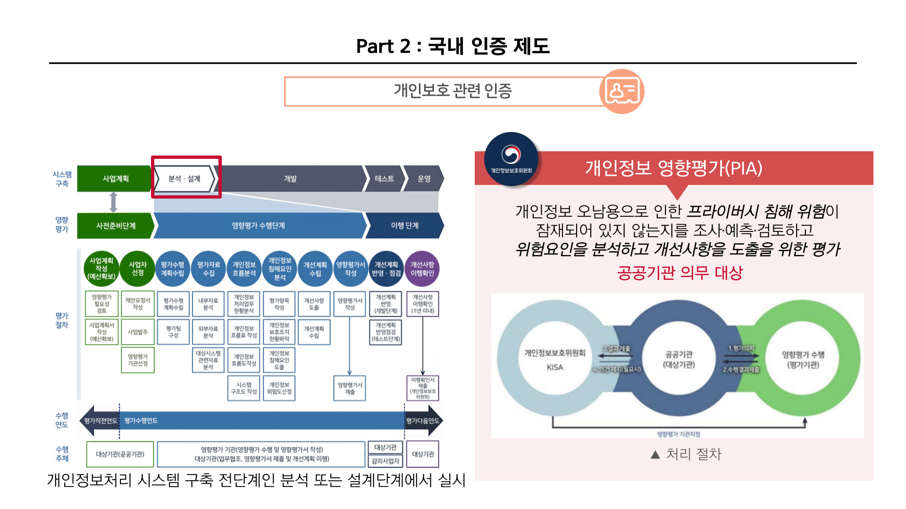

안녕하세요! romi0x입니다 😀

오늘은 국내 보안 인증 제도에 대해서 소개해보려고 해요!

저번엔 정보보호와 관련된 인증제도에 대해 알아봤죠!

[Part1. 국내 보안인증제도- 정보보호](https://hackyboiz.github.io/2024/07/07/romi0x/certification_security/)

이번엔 개인정보와 클라우드입니다~!!

이번 편은 개인정보보호와 클라우드에 대해서 다뤄볼게요!

- 개인정보
    1. **정보보호 및 개인정보보호 관리체계 인증(ISMS-P)**
    2. **개인정보 영향평가(PIA)**

    
- 클라우드
    1. **클라우드보안인증제(CSAP, Cloud Security Assurance Program)**

    

## 개인정보보호

### 1️⃣ 정보보호 및 개인정보보호 관리체계 인증(ISMS-P)

**ISMS-P는 기존의 ISMS와 개인정보 항목이 합쳐진 인증제도입니다.
ISMS와 겹치는 내용은 제외하고 새롭게 추가된 내용만 다룹니다.**

**ISMS에 대한 내용이 궁금하다면 [링크](https://hackyboiz.github.io/2024/07/07/romi0x/certification_security/)를 참고해주세요.**

- 정의
    - **정보보호 및 개인정보보호 관리체계 인증**로, ISMS-P라고 불리는 인증제도입니다.
    - ISMS-P 인증은 기업이 **정보보호와 개인정보보호**를 위해 필요한 모든 조치를 체계적이고 일관되게 실행하고 있음을 증명하는 중요한 제도입니다.
      이를 통해 기업은 다양한 이점을 얻고, 정보보호와 개인정보보호를 위한 지속적인 개선과 발전을 도모할 수 있습니다.
- 인증 추진 기관

  *ISMS와 동일*

- 관련 법령

  기존 ISMS 법령과 개인정보보호법이 합쳐져 ISMS-P 법적근거가 됩니다.
  - ISMS 관련 법령
    - 정보통신망 이용촉진 및 정보보호에 관한 법률 제47조
    - 정보통신망 이용촉진 및 정보보호에 관한 법률 시행령 제47조~제54조
    - 정보통신망 이용촉진 및 정보보호에 관한 법률 시행규칙 제3조
  - ISMS-P 관련 법령
    - 개인정보보호법 제32조의2 
    - 개인정보보호법 시행령 제34조의2~제34조의8
    - 정보보호 및 개인정보보호 관리체계 인증 등에 관한 고시
  

- 인증 대상

  *ISMS와 동일*

  ISMS와 인증 대상은 동일하나 대상자의 점검 항목에서 개인정보 항목이 있다면 **평가시 개인정보 항목 인증이 동시에 진행됩니다.**

- 평가 절차

  *ISMS와 동일*

- 인증 기준

  

  [사진 출처](https://isms.kisa.or.kr/main/ispims/intro/)

  ISMS-P의 경우 기존의 ISMS 인증기준인  ‘**관리체계 수립 및 운영**’ 과 ‘**보호대책 요구사항**’와 ISMS-P의 인증기준인 ‘**개인정보 처리단계별 요구사항**’이 포함됩니다.
  

  괄호 안에 숫자는 인증기준 개수를 나타내요.

  [3가지 인증기준으로 총 80개의 인증기준이 있어요.](https://isms.kisa.or.kr/main/ispims/notice/?boardId=bbs_0000000000000014&mode=view&cntId=21)

- 인증 혜택

  *ISMS와 동일*

### 2️⃣ 개인정보 영향평가(PIA)

- 정의
    - 개인정보파일의 신규 도입·변경 시 위험요인 분석 및 개선 사항을 도출하기 위하여 **사전에 조사 분석·평가하기 위한 제도**입니다.
- 인증 추진 기관

  ISMS 인증 체계와 관련된 기관은 다음과 같아요.
    <table>
      <tr>
        <td>정책기관</td>
        <td>
          <a href="https://www.msit.go.kr/">과학기술정보통신부</a> 
          <a href="https://www.pipc.go.kr/">개인정보보호위원회</a>
        </td>
      </tr>
      <tr>
        <td>인증기관</td>
        <td>
          <a href="https://www.kisa.or.kr/">한국인터넷진흥원(KISA)</a> 
          <a href="https://www.fsec.or.kr/">금융보안원(FSEC)</a>
        </td>
      </tr>
      <tr>
        <td>심사기관</td>
        <td>
          <a href="https://www.kait.or.kr/">한국정보통신진흥협회(KAIT)</a> 
          <a href="https://www.tta.or.kr/">한국정보통신기술협회(TTA)</a> 
          <a href="https://www.opa.or.kr/">개인정보보호협회(OPA)</a> 
          차세대정보보안인증원(NISC)
        </td>
      </tr>
    </table>

- 관련 법령
  - 「개인정보 보호법」 제33조(개인정보 영향평가)
  
- 평가 대상
    
    **공공기관**이 구축‧운용‧변경하는 개인정보파일 중에 아래에 해당하는 개인정보파일에 한하여 **영향평가를 의무화** 하고 있습니다.
    
    평가 대상인지 확인하고 싶다면 [링크](https://www.privacy.go.kr/front/per/iass/duty/effectsEvalutionDuty.do)을 참고해주세요
    
  - **의무 대상자**
  
   
    
- 처리절차&평가절차
    
    - 처리절차는 다음과 같아요. 
        
      평가를 위한 큰 처리 절차입니다. 
        
        **개인정보 영향평가에 관한 고시** 제12조(영향평가서의 제출) 
        
        영 제38조제2항에 따라 영향평가서를 제출받은 대상기관의 장은 **2개월 이내에** 평가결과에 대한 내부승인 절차를 거쳐 영향평가서 및 그 요약본(요약본을 공개하려는 경우 해당 요약본을 포함한다)을 보호위원회에 제출해야해요.
      
      [사진 출처](https://www.pipc.go.kr/np/default/page.do?mCode=D050020000)

  - 평가절차는 다음과 같아요.

    여기서, 영향평가는 시스템 구축단계에서 ‘**분석•설계’ 단계**에서 진행된다는 점!!
    
  
- 평가항목

    개인정보 침해요인 분석을 위한 평가 항목은 **5개의 평가영역, 25개의 평가분야에 대해 총 85개**입니다.

  
  
[사진 출처](https://isms.kisa.or.kr/main/ispims/notice/)

    해당 항목들의 평가 항목에 대한 **평가 기준은 4가지**로 나눠 평가됩니다.
  

  평가항목별 평가는 상세한 근거와 함께 평가(부분이행, 미이행, 이행, 해당 없음)한 후, 상세한 사유 및 증거 자료를 같이 제시합니다.

## 클라우드보안
### 1️⃣ 클라우드보안인증제(CSAP, Cloud Security Assurance Program)

- 정의
    - 클라우드서비스 제공자가 제공하는 서비스에 대해 정보보호 수준의 향상 및 보장을 위하여 보안인증기준에 적합한 **클라우드컴퓨팅서비스에 대하여 보안인증을 수행하는 제도입니다.**
    - 클라우드컴퓨팅서비스의 정보보호 수준 향상 및 보장을 위하여 과학기술정보통신부가 보안인증기준에 적합한 클라우드컴퓨팅서비스에 대하여 인증하는 제도입니다.
- 인증 추진 기관

  관련 기관은 다음과 같아요.
    <table>
      <tr>
        <td>정책기관</td>
        <td>
          <a href="https://www.msit.go.kr/">과학기술정보통신부</a>
        </td>
      </tr>
      <tr>
        <td>인증기관</td>
        <td>
          <a href="https://www.kisa.or.kr/">한국인터넷진흥원(KISA)</a>
        </td>
      </tr>
      <tr>
    <td>심사기관</td>
    <td>
      <a href="https://www.kait.or.kr/">한국정보통신진흥협회(KAIT)</a>
    </td>
  </tr>
    </table>

    
  [사진 출처](https://isms.kisa.or.kr/main/csap/intro/)

- 추진 근거
  - 「클라우드컴퓨팅 발전 및 이용자 보호에 관한 법률」 
    - 제5조에 의한 「제1차 클라우드컴퓨팅 기본계획」(2015)에 따른 클라우드서비스 보안인증제도 시행
    - 제23조의2에 따라 보안인증에 관한 업무 수행
     
- 인증 대상
  - 인증대상은 클라우드서비스(IaaS, PaaS, SaaS 등) 제공 사업자입니다. 
  
    - IaaS(Infra as a Service)
      - 서버, 스토리지 등 IT 인프라를 서비스 제공
    - SaaS(Software as a Service)
      - 응용SW를 서비스로 제공
    - DaaS(Dsktop as a Service)
      - 데스크탑(PC)을 서비스로 제공

- 보안 인증 유형

  보안 인증 유형은 최초평가, 사후평가, 갱신평가로 이루어져 있어요.
  
  [사진 출처](https://isms.kisa.or.kr/main/csap/intro/)
    - 최초평가
      - 처음으로 인증을 신청하거나, 인증범위에 중요한 변경이 있어 다시 인증을 신청한 때에 실시하는 평가
      - 최초평가를 통해 인증을 취득하면, **5년의 유효기간**을 부여 
    - 사후평가
      - 보안인증을 취득한 이후 지속적으로 클라우드서비스 보안인증기준을 준수하고 있는지 확인하기 위한 평가
      - 보안인증 **유효기간(5년) 안에 매년 시행**
    - 갱신평가
      - 보안인증 유효기간(5년)이 만료되기 전에 클라우드서비스에 대한 보안인증의 연장을 원하는 경우에 실시하는 평가
      - 갱신평가를 통과하는 경우, **5년의 유효기간**을 다시 부여
- 인증 기준
    - 기존 보안인증제도의 유형에 따른 보안인증기준은 다음과 같습니다.

        인증 유형별 인증 기준이 궁금하다면 [링크](https://isms.kisa.or.kr/main/csap/notice/)를 참고해주세요!
  

### 참고 자료

[한국인터넷진흥원(KISA)](https://isms.kisa.or.kr/main/)

[클라우드서비스 보안인증제 안내서(2023.03)](https://isms.kisa.or.kr/main/csap/notice/?boardId=bbs_0000000000000004&mode=view&cntId=62)

[https://www.openads.co.kr/content/contentDetail?contsId=9604](https://www.openads.co.kr/content/contentDetail?contsId=9604)

[https://www.fsec.or.kr/bbs/1007](https://www.fsec.or.kr/bbs/1007)

[https://isms.kisa.or.kr/main/csap/notice/](https://isms.kisa.or.kr/main/csap/notice/)
