안녕하세요! romi0x입니다 😀

오늘은 우리가 일상에서 자주 접하게 되는 국내 보안 인증제도에 대해 이야기해보려고 합니다.

기업의 신뢰성을 판단하는 데 있어 보안 인증제도가 얼마나 중요한 역할을 하는지 아시나요?

저는 취업을 준비할 때 기업을 선택하거나 필요한 서비스를 선택할 때, 해당 기업이 어떤 인증을 받았는지, 얼마나 철저히 준비되어 있는지를 꼭 확인합니다.

이는 우리의 정보가 얼마나 안전하게 보호되는지에 대한 📍**중요한 지표**📍가 되기 때문이죠.

이 블로그를 통해 여러분들이 보안 인증제도에 대해 더 잘 이해하게 된다면, 취업 시 기업을 선택할 때나 다양한 서비스를 이용할 때 더 현명한 결정을 내릴 수 있을 것입니다.😀

보안 인증은 단지 기업의 신뢰성을 판단하는 기준일 뿐만 아니라, 우리가 안전한 환경에서 생활하고 일할 수 있도록 도와주는 중요한 요소입니다.

그럼, 본격적으로 국내 보안 인증제도에 대해 알아보도록 하겠습니다. 함께 읽어나가며 우리의 정보와 개인정보를 지키는 방법에 대해 더 깊이 이해해 보아요!

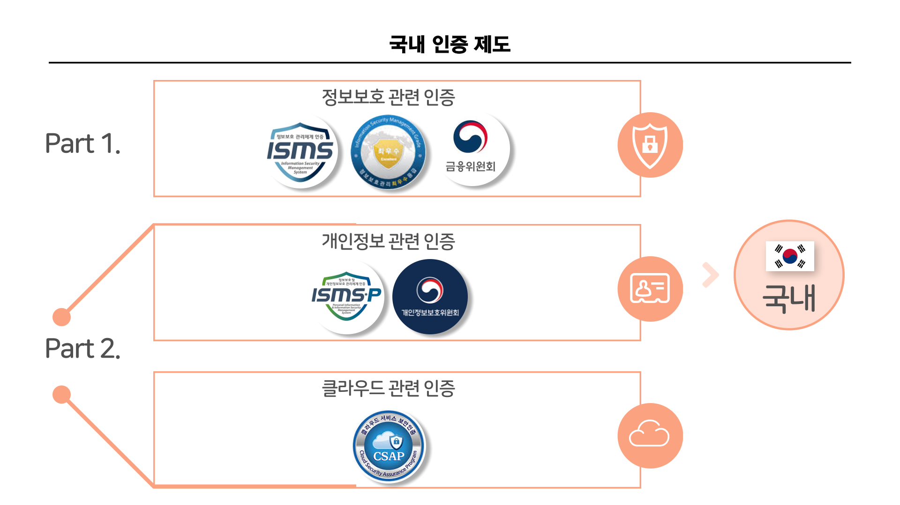

국내 인증제도는 크게 3가지로 나눌 수 있어요.

정보보호, 개인정보보호, 클라우드보안이죠!

차근차근 알아보아요 😀

**Part1은 정보보호, Part2는 개인정보와 클라우드에 대해 다룹니다.**

이번 편은 정보보호에 대해서 다뤄볼게요!

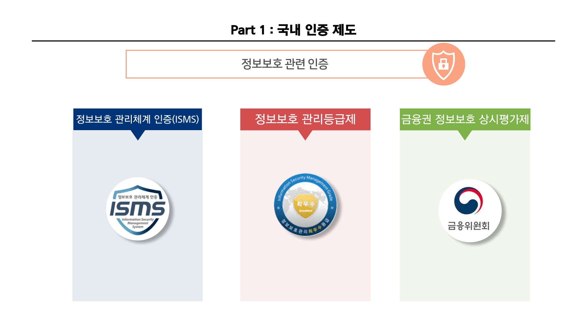

1. **정보보호 관리체계 인증(ISMS, Information Security Management System)**
2. **정보보호등급제**
3. **금융권 정보보호 상시평가제**

## 정보보호

### 1️⃣ 정보보호 관리체계 인증(ISMS, Information Security Management System)

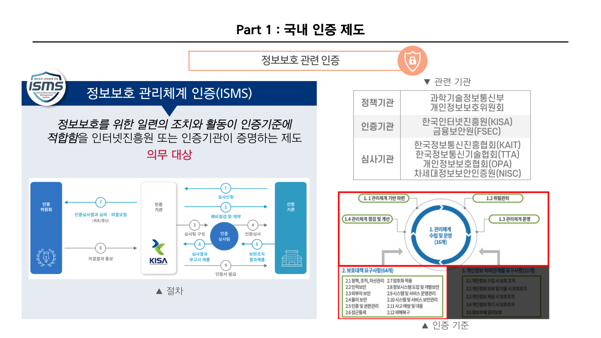

- 정의
    - **정보보호 관리체계 인증**로, ISMS라고 해요.
      - ISMS(Information Security Management System)는 정보보호 관리체계로, **기업이나 기관이 정보보호를 위해 실행하는 일련의 조치와 활동이 일정한 기준에 적합함을 증명하는 제도**입니다.

        이 제도는 한국인터넷진흥원(KISA) 또는 지정된 인증기관이 심사를 통해 인증을 부여합니다.

- 인증 추진 기관

  ISMS 인증 체계와 관련된 기관은 다음과 같아요.
  
  <table>
  <tr>
    <td>정책기관</td>
    <td>
      <a href="https://www.msit.go.kr/">과학기술정보통신부</a> 
      <a href="https://www.pipc.go.kr/">개인정보보호위원회</a>
    </td>
    <td>
      - 법, 제도 개선 및 정책 결정  
      - 인증기관 및 심사기관 지정
    </td>
  </tr>
  <tr>
    <td>인증기관</td>
    <td>
      <a href="https://www.kisa.or.kr/">한국인터넷진흥원(KISA)</a> 
      <a href="https://www.fsec.or.kr/">금융보안원(FSEC)</a>
    </td>
    <td>
      - 제도 운영 및 인증품질관리  
      - 신규•특수 분야 인증심사  
      - ISMS 인증서 발급  
      - 인증심사원 양성 및 자격 관리
    </td>
  </tr>
  <tr>
    <td>심사기관</td>
    <td>
      <a href="https://www.kait.or.kr/">한국정보통신진흥협회(KAIT)</a> 
      <a href="https://www.tta.or.kr/">한국정보통신기술협회(TTA)</a> 
      <a href="https://www.opa.or.kr/">개인정보보호협회(OPA)</a> 
      차세대정보보안인증원(NISC)
    </td>
    <td>
      - 인증심사 수행  
      - 관련 법령
    </td>
  </tr>
</table>

- 관련 법령

    ISMS 관련 법령은 3가지가 있어요.
    - 정보통신망 이용촉진 및 정보보호에 관한 법률 제47조
    - 정보통신망 이용촉진 및 정보보호에 관한 법률 시행령 제47조~제54조
    - 정보통신망 이용촉진 및 정보보호에 관한 법률 시행규칙 제3조

- 인증 대상

  인증 대상은 ‘**의무 대상자**’와 ‘**자율 신청 대상자**’로 나눌 수 있어요.

    - **의무 대상자**
        - 인증 의무대상자는 아래 표로 구분됩니다.

          의무 대상자가 ISMS 인증 미 이행시 정보통신망법 제76조에 의해 **3,000만원 이하의 과태료**가 부과됩니다.
          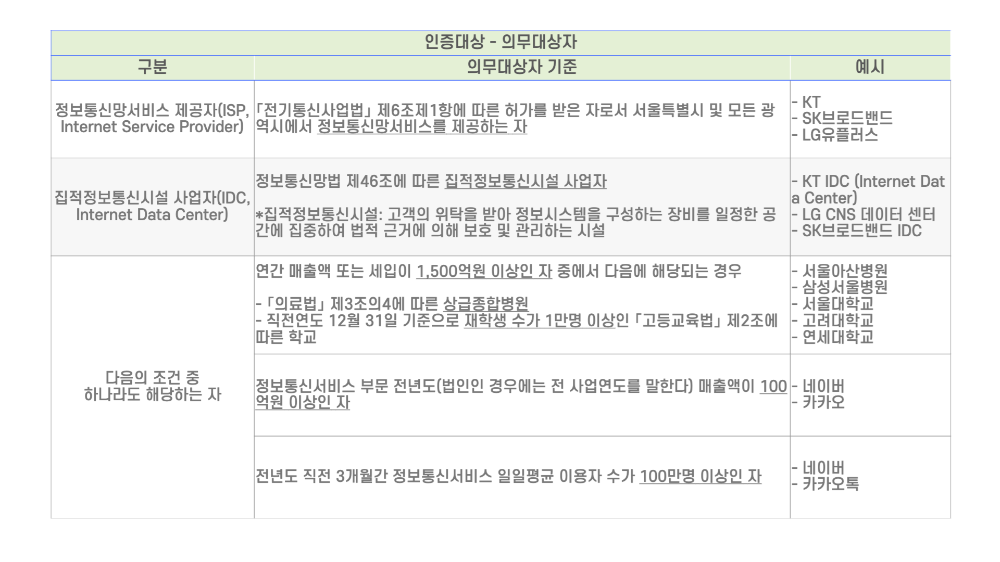
    
      - **자율 신청 대상자**
        - 의무대상자 기준에 해당하지 않으나 **자발적으로 신청**하여 인증을 진행하게 되면 임의신청자로 분류됩니다.
          
            즉, 임의신청자가 인증 취득을 희망할 경우 **자율적으로 신청**하여 인증심사를 받을 수 있어요.

- 평가 절차 

    평가절차는 다음과 같아요.

    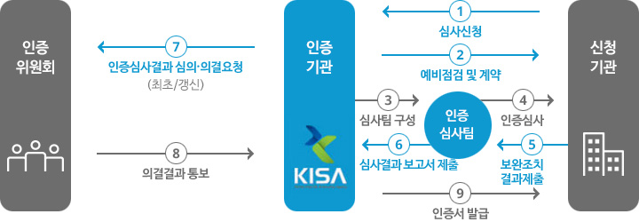
    [사진 출처](https://isms.kisa.or.kr/main/ispims/request/)

    인증심사 신청 시 기관은 [필요한 서류](https://isms.kisa.or.kr/main/ispims/notice/)들을 준비하여 인증기관 또는 심사기관에 제출합니다.

  세부 절차는 아래와 같아요.
    - 신청 단계 : 신청공문 + 인증신청서, 관리체계운영명세서, 법인/개인 사업자 등록증
    - 계약 단계 : 수수료 산정 > 계약 > 수수료 납부
    - 심사 단계 : 인증심사 > 결함보고서 > 보완조치내역서
    - 인증 단계 : 최초/갱신심사 심의 의결(인증위원회), 유지(인증기관)

- 인증 기준

  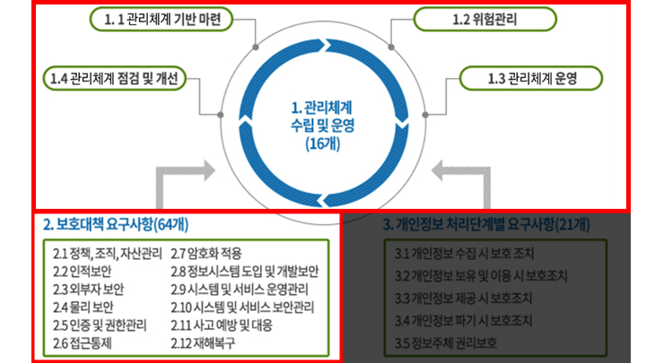

  [사진 출처](https://isms.kisa.or.kr/main/ispims/intro/)

  ISMS의 경우 ‘**관리체계 수립 및 운영**’ 과 ‘**보호대책 요구사항**’이 해당됩니다.
  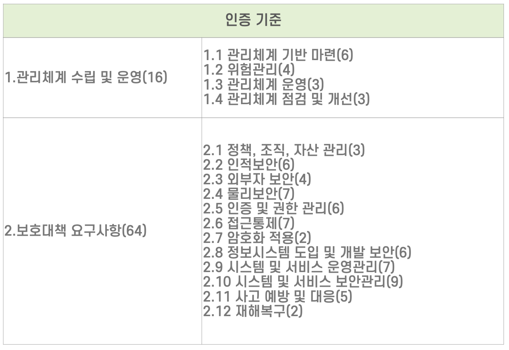

  괄호 안에 숫자는 인증기준 개수를 나타내요.

  [2가지 인증기준으로 총 80개의 인증기준이 있어요.](https://isms.kisa.or.kr/main/ispims/notice/?boardId=bbs_0000000000000014&mode=view&cntId=21)

- 인증 혜택
  - 인증을 받는다면 4개의 기관에서 혜택을 받을 수 있어요.
    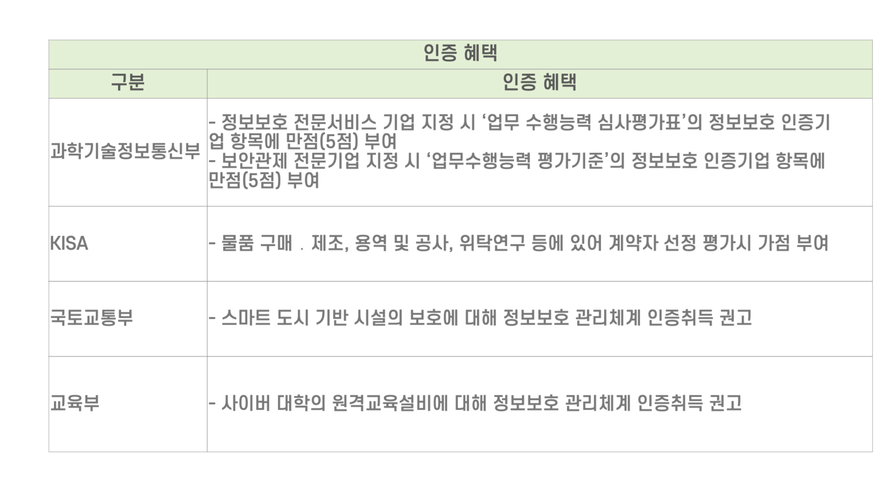
  
    
##  2️⃣ 정보보호등급제

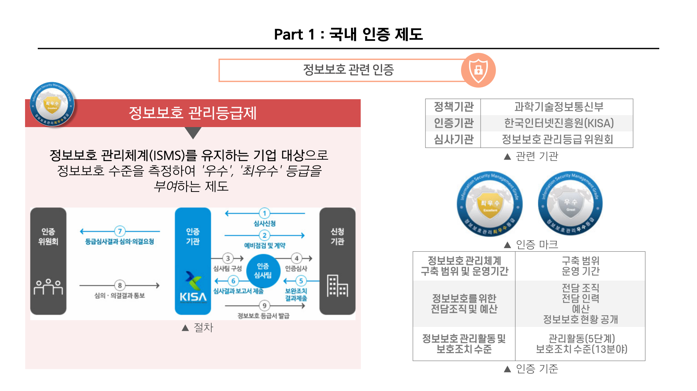

- 정의
    - **정보보호등급제는 정*보보호 관리체계(ISMS)를 유지하는 기업 대상***으로 정보보호 수준을 측정하여 **'우수', '최우수'** 등급을 부여하는 제도입니다.
    - 정보보호등급제를 통해 높은 등급을 받으면 *기업의 신뢰성, 경쟁력, 법적 준수, 사이버 방어력, 고객 만족도, 시장 평판, 글로벌 진출, 내부 관리*가 모두 향상됩니다.
- 인증 추진 기관

  정보보호등급제와 관련된 기관은 다음과 같아요.

    <table>
      <tr>
        <td>정책기관</td>
        <td><a href="https://www.msit.go.kr/">과학기술정보통신부</a></td>
        <td>- 법, 제도 개선 및 정책 결정</td>
      </tr>
      <tr>
        <td>인증기관</td>
        <td><a href="https://www.kisa.or.kr/">한국인터넷진흥원(KISA)</a></td>
        <td>- 정보보호 관리등급 제도 운영 - 정보보호 관리등급 심사 수행 - 정보보호 관리등급 위원회 운영</td>
      </tr>
      <tr>
        <td>심사기관</td>
        <td>정보보호 관리등급 위원회</td>
        <td>- 등급 심사 결과 심의 ﹒의결</td>
      </tr>
    </table>

- 관련 법령

  관련 법령은 3가지가 있어요.
  - 정보통신망 이용촉진 및 정보보호 등에 관한 법률 제47조의 5
  - 정보통신망 이용촉진 및 정보보호 등에 관한 법률 시행령 제55조의 2~제55조의 5
  - 정보보호 관리등급 부여에 관한 고시(과학기술정보통신부 제2016-40호)
  

- 인증 대상
  - 인증 범위와 인증 유지기간은 다음과 같아요.
    - 정보보호관리체계(ISMS) 인증 범위
      - 전사(全社) 범위로 1년 이상 정보보호 관리체계를 운영(1년은 회계년도를 포함한 기간을 말함)
    - 정보보호관리체계(ISMS) 인증 유지기간
      - 정보보호 관리체계 인증을 3년간 연속으로 유지

- 평가 절차

  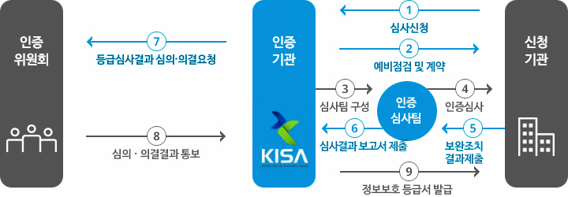

  [사진 출처](https://isms.kisa.or.kr/main/isrs/request/)

  인증심사 절차는 **인증신청 및 계약, 심사팀 구성, 인증심사, 보완조치 및 확인, 인증위원회 심의, 인증부여** 등 크게 6단계로 구성돼요.

- 인증 심사 기준
  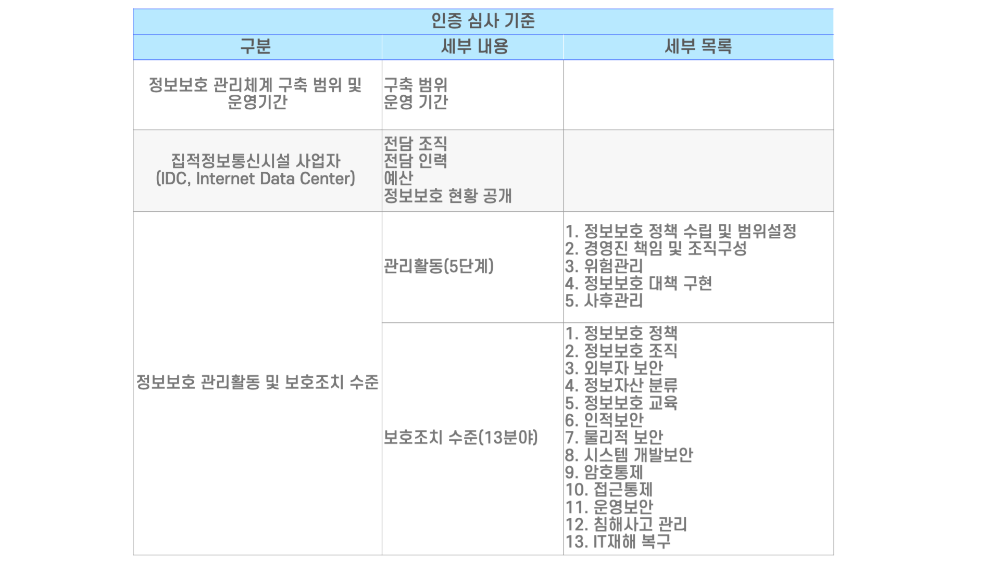

- 등급 부여 기준

  **‘최우수’와 ‘우수’ 등급을 부여하는 기준**은 다음과 같아요.
  - 최우수
    - 정보보호 통제 활동에서 얻어진 **문제점을 지속적으로 개선하여 반영함으로서 기업의 정보보호 수준을 최적화하는 단계**
  - 우수 
    - 기업에 내재된 정보보호 통제 및 프로세스를 **지속적으로 측정, 관리하는 단계로 정기적으로 정보보호 상태를 점검하는 단계**

### 번외) ISMS vs 정보보호 관리등급제

번외로 ISMS와 정보보호 관리등급제가 뭐가 다른지 표로 확인해볼까요?!👌
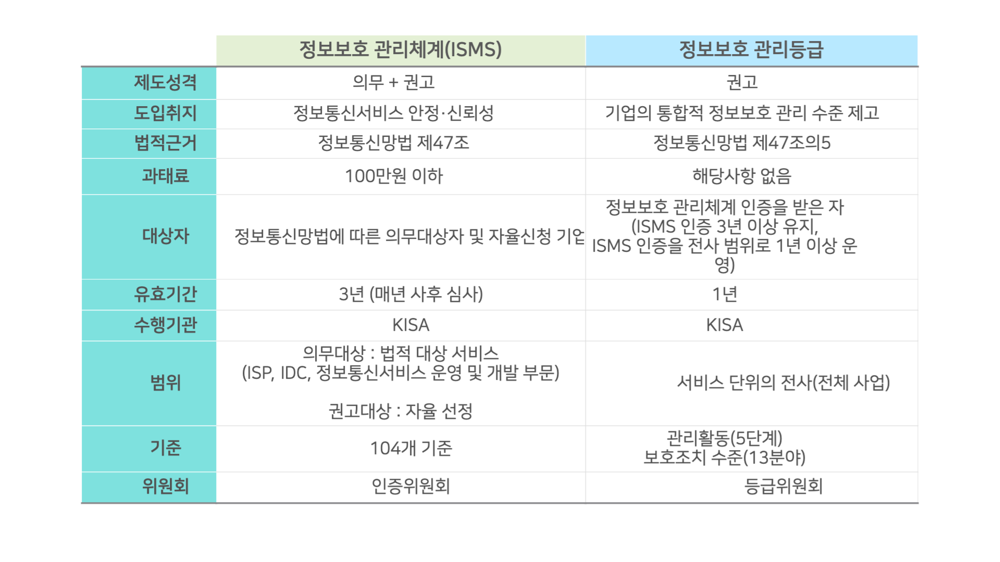

##  3️⃣ **금융권 정보보호 상시평가제**

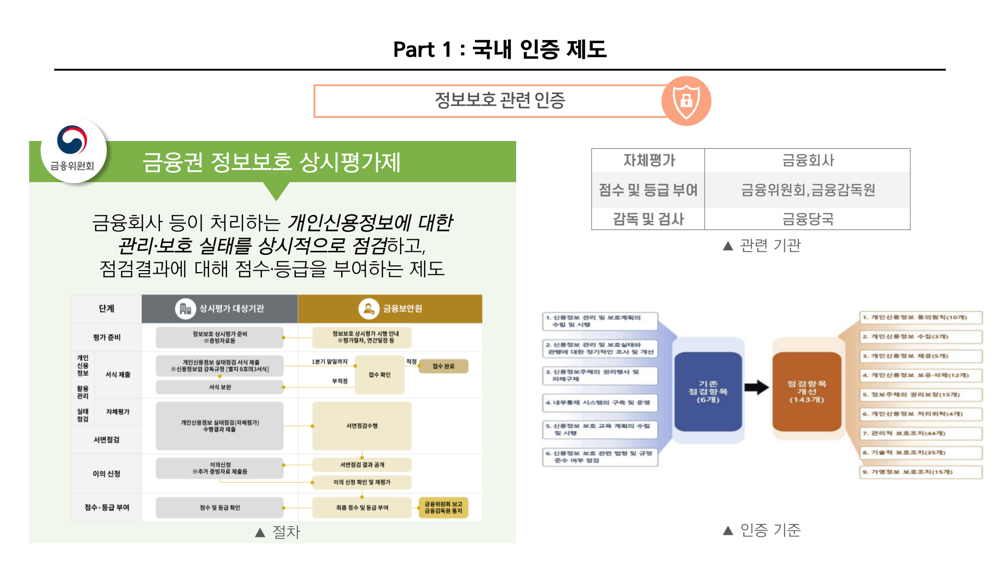

- 정의
    - 금융권 정보보호 상시평가제는 **금융회사**의 개인신용정보 활용ㆍ관리 실태점검(자체평가) 결과를 접수하고, 그 점검 결과에 대해 서면점검 수행 및 점수ㆍ등급 부여하는 제도입니다.
    - 동의·수집·제공 등 **정보의 생애주기에 대한 정보보호 규제**를 체계적·상시적으로 준수·검증할 수 있는 평가체계입니다.
- 인증 추진 기관

    <table>
      <tbody>
        <tr>
          <td>대상기관</td>
          <td>금융회사</td>
          <td>정보보호 취약점 자율진단</td>
        </tr>
        <tr>
          <td>심사기관</td>
          <td>금융보안원</td>
          <td>- 서면점검 - 점수 및 등급화 - 자체평가 지원 - 취약점 컨설팅</td>
        </tr>
        <tr>
          <td>인증기관</td>
          <td>금융위원회, 금융감독원</td>
          <td>- 금융회사 정보보호 수준 모니터링 - 점검결과를 현장점검, 테마검사 등에 활용</td>
        </tr>
      </tbody>
    </table>

- 관련 법령
  - 「신용정보의 이용 및 보호에 관한 법률」
    - 제20조(신용정보 관리책임의 명확화 및 업무처리기록의 보존)제6항
    - 제45조의5(개인신용정보 활용·관리 실태에 대한 상시평가)

- 인증 대상

  **신용정보법 시행령 제17조제7항에서 규정하고 있는 기관**으로 금융지주·은행·보험·금융투자·여신금융·저축은행·상호금융·대부업·신용정보회사 등·공공기관 등이 포함됩니다.

  우리가 아는 신한은행, 국민은행, 삼성생명, 롯데카드, SBI저축은행 등이 해당합니다.

- 평가 절차

  금융권에 대한 정보보호 실태 점검을 3단계로 세분화하고, 점검결과에 대해 피드백을 제공합니다.
  1. 자체평가
     - 금융회사 등은 직전연도 개인신용정보 보호 실태에 대한 자체평가를 수행하고 금융보안원에 결과 제출
  2. 점수 및 등급부여
     - 금융보안원은 금융회사의 제출내역에 대해 점검을 수행하고, 점검결과를 기반으로 점수•등급 부여
  3. 감독•검사
     - 금융당국은 금융회사 등의 평가결과를 기반으로 현장 점검, 테마검사 등 취약점 보완 조치를 수행
  

- 인증 기준
  
  - 금융권 정보보호 실태를 면밀히 점검할 수 있도록 점검항목을 **9개 대항목, 143개 소항목**으로 정밀하게 구분되어 있어요.

       1. 동의원칙 (10개)
       2. 수집 (3개)
       3. 제공 (5개)
       4. 보유·삭제 (12개)
       5. 권리보장 (15개)
       6. 처리위탁 (4개)
       7. 관리적 보호조치 (44개)
       8. 기술적 보호조치 (35개)
       9. 가명정보 보호조치 (15개)
    
  - 점검항목별 준수정도를 **① 이행 ② 부분이행 ③ 미이행 ④ 해당없음** 4단계로 구분하여 평가합니다.

### 참고 자료

[한국인터넷진흥원(KISA)](https://isms.kisa.or.kr/main/)

[https://www.fsec.or.kr/bbs/1007](https://www.fsec.or.kr/bbs/1007)