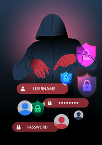

안녕하세요! romi0x입니다 😀
따뜻해지는 봄날씨와 함께 돌아온 해킹짹짹 뉴스레터입니다 🐤
매주 월요일에 올라오는 새로워진 해킹짹짹 뉴스레터 기대 많이 해주세요~!~

## 이번 주 짹짹 PICK🐥
> 🗣 **北 해킹그룹 안다리엘, 국내 자산관리 솔루션 악용해 악성코드 배포**

2024-03-15 | 보안뉴스 | [기사보기](https://m.boannews.com/html/detail.html?idx=127778)

북한 해킹그룹 ‘안다리엘(Andariel)’이 국내 자산관리 솔루션을 악용해 국내 기업을 공격했어요!!💥

원격 제어를 위한 다양한 기능을 제공하는 메시에이전트(MeshAgent)를 설치한 점이 특징이라고 합니다. 이번 공격 사례에서는 [키로거(Key Logger) 악성코드](#짹짹이에게-물어봐)⌨️와 [클립보드 로깅 기능](#짹짹이에게-물어봐)📋도 보유하는 악성코드가 발견됐다고 합니다!!

# 
> ✨ **선관위 "선거 보안 취약점 대부분 조치…미비점 있으면 개선"**

2024.03.11 | 한국경제 | [기사보기](https://www.hankyung.com/article/202403112163Y)

4·10 총선🎫을 앞두고 작년 보안 점검에서 지적된 취약점을 외부 전문가에게 자문 받아 개선했다고 합니다.

# 
> ✨ **개인정보 노출 홈페이지 2만여 개…“언제든 유출 가능해 경각심 가져야”**

2024-03-18 | 전자신문 | [기사보기](https://www.etnews.com/20240318000167)

한국인터넷진흥원(KISA)에서 발표한 개인정보 노출 페이지는 2만여 개가 된다고 합니다!🤯

전년 대비 8.4% 늘어난 수치로, 가장 큰 원인은 홈페이지 운영·관리자 부주의(50.8%)라고 합니다 ⚡

# 
> ✨ **화상회의 사이트로 위장한 해커들…'트로이목마' 공격 활개**

2024.03.17 | 디지털데일리 | [기사보기](https://ddaily.co.kr/m/page/view/2024031513544150747)

💻화상회의 사이트로 위장해 악성 소프트웨어([멀웨어·Malware](#짹짹이에게-물어봐))를 퍼뜨리는 위협 행위가 발견됐습니다!

공격자들은 공식 홈페이지와 유사한 도메인, URL을 갖춘 모방 사이트를 만들어 사용자가 실수로 접속하기를 기다렸다고 합니다 😫

> ✨ **파일 전송 프로그램 파일카탈리스트의 취약점 익스플로잇 코드 공개돼**

2024-03-19 | 보안뉴스 | [기사보기](https://m.boannews.com/html/detail.html?tab_type=1&idx=127888)

파일 전송 도구인 파일카탈리스트(FileCatalyst)에서 초고위험도🚨 취약점의 익스플로잇 코드가 공개됐습니다. 

[CVE-2024-25153](#짹짹이에게-물어봐) 취약점은 9.8점으로 굉장히 위험한 취약점이며 경로 변경 취약점이라고 합니다!

## 짹짹이에게 물어봐   

**키로거(Key Logger) 악성코드**
사용자의 모든 키 입력을 기록하여 민감한 데이터를 수집하는 악성코드

**클립보드 로깅 기능**
파일을 복사할 때 클립보드에 저장되는 임시 데이터를 컴퓨터 파일로 저장하는 기능

**멀웨어(Malware)**
컴퓨터 시스템이나 사용자에게 해를 끼치기 위해 의도적으로 작성된 소프트웨어 코드 또는 컴퓨터 프로그램

**트로이목마**
겉보기에는 정상적인 프로그램으로 보이지만 실행하면 악성 코드인 프로그램

**CVE-2024-25153**
[https://nvd.nist.gov/vuln/detail/CVE-2024-25153](https://nvd.nist.gov/vuln/detail/CVE-2024-25153)

## 지식 PLUS ➕

["그놈이 돌아왔다"…록빗 랜섬웨어 조직 활동 재개](https://mobile.newsis.com/view.html?ar_id=NISX20240319_0002666956#_PA)

[랜섬웨어 공격 활개…텔레그램·트위터 등 SNS 활용해 범위 확대](https://m.ddaily.co.kr/page/view/2024032008481375333)

[“北 해킹사태 막으려면 사이버안보법 도입 서둘러야”](https://biz.heraldcorp.com/view.php?ud=20240320050449)

[다크웹을 살피는 것은 이제 CISO의 기본 소양이다](https://m.boannews.com/html/detail.html?tab_type=1&idx=127931)

[팬텀블루 피싱 공격, MS 오피스 기능 악용해 탐지 회피중](https://www.dailysecu.com/news/articleView.html?idxno=154467)

## 채용공고 짹짹 PICK🐥

### 넥슨
신입/경력 채용 | [채용 바로 보기](https://career.nexon.com/user/recruit/member/postList?joinCorp=NX&jobGroupCd=23&reSubj=)

### KT
대졸 신입 채용 | [채용 바로 보기](https://recruit.kt.com/careers/175533)