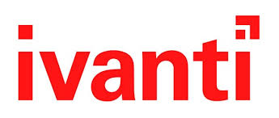
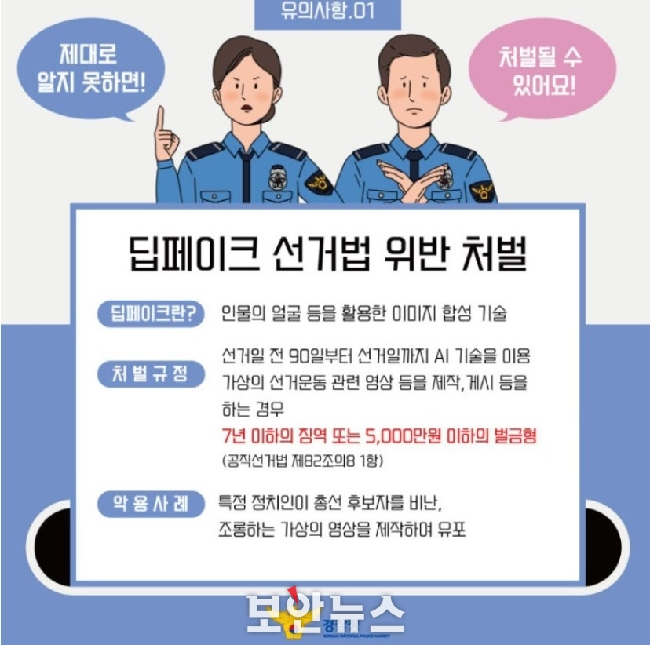

안녕하세요! romi0x입니다 😀
따뜻한 봄이 시작되어 기운 넘치는 한 주를 맞이했네요. 🤗 
해킹짹짹은 봄날의 기운을 담아 여러분께 유용한 소식을 전달하겠습니다!! 
따스한 봄날💐 해킹짹짹과 함께해주세요!

## 이번 주 짹짹 PICK🐥
> ✨ **항공계에 보잉이 있다면 보안 업계에는 이반티가 있다?**

2024.04.08 | 보안뉴스 | [기사보기](https://www.boannews.com/media/view.asp?idx=128624&page=1&kind=1)

올해에만 벌써 11개 취약점이 나왔다고요~??!?? 

전 세계에 4만 개 이상의 기업과 기관들이 이반티의 제품을 사용하고 있는 와중에 취약점들이 말 그대로 쏟아지는 바람에 고객들의 불만이 넘쳐나고 있다고 해요!! 🤯
옴디아(Omdia)의 분석가 에릭 파리조(Eric Parizo)는 최근 이반티에서 나타나는 일들을 여러 ([M&A🏢](#짹짹이에게-물어봐))를 거치면서 축적됐던 문제들이 표출되는 것이라고 분석하고 있어요.

보잉: 세계 최대 항공기 제작 회사로, 올해에만 몇 차례 사고가 발생해 세계적으로 이슈가 되고 있는 회사

## 
> ✨ **인공지능 모델 공유 플랫폼 허깅페이스에서 위험한 취약점 발견돼**

2024.04.09 | 보안뉴스 | [기사보기](https://www.boannews.com/media/view.asp?idx=128693&kind=1&search=title&find=%C3%EB%BE%E0%C1%A1)

허깅페이스🤗에서 취약점에 대한 보안 이슈가 발견됐습니다!

취약점들이 데이터 침해와 인공지능 모델의 감염으로 이어질 수 있다고 해요. 이러한 상황에서는 자신의 인공지능 스택에 대한 가시성을 유지하고 취약점을 지속해서 검토하는 것이 중요할 것 같네요.💻

## 
> ✨ **날로 대담해지는 '데이터 납치'…제로 트러스트 모르면 다 뚫린다**

2024-04-08 | 한국경제 | [기사보기](https://www.hankyung.com/article/2024040864161)

정부기관과 반도체, 금융권 기업을 대상으로 한 사이버 공격이 늘고 있어 근본적인 해결 방안으로 [제로트러스트](#짹짹이에게-물어봐) 모델 도입이 시급하다고 해요.

기존의 '입구만 잘 지키는' 보안 체계와 달리, 제로 트러스트는 서버, 컴퓨팅, 데이터 등을 분리하여 보호한답니다. 따라서 특정 시스템이 침입당해도 다른 시스템은 안전하다는 특징을 가지고 있어요! 🦺

## 
> ✨ **일론 머스크 "AI, 2년내 인간보다 더 똑똑해진다"**

2024.04.09 | zdnet Korea | [기사보기](https://zdnet.co.kr/view/?no=20240409080453)

일론 머스크가 2년 안에 인간보다 더 똑똑한 인공지능이 개발될 것으로 예측했어요. 🦾

AI 칩 선두 주자 젠슨 황 엔비디아 CEO는 “5년 이내에 인간과 같은 수준의 AGI가 등장할 것”이라고 예측했고, 데미스 하사비스 구글 딥마인드 공동 창업자는 올해 초 AGI가 2030년까지 달성될 수 있다고 예상했어요!

일론머스크는 다른 AI 전문가들보다 빠른 발전을 예상한거죠!

## 
> ✨ **경찰청, 딥페이크 기술 이용해 총선 후보 비난 영상 제작·유포 적발**

2024.04.10 | 보안뉴스 | [기사보기](https://www.boannews.com/media/view.asp?idx=128723&direct=mobile)

얼마전, 제22대 국회의원 선거였죠. 경찰청은 [딥페이크](#짹짹이에게-물어봐) 선거법 위반사례를 적발했다고 합니다. 👥

경찰청은 “특정 정치인이 총선 후보자를 비난, 조롱하는 가상의 영상을 제작해 유포했다면 딥페이크 선거법 위반으로 처벌받을 수 있다”며 선거와 관련한 딥페이크 영상 제작 악용에 주의를 당부했어요! 👮

## 짹짹이에게 물어봐 

**M&A(Merger & Acquisition)**

인수 합병,  '인수'는 하나의 기업이 다른 기업의 경영권을 얻는 것이고, '합병'은 둘 이상의 기업들이 하나의 기업으로 합쳐지는 것

**제로트러스트(Zero Trust)**

‘절대 신뢰하지 말고 항상 검증하라(Never Trust, Always Verify)’라는 뜻이 담긴 키워드, 사용자와 프로세스를 신뢰하지 않는다는 원칙 하에 모든 사용자와 디바이스, 애플리케이션과 트랜잭션에 확인을 요구하는 사이버 보안 전략

**AGI(artificial general intelligence)**

인공 일반 지능, 인공 지능 기술이 인간과 동등한 능력을 갖출 때 발생하는 것

**딥페이크**

인공지능을 기반으로 인물의 얼굴 등을 활용한 이미지 합성 기술

### 지식 PLUS ➕

[카카오 AI 자회사 카카오브레인 흡수합병 검토, 인공지능 역량 통합](https://www.businesspost.co.kr/BP?command=article_view&num=348471)

[클라우드 보안협의체 발족…"생태계 활성화"](https://www.newsis.com/view/?id=NISX20240408_0002691906&cID=10406&pID=13100)

[이글루코퍼레이션-프라이빗테크놀로지, 제로 트러스트 사업 협업](https://n.news.naver.com/mnews/article/138/0002170846)

[안랩 V3, 'AV-TEST' PC 보안솔루션 평가서 만점으로 인증 획득](https://www.fnnews.com/news/202404090909376367)

[제로트러스트 시대 열린다…과기정통부, 시범사업 본격 추진](https://www.hankyung.com/article/202404086972i)

[네이버·인텔 AI 동맹, 공동연구소 세운다](https://www.mk.co.kr/news/it/10987125)

## **4월 보안 컨퍼런스** 🐥

[2024 WORLD IT SHOW](https://www.worlditshow.co.kr/main/main.php) | 2024.04.17 ~ 19

[AI 차세대 컨택센터 컨퍼런스2024](https://conference.etnews.com/conf_info.html?uid=292) | 2024.04.23

[NetSec-KR 2024 제30회 정보통신망 정보보호 컨퍼런스](http://www.netsec-kr.or.kr/) | 2024.04.24 ~ 25
