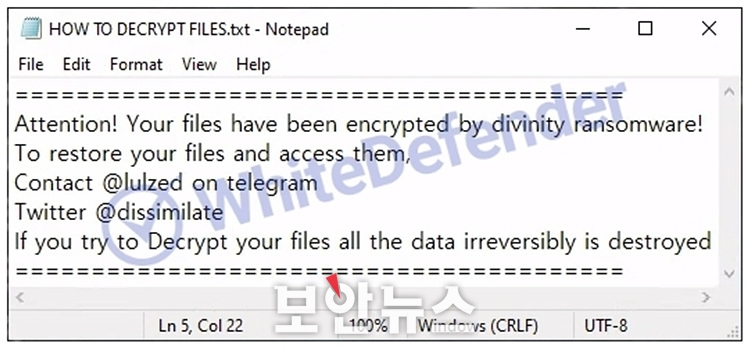
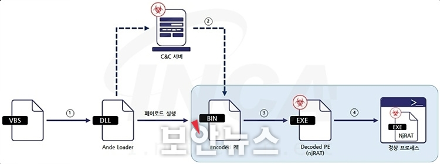
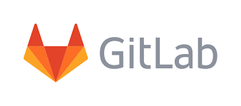

안녕하세요! romi0x입니다 😀
5월은 가정의 달이라고 하죠!
사랑하는 사람들과 함께 좋은 추억을 남길 수 있는 행복한 5월 보내세요🙇
이번 달도 해킹짹짹🐥과 함께해주세요!

## 이번 주 짹짹 PICK🐥
> 🗣️ **북한 해커 킴수키, 설정 똑바로 되지 않은 디마키(DMARC)노린다**

2024.05.08 | 보안뉴스 | [기사보기](https://www.boannews.com/media/view.asp?idx=129624)

보안인🔐이라면 북한의 해커 집단인 킴수키(Kimsuky) 익숙하실텐데요.
최근에는 이메일을 향한 공격을 강화하고 있다는 소식입니다🫢

보안 프로토콜로 이미 보호되고 있는 이메일을 공격하고 있다고 합니다.
문제의 보안 프로토콜은 바로!! 디마키(DMARC) 입니다.

디마키는 도메인을 기반으로 하여 메시지를 인증해주는 역할을 담당하는 이메일 보안 프로토콜입니다.📧

현재 많은 조직(기업, 기관 등)들이 디마키를 도입해 둔 상태이지만, 실제 사용하는 환경에서 대체로 디마키의 설정을 ‘아무것도 하지 않음’으로 해두었기에 수상한 메일을 차단하지 못하는 경우가 많다고 해요.
킴수키도 바로 이 부분을 노려 공격하는 겁니다!

## 
> ⚠️ **디비니티 랜섬웨어, 모든 드라이브 암호화와 바탕화면 변경하는 공격 중**

2024.05.07 | 보안뉴스 | [기사보기](https://www.boannews.com/media/view.asp?idx=129600&page=1&mkind=&kind=1&skind=5&search=title&find=)

본인의 컴퓨터 내 모든 파일들이 모르는 확장자로 변해버린다면?! 너무 당황스러울 거 같은데요😅

모든 파일을 ‘.divinity’ 확장자로 변경해 모든 파일 암호화하는 디비니티 랜섬웨어 침해사고가 발생하고 있어요🔐
디비니티 랜섬웨어는 C++ 기반의 랜섬웨어로 실행 시 컴퓨터 내 모든 드라이브에 대해 암호화를 진행해요.

피해자에게 텔레그램이나 트위터로 연락하라고 주소를 남기고 있다고 합니다.
확장자를 바꾸기 모자라 바탕화면도 임의로 변경한다고 해요!!

## 
> 🗣️ **안데 로더 악성코드, 이미지 스위칭 이용해 북미 제조업 대상 공격**

2024.05.08 | 보안뉴스 | [기사보기](https://www.boannews.com/media/view.asp?idx=129641&direct=mobile)

최근 북아메리카 제조업을 대상으로 ‘안데 로더’라는 악성코드가 유포되었다고 해요 😱

공격자는 안데 로더를 이용해 사용자 PC에서 최종 페이로드를 다운로드하고 실행해요📑
안데 로더 악성코드는 공격자가 의도와 목적에 맞게 [최종 페이로드](https://www.notion.so/2024-05-13-3cab5c73e6f04079ba451b28c614f1a8?pvs=21)의 변경이 가능하고, [이미지 스위칭 기법](https://www.notion.so/2024-05-13-3cab5c73e6f04079ba451b28c614f1a8?pvs=21)을 이용해 악성코드를 정상 프로세스로 위장할 수 있어 주의가 필요해요!

## 
> ⚠️ **깃랩 최신 보안취약점, 데이터 유출 및 무단 액세스 주의**

2024.05.06 | 데일리시큐 | [기사보기](https://www.dailysecu.com/news/articleView.html?idxno=155700)

국내에서는 인지도가 낮지만 Git 저장소인 깃랩에서 위험한 취약점이 발견 됐어요

[깃랩에서 발견된 취약점](https://about.gitlab.com/releases/2024/05/08/patch-release-gitlab-16-11-2-released/)은 개인 식별 정보(PII) 또는 인증 토큰과 같은 민감한 데이터 유출을 목적으로 하는 악성 코드를 삽입할 수 있게 해준다고 해요🙌

깃허브와 깃랩 관련 이슈가 더 궁금하시다면 아래 링크도 참고해보세요! ⬇️
**참고: [깃허브와 깃랩 사용하면 사실상 대처법이 전무한 피싱 공격 완성](https://www.boannews.com/media/view.asp?idx=129218&direct=mobile)**

## 
> ⚠️ **‘정부24’ 서류 뗐더니 남 개인정보…1200건 유출에 “개발자 실수”**

2024.05.06 | 한겨레신문 | [기사보기](https://www.hani.co.kr/arti/area/capital/1139358.html)

정부24에서 다른 사람의 증명서가 잘못 발급되는 등 오류가 발생해 1200여건의 개인정보가 유출된 사실이 뒤늦게 알려졌다고 해요👥

행정안전부는 증명서 오발급이 모두 개발자의 프로그램 개발상 실수 때문에 벌어진 일이라고 밝혔어요🧑‍💻

이후 교육민원 증명서 정상발급 사전 검증 프로그램을 개발‧적용했고, 납세증명서는 불필요한 연계정보 차단 등을 통해 오류발급을 방지할 예정이라고 합니다!

## 짹짹이에게 물어봐 

**최종 페이로드**

프로그램이나 시스템에서 전송되거나 처리되는 실제 데이터

**이미지 스위칭 기법**

이미지나 비디오에서 특정 개체나 패턴을 식별하고 추출하는 방법

### 지식 PLUS ➕

- [라온시큐어, 공공기관 업무용 아이폰 보호한다](https://www.datanet.co.kr/news/articleView.html?idxno=193279)
- [[단독]"개인정보유출 없다더니"…성심당 홈페이지 해킹, 최소 191개 유출 확인](https://www.news1.kr/articles/?5408400)
- [KT-IBK기업은행, 중소기업 정보보안 강화 협력](https://www.sedaily.com/NewsView/2D93XFPBG1)
- [국제 수사기관 연합, 랜섬웨어 그룹 '록빗' 관리자 신원 등 추가 공개 예고](https://www.etnews.com/20240507000224)
- [[RSAC 2024] 세계 최대 사이버보안 행사 개막! 올해 테마는 ‘The Art of Possible’](https://www.boannews.com/media/view.asp?idx=129620)
- [비프로스트랫, VMware 사칭 타이포스쿼팅 방식으로 무작위 공격](https://www.boannews.com/media/view.asp?idx=129642&direct=mobile)
- ['업계 1위' 골프존, 221만명 개인정보 유출로 과징금 75억](https://biz.chosun.com/it-science/ict/2024/05/09/77CHL2I7ERGOBP3C2RCWMPTXXQ/)

## **5월 보안 컨퍼런스** 🐥

- [[전문가초청특강] '4차 산업혁명과 미래 : 데이터 분석' 참가자 모집](https://m.onoffmix.com/event/297887)
- [인공지능시대전문가되기:AI역량강화글로벌과정설명회](https://m.onoffmix.com/event/298347)
- [사이버보안과 개인정보보호를 위한 실무 세미나](https://m.onoffmix.com/event/295128)