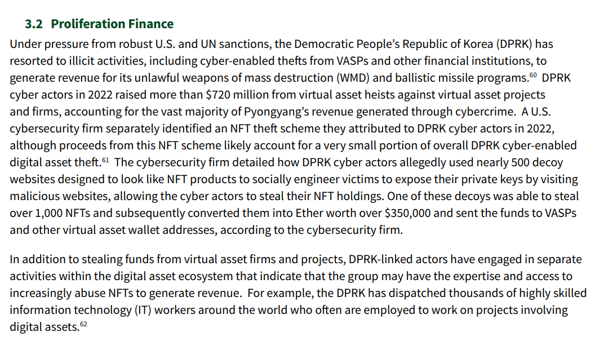
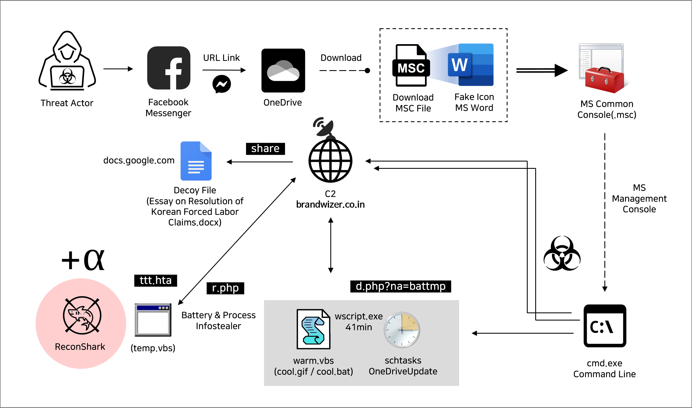
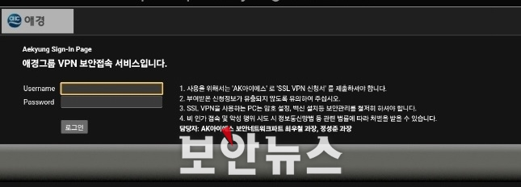
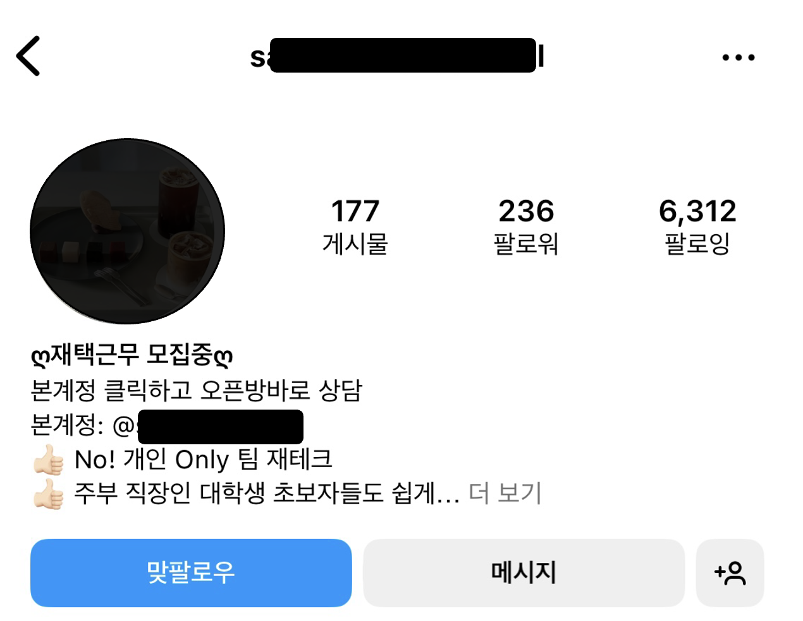

안녕하세요! romi0x입니다 😀

여름의 시작을 알리는 6월이에요.
햇살 가득한 날씨☀️와 함께 행운🍀이 가득가득한 한 달이 되면 좋겠어요!
이번주도 소식을 가득가득 담아 왔어요 👋

## 이번 주 짹짹 PICK🐥
> ⚠️ **美 불법금융 리스크 보고서 "北, 재작년 약1조원 가상자산 절취"**

2024.05.30 | 연합뉴스 | [기사보기](https://www.yna.co.kr/view/AKR20240530008000071?input=1195m)

[출처](https://home.treasury.gov/news/press-releases/jy2382)

미국 재무부에서 ‘2024 대체불가토큰([NFT](#짹짹이에게-물어봐)) 관련 불법 금융 리스크 평가보고서’를 발표했어요.

보고서에 따르면, 북한은 2022년에 가상 자산 프로젝트와 회사들을 대상으로 한 가상 자산 절도로 **7억 2천만 달러(9,860억 원) 이상**을 모았다고 해요. 🫢

"이는 북한이 사이버 범죄를 통해 충당하는 수입의 큰 부분을 차지한다"고 언급하기도 했어요.
또한, 재무부는 "강력한 미국 및 유엔 제재의 압박 아래, 북한은 가상자산사업자(VASP) 및 다른 금융 기관들을 상대로 한 사이버 절도 행위를 포함한 불법 활동에 의지해 불법적인 대량살상무기(WMD)와 탄도미사일 프로그램에 쓸 재원을 만들었다"고 지적했어요.💰

미국 사이버 보안 업체가 파악한 바에 따르면, 북한의 사이버 범죄 행위자들은 **약 500개의 '미끼 웹사이트'🎣**를 활용해 가상 자산 절도를 했다고 합니다.
가상자산 보유자들이  **악성 사이트를 방문하게 해서 비밀번호 🪪등을 노출**하게 만든 뒤 가상자산을 탈취한 것으로 나타났어요.

보고서에는 “북한은 전문 프로그래머들을 대량으로 양성한 뒤 세계 각지로 파견해 다양한 사이버 범죄를 저지르도록 독려하고 있다. 이들은 지난 몇 년 간 수익 창출과 돈세탁을 위해 규제 사각지대에 놓인 가상자산 시장을 적극적으로 노려왔다. 이는 매우 심각한 수준”이라고 밝혔어요.📈

‘2024 대체불가토큰(NFT) 관련 불법 금융 리스크 평가보고서’를 보고싶다면 [링크](https://home.treasury.gov/news/press-releases/jy2382)를 확인해보세요!

## 
> 🗣 **서울시, 지자체·공공기관 최초 사이버 보안 해킹방어대회 개최한다**

2024.05.28 | 전자신문 | [기사보기](https://m.etnews.com/20240528000233)

서울시가 내년에 지자체·공공기관 **최!초!로!😎** 사이버 보안 해킹방어대회를 개최한다고 전했어요.

일반인, 학생 등이 참가하지 않고 **공무원, 공공기관 재직자만을 대상**으로 하는 해킹방어대회는 이번이 처음라고 합니다. 나아가 2026년에는 해외로 대상을 넓혀 전국 공무원, 공공기관 재직자에 해외도시 공무원까지 포함한 **국제해킹방어대회를 개최를 추진**한다고 밝혔어요.

서울시는 국내 지자체나 공공기관 공무원, 재직자의 경우 그동안 민간에 비해 전문성을 쌓을 기회가 적어 해킹방어 관련 주로 외부 용역이나 업체 의존도가 높았다고 분석했어요.

이에 공무원, 공공기관 재직자의 업무 관련 내재 능력을 향상하고 사이버보안의 핵심멤버로서 역할을 다 할 수 있도록 범용 대회보다 자체 행사를 기획했다고 해요.😊

사이버 보안 해킹방어대회 내용은 **안전한 스마트시티 인프라 보호와 운영**을 위한 내용을 주로 다뤄 다른 대회와 차별성을 둔다고 합니다.
또한, 서울시가 보유하고 있는 데이터와 개인정보 보호 활동, 보안관제 시스템 운영 관리 등 전반을 다룰 전망이라고 밝혔어요.

## 
> ⚠️ **점점 교묘해지는 北해킹기술…"MS 관리자 페이지로 위장"**

2024.05.28 | 이데일리 | [기사보기](https://m.edaily.co.kr/news/read?newsId=03047126638893512&mediaCodeNo=257)

북한의 Kimsuky APT 그룹이 새로운 공격 전략으로 공격을 진행해 이슈입니다.🚨

일반인들이 잘 사용하지 않는 [마이크로소프트 관리 콘솔(MSC)](#짹짹이에게-물어봐) 문서를 활용한 것인데요.
이 방법으로 **1차 방어선인 백신 프로그램 탐지를 피한 것이 이번 공격의 특징**입니다.

지니언스 시큐리티대응센터(GSC)에 따르면 북한 해킹조직 ‘김수키(Kimsuky)’는 한국의 북한인권국제협력대사로 위장한 **가짜 페이스북 계정과 MS 관리콘솔 문서로 국내 대북·안보 종사자들을 해킹한 것**으로 밝혀졌어요.

공격자는 한국내 특정 공직자 프로필처럼 만든 가짜 페이스북 계정으로 위장해 비공개 문서를 공유해 주는 척하며 URL 링크를 전달하였고, 링크에 접속하면 원드라이브(OneDrive) 링크로 이동해 파일 다운로드 화면이 나옵니다.

해당 파일은 'My_Essay(prof).msc'으로, 확장자는 [.msc] 유형은 'Microsoft Management Console' 프로그램으로 연결되어 실행되는 'Microsoft Common Console 문서' 입니다.

여기서 굉장히 흥미로운 것은 **해당 악성 파일이 바이러스토탈 업로드 당시 다국적 60개 Anti-Malware 스캐너 전부 위협 요소를 탐지하지 못한 점**입니다!!

해당 공격에 대해서 자세하게 보고싶다면 [링크](https://www.genians.co.kr/blog/threat_intelligence/facebook)에서 확인해보세요!!

## 
> 🗣️ **중국 해커 니옌, 광운대·제주대 계정정보 해킹 주장... 또 시작됐나**

2024.05.27 | 보안뉴스 | [기사보기](https://www.boannews.com/media/view.asp?idx=130077&direct=mobile)

올해 초 국내 사이트 무차별 공격한 중국 해커 니옌을 기억하시나요?  [당시 기사](https://news.nate.com/view/20240207n40464)

당시 100여개의 국내 기관과 교육 사이트를 무차별적으로 공격했죠.😡

이번엔 니옌은 텔레그램을 통해 제주대학교와 광운대학교 계정정보를 탈취했다고 주장하면서 이용자 계정정보인 아이디와 비밀번호를 텔레그램에 공유했어요.

니옌은 해킹했다고 주장한 근거로 계정정보로 로그인한 광운대학교의 받은 메일함 내부 화면과 메일 쓰기 화면과 제주대학교 메일 시스템 화면도 함께 공개했어요.

여러 보안전문가들은 주 공격 방법이였던 [웹쉘](#짹짹이에게-물어봐) 등 웹서버 공격 뿐만 아니라 [무작위 대입 공격](#짹짹이에게-물어봐)을 통한 계정 탈취 시도로 예상하고 있어요. 또한, 공격자가 유출된 계정으로 웹메일 시스템에 로그인한 것을 인증했는데, 이러한 경우 로그인 권한을 통해 이메일 피싱, 파일 업로드 등 학교 시스템을 대상으로 추가 공격을 시도할 수 있다고 경고했어요.🚨

## 
> ⚠️ **치밀해지는 온라인 스캠… “악성파일 안 깔아도 인스타 DM 유의해야”**

2024.05.24 | 조선비즈 | [기사보기](https://biz.chosun.com/it-science/ict/2024/05/24/3BEYQ5MNVVFXDN3AEKPHZGQRUE/)

최근 온라인 스캠(사기)이 다양해지고 치밀해지면서, 인스타그램 등 소셜미디어(SNS)를 활용한 범죄가 늘고 있어 주의가 필요해요.

문제는 스캠 수법이 점점 치밀해진다는 것인데, 특히 인스타그램 등을 활용한 범죄가 증가하고 있어요.

'고수익 부업'이라는 키워드로 이용자들을 유인해 불법 카지노 베팅을 하게 만들어요. 스캐머는 인스타그램을 통해 경제적으로 여유로운 생활과 값비싼 물건 사진을 무단으로 도용해 광고하고, 주로 전업주부나 여성들에게 접근해요. 피해자들이 스캐머에게 먼저 연락하게 만들어, 초기에는 실제 수익금을 지급하지만 투자금이 커지면 추가 입금을 요구하며 돈을 돌려주지 않아요.🤑

몸캠 피싱에도 인스타그램이 활용돼요. 스캐머는 악성 파일 없이도 피해자를 협박할 수 있어요. **인스타그램의 메시지 기능을 이용해 피해자의 지인 목록을 캡처한 후, 성적인 대화나 영상 통화를 유도하고 이를 유출하겠다고 협박해요.**

안랩 시큐리티 인텔리전스 센터에서 [관련 블로그](https://asec.ahnlab.com/ko/63616/)를 확인해보세요!

## 짹짹이에게 물어봐 

**마이크로소프트 관리 콘솔(MSC)**

마이크로소프트 윈도우 운영체제(OS)의 구성요소로, 쉽게 말하면 시스템 관리자들이 쉽게 운영할 수 있도록 기능을 모아 놓은 화면

**NFT**

디지털 자산의 소유권을 블록체인에 기록하여 유일성과 희소성을 보장하는 기술

**웹쉘**(Web Shell)

웹 서버에서 원격으로 명령을 실행할 수 있는 악성 스크립트로, 공격자가 서버를 제어하고 민감한 정보를 탈취하는 데 사용

**무작위 대입 공격**

모든 가능한 조합을 시도해 비밀번호나 암호를 알아내는 해킹 기법

### 지식 PLUS ➕

- ["잘하는 사업 더 잘하자" 글로벌 보안기업 인수합병 행렬](https://news.zum.com/articles/90884865)
- [가짜 백신 사이트 운영하는 공격자들, 정보 탈취형 멀웨어 유포](https://www.boannews.com/media/view.asp?idx=130083&direct=mobile)
- [중국 배후 해커조직, 공격 탐지·추적 피하는 ORB 네트워크 활용해 스파이 활동](https://www.boannews.com/media/view.asp?idx=130074&kind=&sub_kind=)
- [日 20대 남성, AI 랜섬웨어 개발에 악용..."돈 벌고 싶었다"](https://www.dt.co.kr/contents.html?article_no=2024052802109931065006&ref=naver)

## **5월 보안 컨퍼런스** 🐥

- [**제13회 개인정보보호페어 & CPO워크숍**](https://www.pisfair.org/2024/index.html) | **6월 4일(화) ~ 5일(수)**