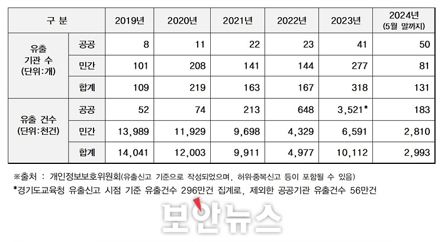
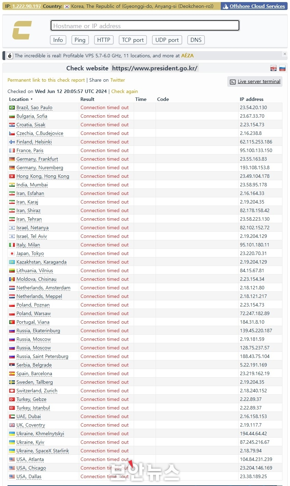

여름맞이 보안 비상! 🌞🍉

안녕하세요! romi0x입니다 😀

이제 여름이 코앞으로 다가온 것만 같은 날씨입니다😎

이런 날 시원한 수박🍉🍉과 해킹짹짹🐣🐣 어떠세요~~?

블랙바스타 랜섬웨어의 윈도우 제로데이 취약점 악용 사례, QR코드 큐싱 사기, 공공기관 개인정보 유출, 디도스 공격까지!

충격적인 사이버 위협 소식! 놓치면 큰일 납니다!🔥

## 이번 주 짹짹 PICK🐥
> ⚠️ **블랙바스타 랜섬웨어, CVE-2024-26169 Windows OS에서 발견된 취약점**

2024.06.17 | 보안뉴스 | [기사보기](https://www.boannews.com/media/view.asp?idx=130624&direct=mobile)

최근에 발표된 [시만텍 보고서](https://symantec-enterprise-blogs.security.com/threat-intelligence/black-basta-ransomware-zero-day)에 따르면, 블랙바스타와 연결된 공격자들이 최신 Windows 취약점을 제로데이로 악용한 가능성이 있어 화제입니다. **이 취약점(CVE-2024-26169)은 Windows 오류 보고 서비스에서 발생하는 것으로, 공격자가 해당 시스템에서 권한을 상승🆙시킬 수 있는 문제를 포함**하고 있어요.

Microsoft은 2024년 3월 12일 이 취약점에 대한 패치를 배포했으며, 당시 **외부에서의 실제 악용 사례는 발견되지 않았다**고 밝혔어요. 

그러나!! Symantec의 조사 결과, 최근 공격에서 사용된 익스플로잇 도구는 패치 이전에 컴파일된 것으로 확인되어, 취약점이 공개되기 전에 취약점을 악용해서 공격을 시도한 것으로 보입니다 😵‍💫

시만텍은 최근 랜섬웨어 공격 시도 사건을 조사하면서 [블랙바스타](#짹짹이에게-물어봐)와 유사한 점을 발견했습니다. 공격자들은 익스플로잇 도구를 활용했고, werkernel.sys 파일의 [널 보안 디스크립터](#짹짹이에게-물어봐) 특성을 악용해 관리자 권한을 획득하려 했습니다.

블랙바스타는 2022년 4월 처음 발견되었으며, 시만텍은 카디널이라는 공격 단체가 블랙바스타라는 랜섬웨어를 사용하고 있다고 설명했어요. 이 랜섬웨어는 [칵봇(Qakbot) 봇넷](#짹짹이에게-물어봐)과 깊은 연관이 있으며, 칵봇이 폐쇄되자 잠시 활동이 줄어들었으나, [다크게이트(DarkGate)](#짹짹이에게-물어봐)로더와 손잡고 다시 활성화되었습니다.

## 
> 🗣 **'큐싱' 주의보…공유자전거 QR 찍었다가 통장 털려**

2024.06.17 | 매일경제 | [기사보기](https://m.mk.co.kr/amp/11043900)

최근에는 QR코드🔍를 악용한 신종 사이버 금융사기💰인 '큐싱(Qshing)' 사례가 증가하고 있습니다. 큐싱은 QR코드와 피싱(Phishing)을 결합한 용어로, **사용자가 QR코드를 스캔하면 악성 앱을 설치하도록 유도하는 사기 수법**입니다.

QR코드를 이용한 공격은 다양합니다. 예를 들어 전동킥보드나 고객 사은품 이벤트와 같은 위장된 QR코드를 제작하여 유인하기도 합니다. 또한 주차된 차량에 부착된 가짜 '불법 주차 경고장'을 통해 QR코드를 스캔하도록 유도하여 개인 정보를 탈취하기도 합니다.

큐싱의 특징은 **QR코드를 스캔하기 전까지 그 신뢰성을 판단하기 어렵다**는 점입니다.📱 이로 인해 사기를 감지하기가 더욱 어려운 상황입니다. 중국에서는 정부를 사칭한 메일을 통해 QR코드를 이용하여 개인 정보를 탈취하려는 사례도 발생했어요 😱

사용자는 QR코드를 스캔하기 전에 출처를 확실히 확인하고, 알려진 앱 스토어를 통해 안전한 앱만 다운로드하는 등의 주의가 필요합니다. 또한, 공공장소나 기업에서 제공하는 QR코드도 가능한 주의해서 사용해야 합니다.

## 
> 🗣 **전국 공공기관 개인정보 유출 피해, 올해만 50곳으로 ‘역대 최다’ 찍어"**

2024.06.20 | 보안뉴스 | [기사보기](https://www.boannews.com/media/view.asp?idx=130758&direct=mobile)

올해만 벌써 50곳의 공공기관에서 개인정보 유출 사고가 발생한거 알고 계신가요?!

개인정보보호위원회 자료에 따르면 **2024년 1월부터 5월까지만 50곳의 공공기관에서 개인정보 유출이 신고**되었습니다. 이는 한 달 평균 약 10곳에서 발생한 것으로, 공공기관의 개인정보 보호 상황이 심각함을 보여줍니다. 2019년 8곳에서 시작해 2023년에는 41곳으로 증가한 뒤, 올해는 이미 절반을 넘어 역대 최고치를 기록하고 있습니다.🤦‍♂️

특히 [지난 뉴스레터](https://hackyboiz.github.io/2024/05/13/romi0x/newsletter0513/#-3)에도 소개되었던  2024년 4월, 행안부의 '정부24' 시스템 오류로 인해 1,200건 넘는 민원서류가 타인에게 발급되며 이름, 주소, 주민등록번호 등이 유출되었습니다. 또한 [지난 뉴스레터](https://hackyboiz.github.io/2024/05/20/clalxk/newsletter0520/#%EC%9D%B4%EB%B2%88-%EC%A3%BC-%EC%A7%B9%EC%A7%B9-PICK%F0%9F%90%A5)에서도 소개되었던 북한의 공격으로 인한 법원 해킹으로 1,014GB 분량의 개인정보가 유출된 사건에 대한 조사도 진행 중에 있습니다.

그럼에도 불구하고 공공기관에서의 개인정보 유출 사건은 증가하고 있으며, 이에 대한 당국의 제재가 효과적으로 이루어지지 않고 있다는 비판이 나오고 있습니다.📢

## 
> 🗣️ **올해만 벌써 50곳의 공공기관에서 개인정보 유출 사고가 발생한거 알고 계신가요?!**

2024.06.18 | 보안뉴스 | [기사보기](https://www.boannews.com/media/view.asp?idx=130643&direct=mobile)

디도스 공격으로 대한민국 정부 기관 및 기업 등 22개 사이트가 공격당했습니다.🎯

이 공격은 러시아 해커 그룹이 우크라이나를 지원하는 한국의 행동에 불만을 품어 감행했다고 주장하고 있는데요. **공격은 12일에 7개 사이트, 13일에 3개 사이트, 15일에 2개 사이트, 그리고 17일에 10개 사이트에서 발생했습니다.**

공격을 받은 주요 사이트로는 대한민국 대통령실, 인천국제공항, 신한금융지주회사, 한국수출입은행, 관세청, 경찰청, 국세청, 우정사업본부, 서울특별시, 제주대학교, 산업통상자원부, 외교부, 국무조정실국무총리비서실, 인사혁신처, 식품의약품안전처, 문화체육관광부, 교육부, 환경부, 국토교통부, 고용노동부, 과학기술정보통신부, 해양수산부 등이 있습니다.

현재는 모든 사이트가 정상적으로 운영되고 있지만, 디도스 공격에 대한 대응과 관련하여 계속해서 모니터링과 협력이 필요하겠네요. 🤔

## 짹짹이에게 물어봐 

**널 보안 디스크립터(null security descriptor)**

일반적으로 null 또는 빈 상태로 설정된 보안 디스크립터(파일, 레지스트리 키, 프로세스 등 객체의 보안 속성을 정의하는 데이터 구조)

**블랙바스타(Black Basta)**

2022년 4월에 발견된 새로운 변종 랜섬웨어로 피해 타깃 리스트를 빠르게 수집할 수 있는 능력과 협상 스타일로 급부상한 그룹

**칵봇(Qakbot)**

금융 정보를 훔치고 다른 악성 소프트웨어를 배포하는 악성코드 봇넷

**다크게이트(DarkGate)**

악성코드를 다운로드하고 실행하는 역할을 하는 악성 소프트웨어, 이 공격은 최근 패치된 마이크로소프트의 제로데이 공격 결함을 교묘하게 악용함

### 지식 PLUS ➕

- [선관위, 보안점검서 직원 정보유출…"외주 직원 실수"](https://www.yna.co.kr/view/AKR20240617160200001)
- [가상자산법 시행 코앞인데…보안·내부통제 아직 ‘미흡’](https://www.busan.com/view/busan/view.php?code=2024061716524399705)
- [명품시계 ‘태그호이어’ 韓 고객정보 유출…과징금 1억2600만원](https://www.ddaily.co.kr/page/view/2024061610443973019)
- [개정위 “쉽게 정보유출” vs 카카오 “해커 탓”](https://www.etnews.com/20240617000165)
- [수익률 120%"…'스팸문자' 유독 많이 오는 이유 있었다](https://www.hankyung.com/article/2024061849591)

## **6월 컨퍼런스** 🐥

[AI 아이디어랩](https://www.xn--ai-h41ir8ydiaw0lto5awzac9ida382tyjj.com/) | 코드게이트 | ~ 2024.06.30 접수

[제10회 대학생 프로그래밍 경진대회](https://www.codeground.org/) | 삼성전자 | ~ 24.07.04

[암호분석경진대회](https://cryptocontest.kr/challenge/) | 한국정보보호학회 | ~ 2408.31

[금융권 보안 취약점 신고포상제 (버그바운티)](http://www.itdaily.kr/news/articleView.html?idxno=223547) | 금융보안원 | ~ 24.08.31
