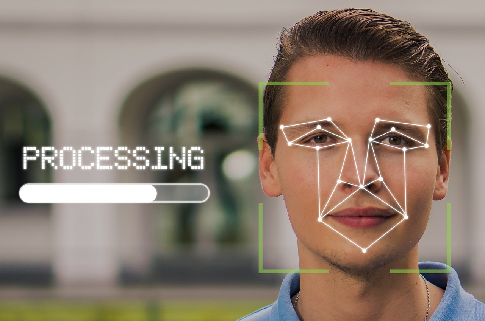

안녕하세요! romi0x입니다 😀

해킹 사고를 1년 동안 숨긴 기업 뉴스부터 개인정보가 탈탈 털린 뉴스까지 이번 주도 꽉꽉 담았습니다!!

## 이번 주 짹짹 PICK🐥
>  **🗣️ 오픈AI에서 있었던 해킹 사고, 1년 넘게 숨겨졌다?**

2024.07.09 | 보안뉴스 | [기사보기](https://www.boannews.com/media/view.asp?idx=131190)

작년 초 오픈AI가 해킹을 당했다는 충격적인 사실🤯이 [뉴욕타임즈](https://www.nytimes.com/2024/07/04/technology/openai-hack.html)를 통해 공개되었습니다.

해커는 사내 메신저를 통해 직원들의 대화 내용💬을 수집했으며, 오픈AI의 인공지능 관련 기술🤖도 탈취한 것으로 보입니다. 이 사건은 인공지능 생태계의 불안전성과 오픈AI의 내부 관리 문제를 드러냈습니다.

⚠️ **문제 1: 데이터 침해와 정보 은폐**

해커는 인공지능 훈련에 사용되는 민감한 데이터에는 접근하지 못한 것으로 보입니다.
오픈AI는 이 사건이 국가 안보에 위협이 되지 않는다고 판단하여 공개하지 않았다고 해명했습니다.

그러나 이는 사용자 데이터 처리와 수급에 대한 불투명성을 해결하는 답변으로는 부족하다는 평입니다. 사용자들이 챗GPT에 입력하는 민감한 데이터와 훈련 데이터가 어떻게 관리되는지 밝히지 않은 것은 큰 문제입니다.🤷‍♂️

⚠️ **문제 2: [내부 갈등과 보안 관리](https://m.news.nate.com/view/20240518n07932)**

당시 오픈AI의 기술 프로그램 관리자였던 레오폴드 아셴브레너는 보안 강화를 요구하는 제안서를 제출했으나, 제안은 무시되었고 , 올해 초 해고되었습니다. 아셴브레너는 회사의 보안 문제를 지적한 것이 해고 이유라고 주장했지만, 오픈AI는 정보 유출을 이유로 들었습니다. 이로 인해 오픈AI 내부의 혼란과 갈등이 드러났습니다.

작년 11월, 오픈AI의 CEO 샘 올트만이 해고되었으나, 직원들의 반발로 일주일 만에 복귀했습니다. 올트만의 해고 이유는 임원진들과의 불화와 소통 부재였으나, 이는 인공지능 개발 철학의 차이에서 비롯된 것으로 보입니다. 이러한 사건은 오픈AI 내부의 신뢰 문제를 더욱 부각시켰습니다. 🤦‍♂️

인공지능 기술은 우리의 생활에 편리함을 가져오지만, 그 뒤에 숨은 보안 문제는 여전히 해결되지 않은 상태입니다. 😵‍💫

## 
> **⚠️ 새로운 APT 그룹 'CloudSorcerer' 등장: 클라우드 기반의 정교한 공격**

2024.07.08 | The Hacker News | [기사보기](https://thehackernews.com/2024/07/new-apt-group-cloudsorcerer-targets.html)

[해커뉴스](https://thehackernews.com/2024/07/new-apt-group-cloudsorcerer-targets.html)에 따르면, 최근 'CloudSorcerer'라는 새로운 APT(Advanced Persistent Threat) 그룹이 등장했다고 합니다. 이들은 주로 러시아🇷🇺의 단체들을 타겟으로 공격을 실행하고 있으며, 클라우드 서비스를[C&C(Command and Control](#짹짹이에게-물어봐)) 서버로 활용하는 것이 특징입니다.

이들의 공격 방식은 CloudWizard라는 다른 공격 단체와 유사점이 많으나, 멀웨어 소스코드에 상당한 차이가 있어 동일 그룹으로 보기는 어렵다고 합니다. 🤔

현재로선 타겟에 침투하는 데 사용된 정확한 방법은 알려지지 않았지만, 초기 접근은 백도어를 사용한다는 점만 밝혀졌습니다. 백도어는 피해자의 컴퓨터에 대한 정보를 수집하고 파일 및 폴더 열거, 셸 명령 실행, 파일 작업 수행, 추가 페이로드 실행이 가능합니다.😈

## 
> **🗣️ 개인 실물사진에 신분증·여권까지 노출…사각지대 놓인 개발 서버**

2024.07.09 | 전자신문  | [기사보기](https://www.etnews.com/20240708000171)

[Criminal IP](https://blog.criminalip.io/2024/07/05/kyc-system/)에 따르면, 약 1만여 건의 개인정보를 그대로 노출한 고객확인([KYC](#짹짹이에게-물어봐)) 서버가 발견되었습니다.

KYC 프로세스를 통해 수집된 개인정보는 신분증, 여권, 신분 확인을 위한 현재 본인 사진 등 많은 개인정보가 포함되어 있습니다. 이러한 개인정보가 관리 미흡으로 인해 KYC 인증 서버와 데이터가 무방비로 인터넷에 노출됐습니다. 😱

2024년 7월 2일에 발견된 KYC 서버는 고객의 신분증, 여권사진, 이름, 생년월일 등이 노출되었습니다. 이 서버에는 전 세계에서 수집된 약 1만 건의 유저 데이터가 저장되어 있었으며, 대한민국 유저 수도 684명에 달했습니다.

해당 서버는 접근 제어가 전혀 없어 누구나 유저의 개인정보를 열람할 수 있는 상태였습니다. 확인 결과 이 서버는 실제 가동 중인 라이브 서버가 아닌 개발용 서버로 추정되며, 방화벽 설정 미흡으로 노출된 것으로 보인다고 합니다. 😳

## 짹짹이에게 물어봐 

- KYC(Know Your Customer)
    - 금융권과 가상화폐 거래소에서 고객이 본인 계정임을 확인하는 절차로, 신분증이나 여권 등을 금융회사에 제출하는 방식
- C&C(Command and Control)
    - 감염된 기계 또는 네트워크와 통신하고 제어하는 도구를 포함하는 공격 유형

### 지식 PLUS ➕

- [전 세계 가장 많은 보안취약점 수를 공개한 보안기업은? 트렌드마이크로](https://www.boannews.com/media/view.asp?idx=131161&direct=mobile)
- [다크웹에 공개된 역사상 가장 큰 비밀번호 DB, 록유2024](https://www.boannews.com/media/view.asp?idx=131200)
- [새로운 봇넷 멀웨어 저그에카, 다양한 기능 탑재한 채 활동 중](https://www.boannews.com/media/view.asp?idx=131174)

## **이번주 보안용어** 🐥

> **Ransomware-as-a-Service (RaaS)**

RaaS는 **랜섬웨어 공격을 서비스 형태로 제공하는 비즈니스 모델**입니다.

RaaS를 통해 기술 지식이 부족한 범죄자도 쉽게 랜섬웨어를 배포할 수 있습니다. 공격자는 RaaS 플랫폼을 사용하여 공격을 계획하고 실행하며, 서비스 제공자는 성공적인 공격 시 수익을 나눠 갖습니다.

예를 들어, GandCrab과 [REvil](https://www.nomios.com/resources/what-is-revil-ransomware/) 같은 랜섬웨어가 RaaS 형태로 제공됩니다. 이 서비스는 사용자 친화적인 대시보드와 24시간 지원을 제공하여, 누구나 쉽게 사용할 수 있도록 합니다. GandCrab은 2018년에 처음 등장하여 빠르게 확산되었으며 현재는 사실상 자취를 감춘 상태입니다. REvil은 강력한 랜섬웨어를 개발하고 다크 웹에서 판매하고 있으며 소프트웨어 공급망을 공격하여 큰 피해를 입혔습니다.

RaaS는 낮은 진입 장벽과 수익 공유 모델 덕분에 사이버 범죄를 촉진하고 있습니다. 특히, 범죄자들이 기술적 지식 없이도 랜섬웨어를 사용할 수 있어, 사이버 공격의 빈도가 증가하고 있습니다. RaaS는 랜섬웨어 공격을 더 조직적이고 효과적으로 수행할 수 있게 하여, 기업과 개인에게 큰 위협이 되고 있습니다.

