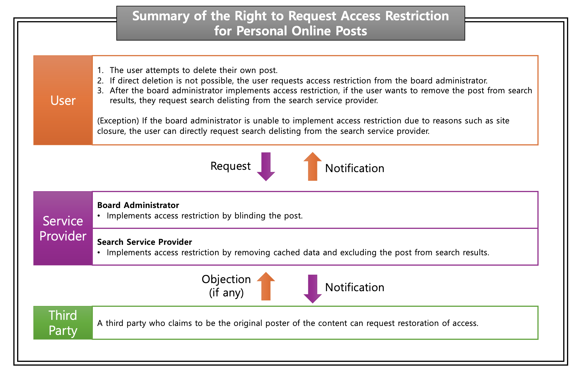

Hello, this is romi0x!

Have you ever wanted to erase embarrassing moments from the internet? Or have you tried to delete a post but couldn't find a way to remove it? Sometimes, you may not be able to delete your posts because there is no delete button or you are no longer a member of the service. To address this issue, there is a legal right called the **"Right to Request Access Restriction for Personal Online Posts."**

In this article, I will introduce the **"Right to Request Access Restriction for Personal Online Posts"**, which allows individuals to request restrictions on public access to posts they have uploaded.

## **1. What is the Right to Request Access Restriction for Personal Online Posts?**

The **"Right to Request Access Restriction for Personal Online Posts"** allows individuals to request restrictions on access to their own posts on the internet. This right ensures that information and communication service providers, as personal data controllers, comply with privacy protection principles, while allowing users to safeguard their personal data.

Since 2016, South Korea has introduced this right under the **Act on Promotion of Information and Communications Network Utilization and Information Protection (the Information and Communications Network Act)**. Under this system, individuals can request **access restrictions** rather than **deletion** of their posts.

## **1-2. Comparison with Global Cases**

When it comes to online information deletion requests, South Korea's **Right to Request Access Restriction for Personal Online Posts** and the globally recognized **"Right to Be Forgotten"** share similar goals but differ in legal application and scope.

### **European Union (EU): Right to Be Forgotten**

In the European Union, there is a legal right called the **"Right to Be Forgotten."** This right was officially recognized in 2014 following a ruling by the **Court of Justice of the European Union (CJEU)** in the **Google Spain case**. The **General Data Protection Regulation (GDPR)**, which took effect in 2018, explicitly defines this right.

One major case highlighting this right is:

- **Google Spain Case (2014)**: A Spanish man requested the removal of search results linking to outdated debt-related information. The CJEU ruled that individuals have the right to request the removal of specific search results.

While the EU shares similarities with Korea's system, European laws place a stronger emphasis on **personal data protection**.

### **United States: Focus on Freedom of Expression**

The **Right to Be Forgotten** is not legally recognized in the United States. Instead, digital platforms offer users the ability to delete their own posts. For example, social media platforms like **Facebook** and **Twitter** allow users to remove their posts at any time. However, due to the strong emphasis on **freedom of expression**, content related to public figures or issues of public interest may not be easily removed.

| Category | South Korea (Right to Request Access Restriction) | European Union (Right to Be Forgotten) | United States |
| --- | --- | --- | --- |
| Scope | Posts made by the individual | Includes third-party content | Limited personal data protection laws |
| Deletion Process | Search restriction (post remains) | Search result removal & content deletion possible | Limited removal possible |
| Legal Basis | Information and Communications Network Act | GDPR, CJEU rulings | Freedom of Expression, some state laws |

## **2. How to Request Access Restriction for Your Own Posts**

So, how can individuals in South Korea exercise this right and request access restrictions on their posts?

### **Eligible Requests**

Users can exercise this right for posts they have made on **online platforms, including comments, photos, and videos**. If a **deceased individual has designated a representative** or if the **family of the deceased** requests access restriction, the request can still be made. If the designated representative and the family have differing opinions, the designated representative's decision generally takes precedence.

### **Who Can Submit a Request and Who is Responsible?**

Any individual can submit a request, and it should be directed to the **website administrator** or **search engine provider**.

### **Steps to Request Access Restriction**

1. **Check if you can delete the post yourself.**
    - If the user can delete their own post, the platform operator may refuse the request for access restriction.
2. **If self-deletion is not possible, request access restriction from the website administrator.**
    - Supporting documents should be submitted along with the request.
    - Required documents include:
        - The **URL of the post** in question.
        - Proof that the requester originally posted the content.
        - A **statement of reasons** for the access restriction request.
3. **If further action is needed, request removal from search engine providers.**
    - To do this, users must provide evidence that the website administrator has already restricted access.

## **3. How Service Providers Process Access Restriction Requests**

Once a request is made, **website administrators** and **search engine providers** must follow a review process to determine the appropriate action.

- Website administrators will **consider the submitted evidence** and apply **access restriction measures**, such as **blurring or blocking access to the post**.
- Search engine providers will **remove the post from search results** where applicable.

## **4. Notification of Results & Third-Party Objections**

Once access restriction measures have been applied, the service provider must **notify the requester** of the result.

If a **third party objects** to the restriction, the service provider will **review the submitted evidence** and decide whether to uphold the restriction or lift it.

## **5. Requesting Access Restriction from Major Korean Search Engines**

Major Korean portal sites **Naver (N)** and **Daum (D)** provide guidance on requesting access restriction:

- **Naver Access Restriction Request Guide**
    - [https://help.naver.com/service/30001/category/5759?lang=ko](https://help.naver.com/service/30001/category/5759?lang=ko)
- **Daum Access Restriction Request Guide**
    - [https://cs.daum.net/redbell/right/precludeProcess.html](https://cs.daum.net/redbell/right/precludeProcess.html)