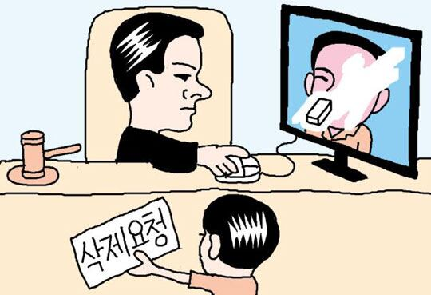
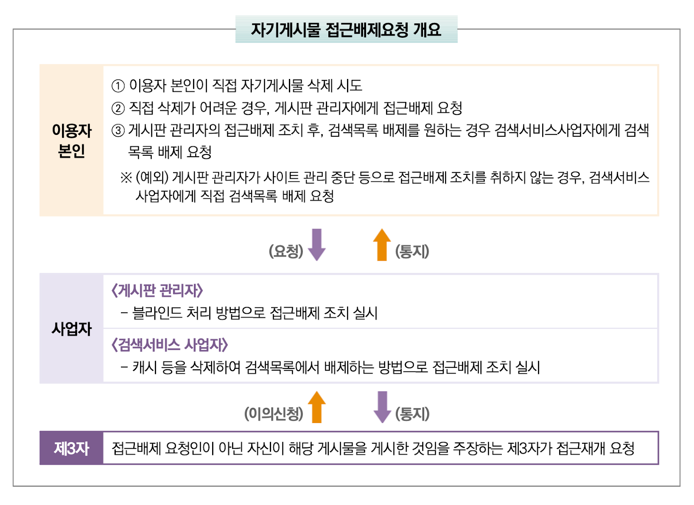
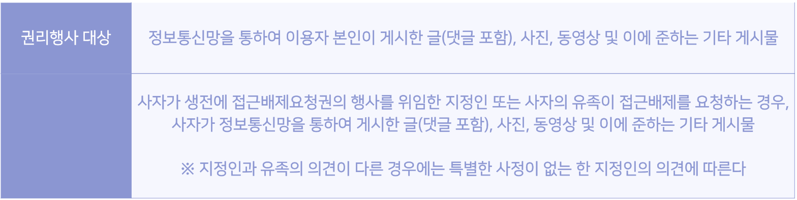
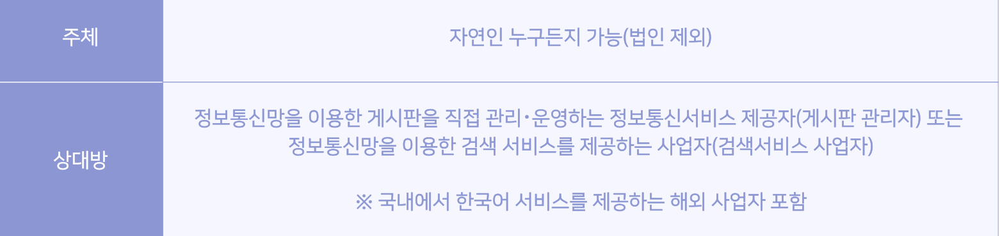

안녕하세요, romi0x예요!

인터넷에 남겨진 본인의 흑역사를 지우고 싶었던 적이 있나요? 혹은 게시물을 삭제하려 했지만 삭제할 수 없었던 경험이 있나요? 서비스 회원을 탈퇴하거나 게시물 삭제 버튼이 없어서 원하는 게시물을 삭제하지 못하는 상황이 있을 수도 있어요. 이런 상황을 해결하기 위해 ‘**인터넷 자기게시물 접근배제요청권**’이라는 권리가 있어요.

이번 글에서는 본인이 올린 게시물에 대해 타인의 접근 배제를 요청할 수 있는 권리인 ‘**자기게시물 접근배제요청권**’에 대해 소개할게요.

출처: https://biz.chosun.com/site/data/html_dir/2014/07/17/2014071700027.html

# **1. 인터넷 자기게시물 접근배제요청권?**

이용자 본인이 인터넷상에 게시한 게시물에 대해 타인의 접근 배제를 요청할 수 있는 권리를 ‘**자기게시물 접근배제요청권**’이라고 해요. 이 권리로 인해 정보통신서비스 제공자는 개인정보처리자로서 개인정보 보호 원칙을 준수할 수 있고, 이용자는 본인의 개인정보를 보호하고 안전하게 지킬 수 있어요.

한국에서는 2016년부터 정보통신망 이용촉진 및 정보보호 등에 관한 법률(정보통신망법)에 따라 개인이 자신이 작성한 게시물에 대해 검색 제한을 요청할 수 있는 ‘인터넷 자기게시물 접근배제요청권’이 도입되었어요. 이는 본인이 작성한 게시물이라 하더라도 삭제 요청이 아닌 ‘접근 제한’ 조치를 요구할 수 있도록 한 제도예요.

## 1-2. 해외 사례와 국내 비교

인터넷상의 정보 삭제 요청과 관련하여 한국의 ‘인터넷 자기게시물 접근배제요청권’과 해외에서 널리 논의되는 ‘잊힐 권리(right to be forgotten)’는 공통된 목적을 가지면서도 법적 적용 방식과 범위에서 차이를 보여요.

### **유럽연합(EU): 잊혀질 권리**

유럽연합에서는 ‘잊혀질 권리(Right to be Forgotten)’라는 법적 권리가 있어요. 2014년 유럽사법재판소(CJEU)의 판결(구글 스페인 사건) 이후 공식적으로 인정되었어요. 이후 2018년 시행된 일반 개인정보 보호법(GDPR)에서도 잊힐 권리를 명시적으로 규정하고 있죠.

주요 사례로는 구글 스페인 사건이 있어요.

- **구글 스페인 사건(2014)**: 스페인의 한 남성이 과거 채무 관련 정보가 구글 검색 결과에 노출되는 것을 문제 삼아 삭제를 요청한 사건에서 유럽사법재판소는 개인이 특정 정보에 대한 검색 결과 삭제를 요청할 수 있다고 판결했어요.

유럽연합에서는 자기게시물 접근배제요청권과 유사한 개념을 가지고 있지만, 유럽에서는 개인의 **정보 보호**를 더 강조하는 법적 환경이에요.

### **미국: 표현의 자유 중심**

미국은 ‘잊힐 권리’가 법적으로 보장되지 않지만, 각 디지털 플랫폼에서 사용자에게 게시물 삭제 기능을 제공하고 있어요. 예를 들어, **페이스북**이나 **트위터**와 같은 SNS 플랫폼은 사용자가 자신의 게시물을 언제든지 삭제할 수 있도록 허용하고 있어요. 하지만 미국에서는 **표현의 자유**가 중요시되므로, 공적 인물의 게시물이나 공익적인 내용에 대해서는 삭제가 제한될 수 있어요.

| 구분 | 국내 자기게시물 접근배제요청권 | 유럽연합(EU) | 미국 |
| --- | --- | --- | --- |
| 적용 범위 | 본인이 작성한 게시물 | 제3자가 올린 정보 포함 | 일부 개인정보 보호법 적용 |
| 삭제 방식 | 검색 제한(게시물은 남아 있음) | 검색 결과 삭제 및 정보 삭제 가능 | 제한적 삭제 가능 |
| 법적 근거 | 정보통신망법 | GDPR, 유럽사법재판소 판례 | 표현의 자유 원칙, 일부 주 법률 |

# 2. 이용자 본인의 접근배제 요청 방법 및 절차

그렇다면, 국내에서 자기게시물 접근배제요청권은 어떻게 신청하고 어떤 과정으로 처리되는지 알아볼게요.

- 권리행사 대상

  정보통신망을 통해 **본인이** 게시한 글(댓글), 사진, 동영상 및 이에 준하는 게시물에 대해서 권리를 행사할 수 있어요. 만약 고인이 생전에 권리를 위임한 **지정인** 또는 고인의 **유족**이 접근배제를 요청하는 경우에도 권리를 행사할 수 있어요. 지정인과 유족의 의견이 다른 경우에는 특별한 사정이 없는 한 지정인의 의견을 따라요.

- 권리행사 주체 및 상대방

  권리를 행사하는 주체는 **누구든지** 가능하며 그 상대는 **게시판 관리자** 또는 **검색서비스 사업자**예요.

- 요청 방법 및 절차

  요청하는 방법과 절차는 다음과 같아요.

    1. 이용자 본인이 **직접** 해당 게시물을 삭제할 수 있는지 확인해요.
        - 이용자 본인이 직접 삭제할 수 있다면, 사업자는 자기게시물 접근배제요청을 거부할 수 있어요.
    2. 이용자가 직접 삭제하기 어렵다면, **게시판 관리자에게 자기게시물의 접근배제를 요청**해요.
       이때, 요청 시 입증 자료들을 첨부해야 해요.

       - 접근배제를 원하는 게시물 및 게시물의 위치자료(URL)
       - 요청인이 해당 게시물을 게시하였다는 사실을 입증할 수 있는 자료 
       - 접근배제를 요청하는 사유

    3. **검색서비스 사업자에게 검색목록의 배제**를 추가적으로 원한다면, 게시판 관리자의 접근배제 조치 사실을 입증할 수 있는 자료를 첨부해 검색서비스 사업자에게 검색목록 배제 요청을 해요.

# 3. 사업자의 접근배제 조치 방법 및 절차

이용자가 접근배제를 요청했다면 게시판 관리자와 검색서비스 사업자는 어떤 방법으로 조치를 해야할까요?

사업자는 이용자의 요청을 검토한 후 적절한 조치를 취해야 해요. 게시판 관리자는 요청인이 제출한 입증자료를 종합적으로 고려해 해당 게시물에 대한 **블라인드 처리** 등으로 접근배제 조치를 실시해야 해요. 검색서비스 사업자는 검색목록에서 배제하는 방식으로 조치를 취해야 해요.

# 4. 결과 통보 및 제3자의 이의신청

사업자는 접근배제 조치를 완료한 경우 요청인에게 결과를 통보해야 해요. 또한, 제3자가 이에 대한 이의를 제기할 수 있어요. 이 경우, 사업자는 요청인의 입증자료를 검토한 후 이의 신청을 받아들일지 결정해야 해요.

국내 유명 포털사이트 N사와 D사도 자기게시물 접근배제 요청권을 안내하고 있어요.

- N사의 자기게시물 접근배제 요청 안내

  [https://help.naver.com/service/30001/category/5759?lang=ko](https://help.naver.com/service/30001/category/5759?lang=ko)

- D사의 자기게시물 접근배제 요청 안내

  [https://cs.daum.net/redbell/right/precludeProcess.html](https://cs.daum.net/redbell/right/precludeProcess.html)

### Ref

[개인정보보호위원회 「인터넷 자기게시물 접근배제요청권 안내서」 2024.12](https://www.pipc.go.kr/np/cop/bbs/selectBoardArticle.do?bbsId=BS217&mCode=D010030000&nttId=10895#LINK)