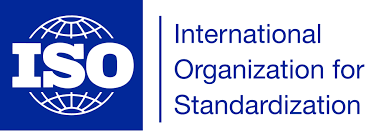
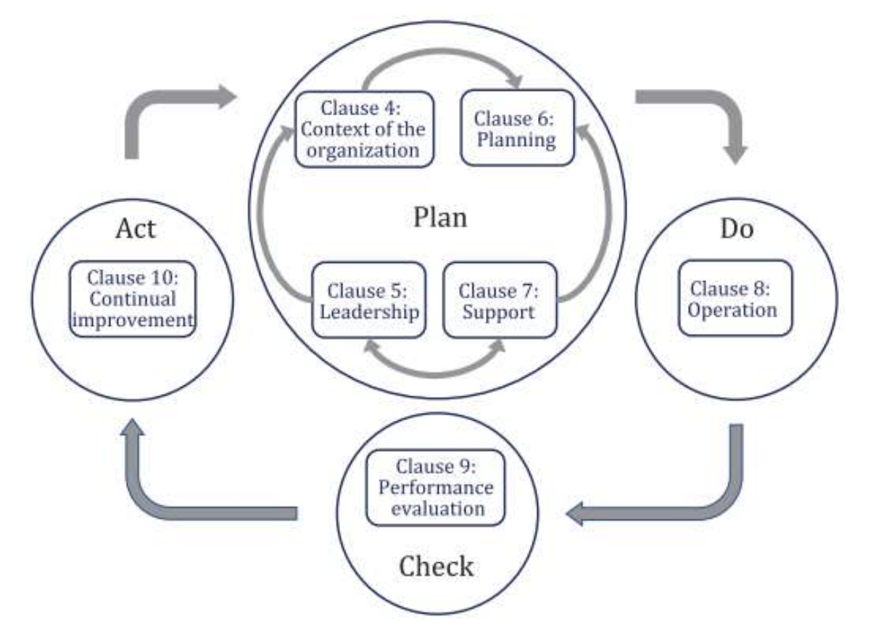
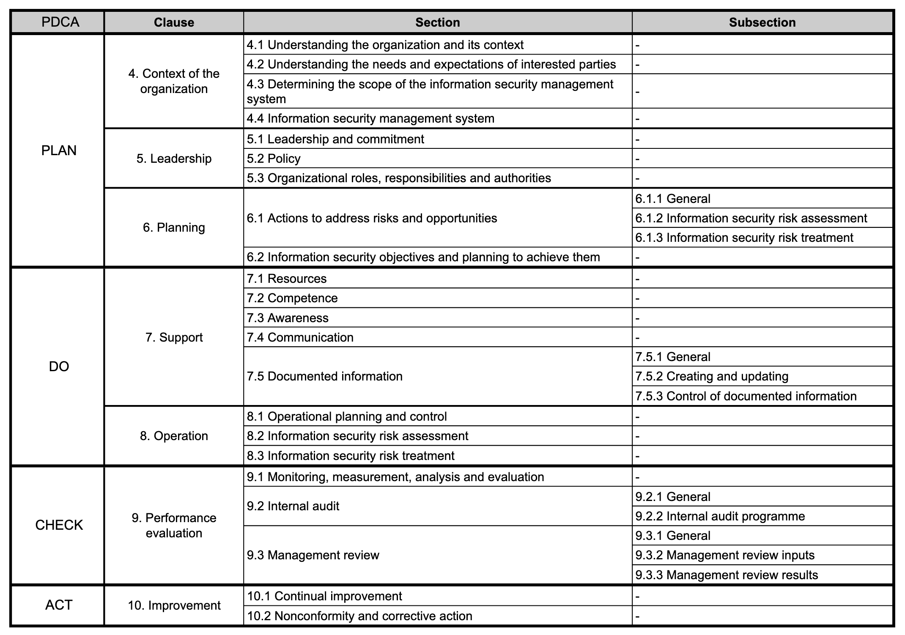
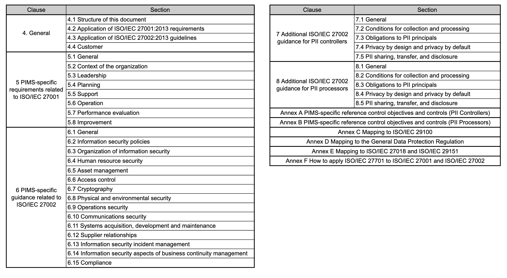
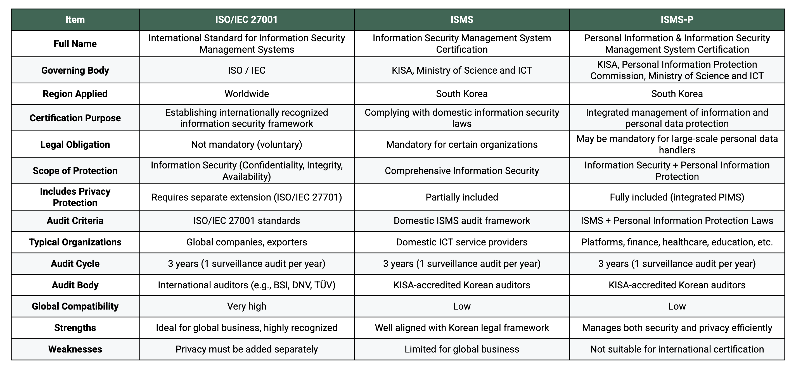

Hello, this is romi0x. 👋

> △△ Corporation accelerates European expansion with ISO 27001 certification
>
>
> OO Cloud obtains APEC Privacy Certification 'CBPR'
>
> Korean startup secures GDPR compliance with ISO 27701 certification
>

Have you come across headlines like these?

If your company is expanding globally or working with foreign partners, you’ve probably heard of **international security certifications**.

As regulations like the **GDPR (EU)**, **CCPA (US)**, and personal data transfer laws in countries like **Japan** and **Singapore** continue to diversify, the importance of having a structured certification system to comply with these requirements is growing rapidly.

In this post, we’ll take a closer look at two major international security certification systems:

**ISO/IEC 27001** and **ISO/IEC 27701**.

Want to learn about Korea’s domestic certification system instead?

Check out these blog posts:

➡️ https://hackyboiz.github.io/2024/07/07/romi0x/certification_security/

➡️ https://hackyboiz.github.io/2024/07/21/romi0x/certification_privacy/

---

## What is ISO/IEC?

Let’s begin with a quick intro to ISO.

ISO certifications are issued based on **standards developed by the International Organization for Standardization (ISO)**.

They verify that a company’s management system is built and operated in accordance with global best practices.

ISO has standards for many industries, and for **information security**, some of the most relevant ones include:

1. **ISO/IEC 27001** – Information Security Management System (ISMS)
2. **ISO/IEC 27002** – Security controls implementation guidelines
3. **ISO/IEC 27017** – Guidelines for cloud security
4. **ISO/IEC 27018** – Privacy protection for cloud-based personal data
5. **ISO/IEC 27701** – Privacy Information Management System (PIMS)
6. **ISO/IEC 27005** – Information security risk management
7. **ISO/IEC 22301** – Business Continuity Management System (BCMS)

Typically, companies begin with **ISO/IEC 27001 (information security)** as a foundation, and then extend to **27701 (privacy)**, **27017/27018 (cloud-specific)** as needed.

---

## ISO/IEC 27001

**ISO/IEC 27001** is an international standard jointly established by ISO and the International Electrotechnical Commission (IEC).

It defines the requirements for an **Information Security Management System (ISMS)** that helps organizations protect their information assets and maintain **confidentiality, integrity, and availability** against evolving security threats.

This certification is globally recognized and applicable to all types of organizations—corporates, public entities, cloud providers, etc.—and helps them **identify, assess, and manage** security risks.

ISO 27001 is structured around the **PDCA cycle** (Plan-Do-Check-Act), requiring organizations to continuously plan, implement, review, and improve their security posture.

https://cdn.standards.iteh.ai/samples/79612/fc6152007e5648b2b175c1e9c2b4a553/ISO-28000-2022.pdf

It covers several areas of information security, including:

Audits are conducted by accredited international certification bodies.

Once certified, an organization undergoes **annual surveillance audits** and a **recertification audit every three years**. These ensure that the system is maintained and improved continuously.

---

## ISO/IEC 27701

**ISO/IEC 27701** is an extension of ISO 27001 that adds comprehensive requirements for **privacy protection**. It provides a framework for managing **Personally Identifiable Information (PII)** throughout its entire lifecycle—from collection to deletion. In short, **ISO 27701 = ISO 27001 + privacy expansion**.

The main goal of ISO/IEC 27701 is to help organizations meet global privacy regulations like **GDPR, CCPA, APPI (Japan), PDPA (Singapore)**, and to ensure the rights of data subjects are protected.

Key points:

- Cannot be certified alone — **must be built on ISO/IEC 27001**
- Differentiates control sets for **PII Controllers** and **PII Processors**
- Includes guidelines for consent, third-party sharing, cross-border transfer, data subject rights, and more

By obtaining ISO/IEC 27701, your organization demonstrates **accountability in privacy management**, not just basic security controls.

---

## What about Korea? ISMS and ISMS-P

South Korea also operates a national certification system for information security:

- **ISMS** (Information Security Management System) focuses on information security only
- **ISMS-P** integrates **privacy and information security**, similar to ISO 27701 + 27001

ISMS is mandatory for certain types of companies (e.g. cloud providers, major platforms), while ISMS-P is required for those handling large volumes of personal data or sensitive information.

Both certifications are administered by the **Korea Internet & Security Agency (KISA)** and other regulatory bodies, and evaluate compliance with local laws like the Personal Information Protection Act (PIPA) and the Network Act.

---

## 🔍 ISO vs ISMS(P): What’s the difference?

While all these certifications help prove that your organization has a structured security system in place,

they differ in purpose, region, and legal applicability.

---

## So, which one should you choose?

- If you’re **expanding internationally** or working with **foreign partners**,

  → Go with **ISO/IEC 27001 + 27701**

- If your focus is **serving the Korean market**,

  → Start with **ISMS**, and expand to **ISMS-P** if handling lots of personal data

- Some organizations pursue **both**, but it’s best to decide based on your audience, legal obligations, and business goals.

---

🔗 Want to learn more about Korean security certifications?

➡️ https://hackyboiz.github.io/2024/07/07/romi0x/certification_security/

➡️ https://hackyboiz.github.io/2024/07/21/romi0x/certification_privacy/