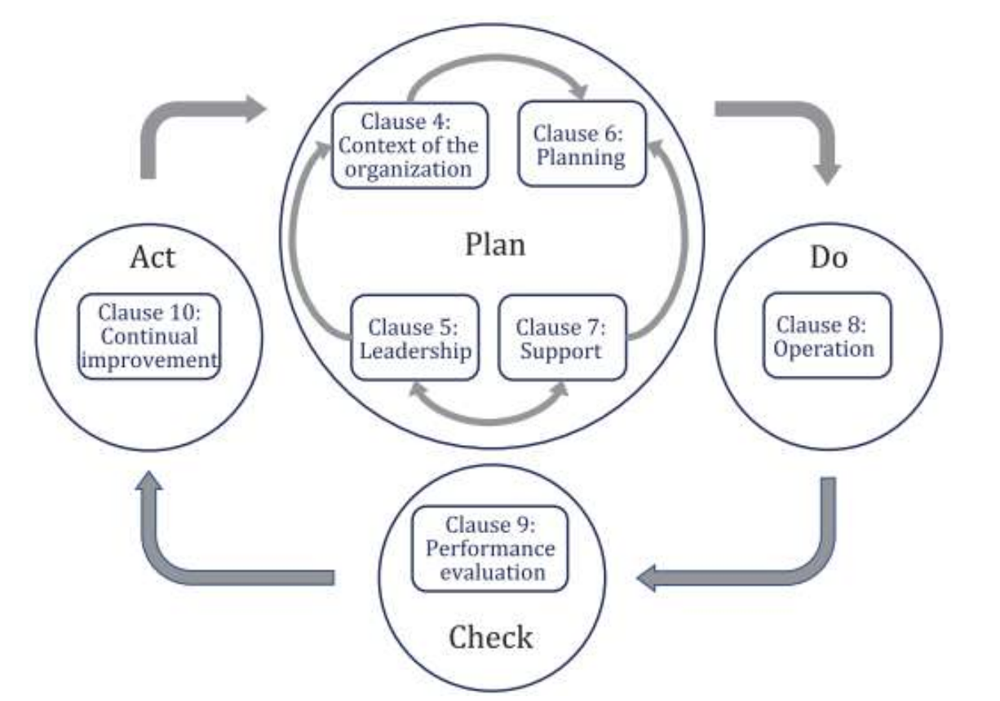

안녕하세요, romi0x입니다.👋

> **△△기업, ISO 27001 인증 획득으로 유럽 진출 가속화**
>
>
> **OO클라우드, APEC 개인정보 인증 ‘CBPR’ 취득**
>
> **국내 스타트업, ISO 27701 인증으로 GDPR 대응 기반 마련**
>

이런 뉴스 헤드라인, 한 번쯤 보신 적 있지 않나요?

글로벌 시장에 진출하거나 외국계 기업과 협력하려는 기업이라면, 국제 보안 인증에 대해 한 번쯤 들어보셨을 겁니다. 특히 유럽의 GDPR, 미국의 CCPA, 일본·싱가포르의 개인정보 이전 요건 등 국가별 규제가 다양화되면서, 이를 체계적으로 대응할 수 있는 인증 제도의 중요성이 커지고 있습니다.

이 글에서는 국제적인 보안 인증 제도인 **ISO/IEC 27001, ISO/IEC 27701**에 대해 살펴보겠습니다.

추가로! 국내 보안 인증제도가 궁금하다면, 아래 블로그에서 확인해보세요~

➡️ [Part1. 국내 보안 인증제도- 정보보호](https://hackyboiz.github.io/2024/07/07/romi0x/certification_security/)

➡️ [Part2. 국내 보안 인증제도- 개인정보보호 & 클라우드](https://hackyboiz.github.io/2024/07/21/romi0x/certification_privacy/)

---

## ISO/IEC?

먼저, ISO에 대해 소개해볼게요.

ISO 인증은 **국제표준화기구(ISO)가 개발한 표준에 따른 인증**으로, 기업의 경영시스템이 국제 표준에 적합하게 구축되어 있음을 증명하는 제도입니다.

ISO는 다양한 분야에 인증을 부여하고 있는데요, 그 중에 정보보안과 관련된 인증은 아래와 같은 인증들이 있습니다.

1. **ISO/IEC 27001** - **정보보안 관리 시스템**

2. **ISO/IEC 27002** - **정보보안 통제 지침**

3. **ISO/IEC 27017** - **클라우드 보안 지침**

4. **ISO/IEC 27018** - **클라우드 개인정보 보호 가이드라인**

5. **ISO/IEC 27701** - **개인정보 관리 시스템**

6. **ISO/IEC 27005** - **정보보안 리스크 관리**

7. **ISO/IEC 22301** - **비즈니스 연속성 관리**

보통 정보보안과 관련한 인증을 받고자하는 기업들은 27001 (정보보안)을 기본으로, 27701 (개인정보),27017/27018 (클라우드)등을 추가해서 인증을 받습니다.

## ISO/IEC 27001

**ISO/IEC 27001은 국제표준화기구(ISO)와 국제전기기술위원회(IEC)가 공동으로 제정한 정보보안경영시스템에 대한 국제 표준**입니다. 이 표준은 조직의 정보 자산을 보호하고, 보안 위협으로부터 기밀성, 무결성, 가용성을 유지하기 위한 체계적인 접근 방식을 제공합니다. 다양한 유형의 조직(기업, 공공기관, 클라우드 사업자 등)이 정보보호 리스크를 식별, 평가, 관리할 수 있도록 지원하며, 그 적합성을 외부 인증을 통해 입증할 수 있습니다.

이 인증은 전 세계적으로 통용됩니다. 특히 유럽, 북미, 아시아 등 에서는 ISO/IEC 27001 인증이 신뢰의 기준이 되기도 합니다.

ISO 27001은 조직이 업무, 장소, 자산과 기술적 특성을 고려해 반영하도록 하며, 이는 계획(Plan), 실행(Do), 점검(Check), 조치(Act)인 PDCA 프로세스의 순환적인 활동의 접근 방법을 기반으로 하고 있습니다.

출처: https://cdn.standards.iteh.ai/samples/79612/fc6152007e5648b2b175c1e9c2b4a553/ISO-28000-2022.pdf

ISO/IEC 27001은 정보보안에 대한 내용을 아래와 같은 항목으로 나눠 심사와 검증을 통해 인증합니다.

심사는 국제 인증기관을 통해 이루어지며, 인증을 받은 후에는 **1년에 1회 이상 사후 심사**, **3년에 1회 갱신 심사**가 이루어집니다. 사후 심사에서는 시스템의 유지 및 개선 여부, 주요 변경 사항 반영 여부 등을 평가합니다.

## ISO/IEC 27701

ISO/IEC 27701은 기존의 정보보호 관리체계인 ISO/IEC 27001을 기반으로 하며, 개인정보(PII: Personally Identifiable Information)의 수집, 처리, 저장, 파기 등 전 과정에서의 보호 및 관리 요구사항을 추가로 정의합니다. **즉, ISO 27701은 ISO 27001 + 개인정보보호 확장판이라고 보시면 됩니다.**

ISO/IEC 27701의 주요 목적은 조직이 개인정보를 수집, 저장, 처리, 이전, 삭제하는 전 과정에서 관련 법규(GDPR, CCPA 등)를 효과적으로 준수하고, 정보주체의 권리를 보호할 수 있도록 체계적인 관리체계를 수립하도록 지원하는 것입니다.

ISO/IEC 27701은 단독으로 인증 받을 수 있는 표준은 아니며, 반드시 ISO/IEC 27001 인증을 기반으로 함께 심사받아야 합니다. 즉, ISO/IEC 27001 인증을 획득한 조직이 추가적으로 ISO/IEC 27701 요구사항을 충족함으로써 개인정보 보호 역량을 공식적으로 인정받을 수 있습니다. 이때 ISO/IEC 27001의 정보보호 통제 항목과 함께 ISO/IEC 27701에서 정의한 개인정보 통제 항목들이 통합적으로 심사됩니다.

ISO/IEC 27701은 GDPR, CCPA, APPI(일본), PDPA(싱가포르) 등 주요 국가의 개인정보보호법 대응 체계로 활용되기도 합니다.

ISO/IEC 27701 주요 특징은 다음과 같아요:

- 기존 ISO/IEC 27001의 개인정보보호에 관한 요구 사항과 가이드라인을 한층 강화
- PII 컨트롤러와 프로세서 역할을 하는 조직이 갖추어야 하는 개인정보보호 관리체계 요구사항을 포함
- EU GDPR 준수를 염두에 두고 제정되었기 때문에 ISO/IEC 27701과 GDPR 규정 간 맵핑을 제공
- ISO/IEC 27001의 확장판이기 때문에 ISO/IEC 27701 인증을 받기 원하는 기업은 ISO/IEC 27001 인증을 보유하고 있어야 함

## ISO vs ISMS(P), 무엇이 다를까?

두 인증 모두 조직이 체계적인 정보보호 시스템을 갖추고 있음을 입증할 수 있는 제도입니다. 하지만 적용 범위와 목적에서 차이가 있습니다.

ISO/IEC 27001은 전 세계에서 인정되는 국제 인증이기 때문에 해외 사업, 다국적 고객 대응에 유리하며, 상대적으로 문서 중심의 표준화된 접근을 요구합니다.

반면, 한국의 ISMS는 국내 법령과 규정을 중심으로 심사가 이루어지며, 실제 운영 및 실무 중심의 점검이 강점입니다.

또한 ISO는 개인정보 보호를 별도로 확장해야 하는 반면, ISMS는 개인정보까지 통합한 ISMS-P라는 인증체계를 운영하고 있어 국내 환경에 더 적합한 방식으로 구성되어 있습니다.

아래는 **ISO/IEC 27001**, **ISMS**, **ISMS-P** 세 가지 인증을 비교한 표입니다. 각 인증의 특징, 적용 대상, 인증 범위 등을 한눈에 보기 쉽게 정리하였습니다.

