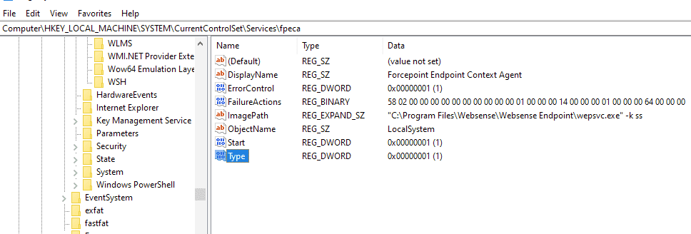

### URL

[Tampering With ForcePoint One DLP EndPoint](https://mrd0x.com/tampering-with-forcepoint-dlp/)

### Target

- Forcepoint One DLP Endpoint 19.10.4281

### Explain

DLP는 Data Loss Prevention, 중요 데이터가 유출되는 것을 방지하는 솔루션입니다.

당연히 DLP 솔루션은 비인가자의 강제 종료 시도를 막을 수 있어야 하는데요.

Forcepoint DLP Endpoint에서 간단한 레지스터 값 변조를 통해 공격자가 솔루션을 비활성화하고 더불어 시스템 권한 상승까지 가능한 취약점이 발견되었습니다.

공격자는 `HKEY_LOCAL_MACHINE\SYSTEM\CurrentControlSet\Services\fpeca` 레지스터의 키 3개의 값을 바꾸는 것으로 이 모든 걸 할 수 있었습니다.




`Start` 값은 기본적으로 `0x02` 로 이 값은 항상 로드되고 실행됨을 의미합니다.

그리고 `Type` 값은 기본적으로 `0x10` 으로 stand-alone process임을 나타냅니다.

공격자는 이 두 키의 값을 다른 값 (e.g. `0x1` )으로 바꾸고 재부팅을 하는 방법으로 솔루션을 비활성화가 가능했습니다.

또한 `ImagePath` 값을 조절하여 공격자의 프로그램을 실행시킬 수 있는데 SYSTEM 권한으로 실행되기 때문에 권한 상승까지 가능했는데요. 

이러한 취약점이 `HKEY_LOCAL_MACHINE\SYSTEM\CurrentControlSet\Services\Fppsvc` 레지스터에서도 동일하게 나타나는 것이 확인되었습니다.

안타깝게도 해당 솔루션은 process 강제종료에 대한 취약점도 발견되었는데요.

해당 솔루션의 중요 프로세스인 `fppsvc.exe` 가 administrator 권한을 가지고 있다면 누구나 강제로 종료시킬 수 있었습니다.

물론 `fppsvc.exe` 는 종료되면 재 시작되도록 동작하지만 다시 실행되는데 걸리는 시간이 종료하는 데 걸리는 시간보다 길어 아래와 같은 간단한 구문을 통해 비활성화 시킬 수 있습니다.

```powershell
FOR /L %N IN () DO taskkill /F /IM "fppsvc.exe"
```
