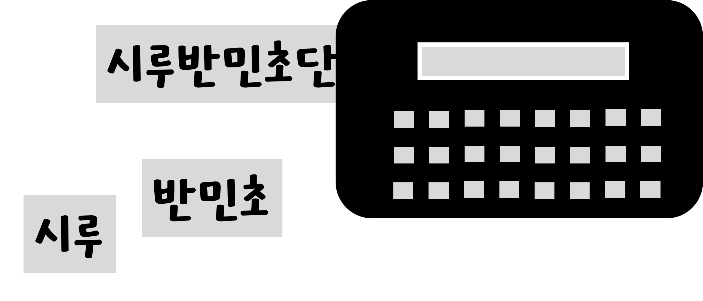
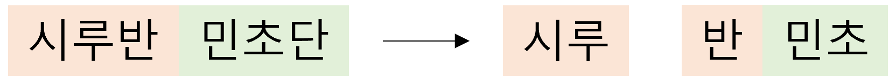

안녕하세요 : ) 시루입니다.

오늘은 간단한 원리지만 불특정 다수에게 피해를 줄 수 있는 공격기법을 가져왔습니다.

### 결과물이 제 요청과 달라요

설명을 위해 라벨기를 가져왔습니다. 이 라벨기는 문장과 길이를 입력하면 길이만큼 잘라 줍니다.

장난꾸러기 시루가 “시루반”이라는 문장을 입력해놓고 두 글자만 입력했다고 하면 어떻게 될까요?

그다음 입력이었던 “민초단” 라벨이 “반민초”가 되어버렸습니다...!

이는 시루의 요청을 처리한 후 남은 ‘반’이라는 글자가 다음 요청에 포함되어 발생한 것입니다.

이런 일이 웹 서비스에서도 발생할 수 있습니다. 이번 글에서는 나의 요청이 타인에게 영향을 줄 수 있는 HTTP Request Smuggling을 알아보겠습니다.

## HTTP Request Smuggling

> HTTP 요청에 대한 일관성 없는 해석
> 

[CWE-444: Inconsistent Interpretation of HTTP Requests ('HTTP Request Smuggling')](https://cwe.mitre.org/data/definitions/444.html)

### 동일한 TCP Connection에서 여러개의 HTTP Message가 처리된 사연

HTTP 프로토콜은 TCP 통신 위에서 동작합니다.

(UDP를 사용하는 HTTP 3는 이 글에선 언급하지 않겠습니다.)

TCP 통신은 신뢰할 수 있는 통신을 위해 여러 정보를 공유하는 3way handshake과정을 거칩니다.

HTTP 통신을 할 때마다 TCP 통신을 새로 해야 한다면 당연히 그만큼 handshake도 해야 하게 됩니다.

이 시간을 최대한 줄이기 위해 HTTP는 기존에 만들어진 TCP 통신을 사용하게 되었습니다.

### HTTP에서 Body 정보를 얻는 방법

[RFC 문서](https://datatracker.ietf.org/doc/html/rfc7230#section-3.3.3)에 따르면 Body의 길이는 다음 규칙을 따릅니다.

- Transfer-Encoding 헤더가 존재하고 chunked transfer coding으로 전달될 때 transfer coding이 data 전송이 끝났음을 가리킬 때까지의 길이로 결정
- Transfer-Encoding 헤더가 존재하지 않고 유효한 Content-Length 헤더가 존재할 때 해당 헤더의 값으로 결정
- Transfer-Encoding 헤더와 Content-Length 헤더가 모두 존재하면 Content-Length 헤더 무시
- Content-Length 헤더가 여러 개 있으면 400 Bad Request 처리

### 라벨기가 웹 서비스였다면

라벨기 이야기를 웹 서비스로 확장 시켜보겠습니다.

라벨기 입력은 완료를 누를 때까지 입력하니 Transfer-Encoding 방식이 어울리고 라벨 커터는 입력받은 길이만큼 자르니 Content-Length가 어울리겠네요

라벨기에 문장을 입력하고 자르는 과정은 아래와 같이 표현할 수 있습니다.

라벨 요청에 대한 응답은 아래와 같이 표현할 수 있습니다.

이렇게 된 원인이 무엇일까요? 우선 동일한 라벨카트리지(TCP 커넥션)에서 처리되었고 라벨기에서는 문자열의 끝(Transfer-Encoding)이 기준이였지만 라벨 커터에서는 길이로 입력한 값(Content-Length)이 기준이였기 때문입니다. 

라벨 커터는 앞서 설명드린 규칙을 어긴 예시라고 볼 수도 있겠네요

이러한 방식으로 다른 요청에 삽입되어 해당 요청을 사용할 수 없게 하거나 완전히 다른 요청으로 바꿔버릴 수 있는 공격이 바로 **HTTP Request Smuggling**입니다.

이 공격기법은 유형이 크게 두 가지로 나뉩니다.

Content-Length 헤더 중복 문제 이하 CL-CL이라 부르는 유형과 Transfer-Encoding, Content-Length 헤더 혼동 문제 이하 CL-TE라고 부르는 유형입니다.

### 그냥 표준만 따르면 되는 것 아닌가요?

맞습니다. 처리하는 주체들이 모두 동일한 기준으로 처리하면 됩니다.

하지만 최근 공격 유형은 요청을 파싱할 때 특정 헤더를 인식하지 못하도록 특수문자를 삽입하거나 다른 내용으로 인식하도록 Buffer Overflow 기법을 사용하는 등 규칙만 따라서는 대응하기 어려운 것이 많습니다.

표준을 따르는 것 외에도 기본적인 길이 검증이나 특수문자 처리등을 신경써야 합니다.

## 마치며

다음 포스트에서는 실제로 취약점이 발생한 사례를 공격 유형별로 다뤄보겠습니다.