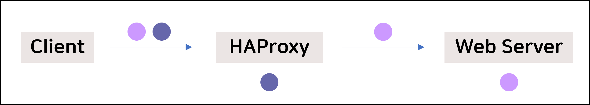
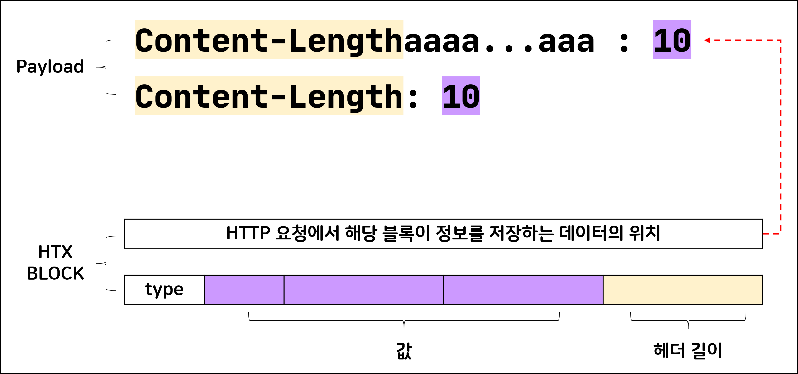
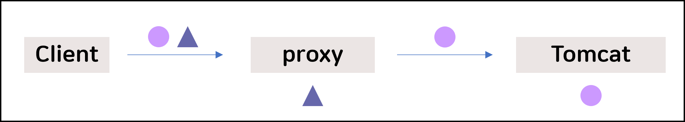

안녕하세요 : ) 시루입니다.

[저번 글](https://hackyboiz.github.io/2022/02/06/syru/funny-smuggling-story-pt1/)에서는 HTTP Request Smuggling이 무엇인지에 대해서 알려드렸는데요.

오늘은 우리 주변에 사용되는 프로그램에서 이 기법으로 공격이 가능한 취약점이 발생한 사례를 알아보겠습니다.


## 잠깐, HTTP Request Smuggling이 뭐였지?

사례 연구에 앞서 복습을 해봅시다.

이 공격 기법은 HTTP 요청이 처리될 때 이전 요청이 다음 요청에 포함되어 해당 요청의 처리결과를 바꾸는 것이었습니다.

웹 서비스 인프라를 구성할 때 트래픽 분산, 캐싱 등을 위해 프록시를 배치하게 되는데 이 프록시와 웹 서버가 서로 HTTP 요청의 Body 길이에 대한 해석을 다르게 하면서 주로 발생합니다. 

Body의 길이는 Content-Length 헤더나 Transfer-Encoding 헤더를 통해 결정되며 아래의 규칙이 존재합니다.

1. Content-Length 헤더가 2개 이상 존재하면 400 Bad Request로 처리한다.
2. Content-Length 헤더와 Transfer-Encoding 헤더가 동시에 존재하면 Transfer-Encoding을 따른다.

규칙을 읽어보면 표준에 따르기만 해도 Smuggling이 방지될 것 같습니다.

하지만 공격자들은 연구 끝에 아래 방법을 사용하여 이를 우회 하였습니다.

1. 특수한 입력값을 통해 특정 파서의 파싱 결과를 다르게 나오도록 유도하기
2. 파서의 잘못된 처리로직을 이용하기


## 공격 사례

편의를 위해 Content-Length를 CL, Transfer-Encoding을 TE라고 부르겠습니다. 

### CL-CL + 특정 파서의 파싱 결과를 다르게 나오도록 유도하기

HAProxy는 고가용성(HA)을 위해 주로 사용되는 프록시 입니다.

작년 9월에 이 프록시에서 CL-CL 유형의 HTTP Request Smuggling이 발견되었습니다.

해당 유형이 동작하려면 두 파싱 단계에서 400 bad request 처리를 막아야합니다.

즉 처리하는 순간에는 CL 헤더는 하나만 있는 것으로 보여야 합니다.

해당 취약 버젼에서 HAProxy는 파싱단계에서 CL이 한번 정상적으로 처리되면 나머지 헤더는 무시하도록 프로그래밍 되어 있습니다.

그렇기에 HAProxy가 웹 서버로 전달하는 HTTP 요청에는 CL 헤더가 하나만 존재하게 됩니다.

지금까지의 내용을 정리하면 대략 아래와 같은 방식으로 공격을 진행하면 됩니다.



그럼 이제 HAProxy가 전달받은 HTTP 요청이 400 Bad Request가 안 뜨면서 두 번째 요청의 CL 헤더의 값과 다르게 하려면 어떻게 해야 할까요?

HAProxy가 파싱과정에서 비정상 헤더를 정상으로 만들면 됩니다.

HAProxy는 HTTP 요청을 파싱할 때 HTX라는 구조를 사용합니다.

HTX는 크게 실제 데이터가 들어있는 payload와 해당 정보를 저장하는 block으로 나뉩니다.

block에는 이 정보가 어떤 payload의 것인지 주소를 저장하는 부분과 해당 payload의 정보를 저장하는 부분으로 나뉩니다.

HTX_BLOCK 구조의 두 멤버는 모두 uint32 (4byte) 자료형을 쓰고 있습니다.



payload의 정보를 저장하는 부분을 보면 헤더의 길이를 저장하는 공간이 1byte인 것을 알 수 있습니다.

정상적인 헤더 중 1byte(256)을 넘는 길이를 가지는 것은 없기 때문에 문제가 없어보입니다.

실제로 아래와 같이 주석만 남겨두고 길이 검증 코드가 존재하지 않았습니다.

```c
/*
 *  HEAD : 3d5f19e04d88e7c8f71cba4ea12e383c91de89f6
 *  PATH : include/haproxy/htx.h
 */

static inline struct htx_blk *htx_add_header(struct htx *htx, const struct ist name,
					     const struct ist value)
{
	struct htx_blk *blk;

	/* FIXME: check name.len (< 256B) and value.len (< 1MB) */
	blk = htx_add_blk(htx, HTX_BLK_HDR, name.len + value.len);
    ...
}
```

이처럼 미흡한 검증은 공격에 쓰이는 좋은 가젯이 됩니다. 

Integer Overflow를 통해 정상 헤더 + dummy 구조의 헤더에서 정상 부분만 처리하도록 하면 우리는 비정상 헤더를 정상으로 보이게 할 수 있습니다.

HTX를 파싱할 때 헤더의 길이는 구분자 `:` 앞까지로 계산됩니다.

```http
POST / HTTP/1.1
Content-Length0aaaa..255개..aa: --- (1)
Content-Length: 4 --- (2)

CLCL
```

(1)에서 헤더의 길이는 270입니다.

그런데 270은 `0b100001110` 인데 공간은 8bit만 할당되어 있으므로 앞에 1은 짤려서 `0b00001110` 만 저장되게 됩니다.

그렇게 조작된 길이 14만큼 읽으면 정상 헤더인 `Content-Length`로 바뀌게 됩니다.


앞서 설명한 부분들을 정리하면 아래의 순서로 Smuggling이 발생합니다.

1. 해당 패킷을 HAProxy가 받을 때는 (1)은 비정상 헤더로 처리되고 (2)를 기준으로 처리

2. HTX 구조로 파싱할 때 Integer Overflow로 인해 (1)이 정상 헤더로 처리

3. HAProxy가 웹 서버에 전달할 때는 (1)이 해당 요청이 다음과 같이 바뀌어 전달
   
   ```http
   POST / HTTP/1.1
   Content-Length:0 --- (1)
   
   CLCL
   ```

4. Content-Length만큼 처리 후 남은 CLCL이 다음 리퀘스트에 삽입됨

이 취약점은 당연히 아래와 같이 길이 검사를 추가하는 방향으로 패치되었습니다.

```diff
+ if (name.len > 255 || value.len > 1048575)
+     return NULL;
```


### CL-TE + 파서의 잘못된 처리 로직 이용하기

Tomcat은 JSP를 처리하는 Web Application Server 입니다.

작년 7월에 tomcat에서 CL-TE 유형의 HTTP Request Smuggling 취약점이 발견되었습니다.

해당 버젼에서 Client가 HTTP/1.0 응답만 받아들이도록 선언되어 있으면 Tomcat이 TE 헤더를 무시하는 로직이 존재하였고 결과적으로 아래와 같이 동작하였습니다.



## 마치며

HTTP Request Smuggling은 처리 방식이 동기화되지 않았다고 하여 HTTP Desync Attack이라고도 불립니다. 

DEFCON 대회 예선 문제로 해당 취약점을 이용한 문제가 출제된 바 있으니 풀어보시면 이해하시는 데 도움이 되실 겁니다.

[uploooadit | OOO archive | DEF CON CTF](https://archive.ooo/c/uploooadit/351/)

### Reference

- https://cve.mitre.org/cgi-bin/cvename.cgi?name=CVE-2021-33037
- https://cve.mitre.org/cgi-bin/cvename.cgi?name=CVE-2021-40346
- https://github.com/haproxy/haproxy/commit/3b69886f7dcc3cfb3d166309018e6cfec9ce2c95#diff-8420c19f30c823a2c9cbe3ee5d35cf31550110b38fe767b620880f9cd82cecc8
