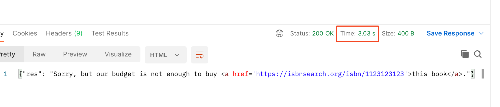
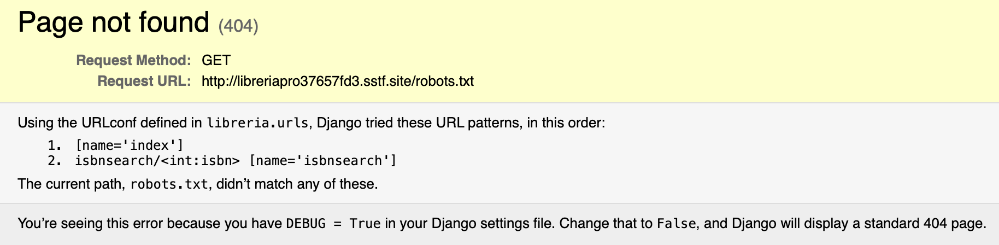
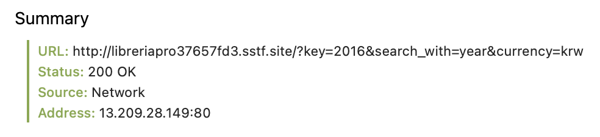
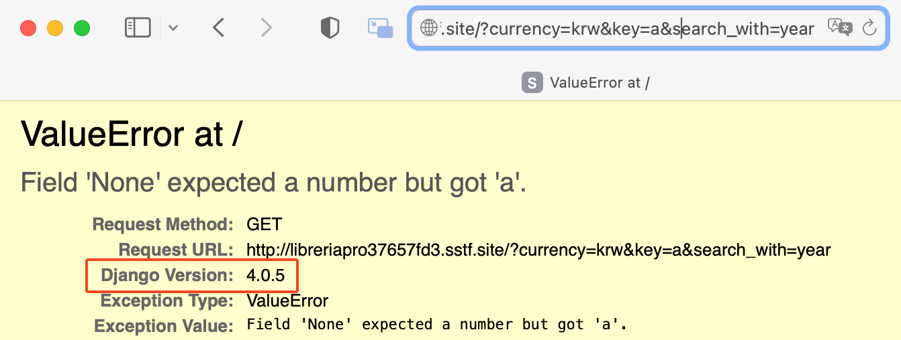
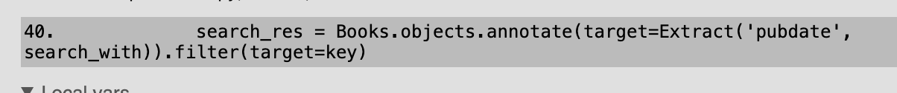

## Prologue
 직장인에게 소중한 주말이지만 요즘에 CTF에서 보기 힘든 SQL injection 문제가 나왔다는 소식에 시간을 내보았습니다.

## Libreria
### Description
```markdown
Welcome to Hacker's Libreria! 

http://libreria.sstf.site 

If you feel hard to solve this challenge, please check out Web tutorials. 

Download: Libreria.zip
```
몇 년 전부터 웹 문제도 소스 코드가 제공되는 방향으로 가야 한다는 의견이 주류가 되면서 불필요한 게싱이 줄어들어 좋습니다.

### Audit
 제공된 PHP 소스 코드를 보면 제일 먼저 `pg_*`함수들로 DBMS가 PostgreSQL라는 걸 파악할 수 있습니다.
사용자의 입력이 쿼리에 주입되는 부분은 index.php 내에 title로 검색, rest.php에 구현된 isbn으로 검색과 책 구매 요청까지 세 부분이 있는데요. 그중 혼자만 prepared statement를 쓰지 않는 책 구매 요청이 수상해 보입니다.
(웹 문제에서는 어색하게 구현되어있는 부분이 공격 벡터일 때가 꽤 있더라고요. 물론 요즘처럼 1day를 활용하는 문제가 많을 땐 얘기가 다릅니다.)
```php
#rest.php:32~49
case 'requestbook':
    if ((isset($_GET['isbn']) && strlen($_GET['isbn']) >= 10)) {
        $res = '{"res": "Sorry, but our budget is not enough to buy <a href=\'https://isbnsearch.org/isbn/'.$_GET['isbn'].'\'>this book</a>."}';
        $db = dbconnect();
        $result = pg_query($db, "SELECT ISBN FROM books WHERE isbn='".$_GET['isbn']."'");
        pg_close($db);
        if ($result) {
            $rows = pg_fetch_assoc($result);
            if ($rows) {
                $isbn = (int)$rows["isbn"];
                if (($isbn >= 1000000000) && ((string)$isbn === $rows["isbn"]))
                {
                    $res = '{"res": "We already have this book('.$rows["isbn"].')."}';
                }
            }
        }
    }
    break;
```
 위는 책 구매 요청 시 이미 존재하는지 파악하는 코드입니다.
이 글을 쓰면서 ISBN 포맷에 대해 잠깐 확인해보니 원래는 10자리를 주로 사용했는데 전자책의 등장으로 출판량이 급증하면서 13자리 ISBN이 규격으로 사용되고 있다고 합니다.
이런 비하인드를 보면 `>=10`이 이해가 안 가는 건 아니지만 저라면 기본값을 설정해두고 db나 env등으로 바꿀 수 있게 했을 것 같네요. 
지금은 공격자의 입장으로 보고 있으므로 당연히 좋은 상황입니다. payload를 더 길게 쓸 수 있다는 건 할 수 있는 게 많기 때문이죠.
`SELECT ISBN FROM books WHERE isbn='{입력값}'` 쿼리를 실행하여 결괏값이 있고 그 결과를 int로 변환했을 때 1_000_000_000 이상이고 int 변환 전의 값과 변환 후 값이 같으면 (정상적인 숫자가 맞으면) 그 값을 출력해줍니다.
입력값에 대한 sanitizing이 아무것도 없다는 것에서 이보다 좋을 순 없습니다.

하지만 이 서비스엔 특이사항이 하나 있습니다. 
```php
#rest.php:10~12
$resp_time = 3.0;

$start = microtime(true);
#rest.php:54~58
$now = microtime(true);

if ($now - $start < $resp_time) {
	usleep((int)(($resp_time + $start - $now) * 1000000));
}
```
에러를 제외한 모든 요청이 응답을 받기까지 3초 이상 걸리게 설계되어있습니다.


아마 너무 많은 동시 요청이 서버에 부하를 줄 수 있어 만든 것 같습니다. 이 부분을 해결하기 위해선 요청을 적게 하는 것이 좋습니다. 맨 앞이 0이 아닌 10자리 이상의 숫자이면 출력해준다는 것을 이용하여 PostgreSQL 내부 함수로 `bytes_to_long`을 구현하고 union select로 데이터를 leak하면 될 것 같습니다.
(해당 문제는 멀티스레드를 사용하면 단순히 한 글자씩 출력하는 것으로도 커버할 수 있는 양의 데이터였지만 제약이 없는 상황을 충분히 활용해보고 싶었습니다.)

- bytes_to_long 구현
    1. string to string token(8byte split)
        hex to bigint에서 8byte 제한이 있어 필요한 step입니다. substring과 generate_series 함수 그리고 with 절을 사용해 구현할 수 있었습니다. 그리고 leak할 때 주로 string_agg로 concat후 긁기에 string_agg를 컬럼 명으로 활용하였습니다.
    2. string to hex
        처음 구현할 때는 regexp_split_to_array 와 unnest를 엮어서 복잡하게 구현해야 하나 보고 있었는데 `encode(col_name::bytea, 'hex')` 이런 간단한 방법이 있었습니다.
    3. hex to bigint
        이것도 PostgreSQL가 지원하는 형 변환을 활용했습니다. bigint(int8)도 8byte 제약이 있어서 decimal을 활용할 수 없었나 찾아봤는데 아쉽게도 사용자 정의 함수를 만들지 않고선 좋은 방법이 없었습니다. `concat('x',encode(substring::bytea, 'hex'))::bit(64)::bigint`
- leak
    db에 flag가 있다는 전제로 데이터베이스명, 테이블 명, 컬럼 명이 필요합니다. 이를 pg_database와 information_schema를 활용하여 조회할 수 있습니다.
 그 외에도 유틸 함수로 long_to_bytes, extract_int등을 구현해놓은 최종 PoC는 아래와 같습니다. 데이터가 많지는 않아서 한 테이블을 leak하는데 4초씩이면 충분했습니다.
 
### PoC
아래 문제 gist 참고

## Libreria Pro
### Description
아쉽게도 Pro 문제라고 소스 코드를 안주네요.
### Audit
앞 문제도 classic했으니 우선 `/robots.txt` 요청을 보내봤는데 이게 웬걸 Django 404 Page를 응답받았습니다.


서버 프레임워크로 Django를 쓰고 Debug모드가 활성화되어 있다는 것을 알아냈으니 더 많은 정보를 얻으려고 일부러 에러를 내봅시다.


책 검색 페이지에선 저 3개의 파라미터를 이용하는 것으로 보이네요. PostgreSQL는 type에 민감하니까 `search_with`를 int형을 쓸 것 같은 year또는 month를 쓰고 `key`를 숫자가 아닌 값으로 줘보았습니다.


예상한 대로 Error가 발생하고 저희는 Django의 버전 정보까지 획득할 수 있었습니다. 또한 Traceback을 자세히 보면 ORM을 쓰고 있고, [Extract](https://docs.djangoproject.com/en/4.2/ref/models/database-functions/#extract)를 통해서 datetime에서 특정 컴포넌트만 뽑아 비교조건으로 쓰는 것을 확인할 수 있습니다.



Django 버전을 알아냈으니 cve가 있었는지 확인해봅시다. 찾아보니 Extract나 Trunc 함수를 사용 시 SQL injection이 가능한 취약점이 있었습니다.([CVE-2022-34265](https://www.cve.org/CVERecord?id=CVE-2022-34265))
어떤 이유로 발생하는 것인지 한번 Django 4.0.5의 소스 코드를 보며 확인해보겠습니다. ORM 동작 구조를 전반적으로 이해할 필요는 없고 저희가 궁금한 Extract를 처리하는 부분만 살펴봅시다.
```python
# https://github.com/django/django/blob/9736596bce4f711ccf2914284938d85748838c94/django/db/models/functions/datetime.py#L41-L75
class Extract(TimezoneMixin, Transform):
    ...
    def __init__(self, expression, lookup_name=None, tzinfo=None, **extra):
        if self.lookup_name is None:
            self.lookup_name = lookup_name
        ...
    def as_sql(self, compiler, connection):
        ...
        elif isinstance(lhs_output_field, DateField):
            sql = connection.ops.date_extract_sql(self.lookup_name, sql)
        ...
        return sql, params

# https://github.com/django/django/blob/9736596bce4f711ccf2914284938d85748838c94/django/db/backends/postgresql/operations.py#L49-L59
def date_extract_sql(self, lookup_type, field_name):
    # https://www.postgresql.org/docs/current/functions-datetime.html#FUNCTIONS-DATETIME-EXTRACT
    if lookup_type == "week_day":
        # For consistency across backends, we return Sunday=1, Saturday=7.
        return "EXTRACT('dow' FROM %s) + 1" % field_name
    elif lookup_type == "iso_week_day":
        return "EXTRACT('isodow' FROM %s)" % field_name
    elif lookup_type == "iso_year":
        return "EXTRACT('isoyear' FROM %s)" % field_name
    else:
        return "EXTRACT('%s' FROM %s)" % (lookup_type, field_name)
```
`Extract('pubdate', {search_with})` 는 `EXTRACT('{search_with}' FROM {field_name})`의 형태로 SQL query에 삽입되게 됩니다. 이때 `%` operator는 quote에 대해 별도의 escape 절차를 진행하지 않고 문자열에 삽입하기 때문에 sql injection에 취약하게 됩니다.
Exploit은 EXTRACT 함수를 완성 후 이전 문제와 같이 union select를 통해 data leak을 하면 됩니다.

### PoC
[PoC Gist](
https://gist.github.com/l0vey0u/055f1abd080c1c26d51fd5b373f5d13a)
## Epilogue
 회사에서 서비스를 개발할 때 ORM을 대부분 사용하며 분명 취약점이 존재할 거라고 계속 생각이 들었는데 실제로 발생했던 취약점을 사용해서 exploit을 해보니 재밌었습니다.