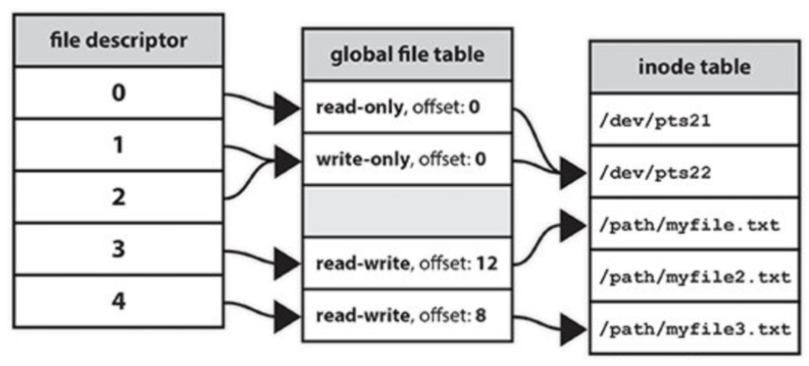

> 전화 한 통만 하면 필요한 논문을 복사해 주는 곳이 있다. 그리고 그곳의 단골손님 영수가 있다. 그런데 이 녀석은 매번 똑같은 논문의 일부분을 복사해 달라고 한다. “아저씨~ ‘고도의 정보화 사회가 되어 가면서, 인간의 삶의 질과 관계된 문제들이 점점 더 그 중요성이 더해짐에 따라 감각, 지각, 사고, 성격, 지능, 적성 등의 인간적 특징들이 고려됐을 때의 인간의 원리에 대한 연구’ 라는 논문 26쪽부터 30쪽까지 복사해 주세요” 이 녀석은 보통 이런 식으로 하루에도 여러 번 주문을 한다. 설상가상으로 말하는 속도도 느린 편이다. 그래서 아저씨가 말씀하시길 “그 논문은 이제부터 너의 18번이다! 그냥 저의 18번 논문 26쪽부터 30쪽까지 복사해 주세요 라고 해라!”영수는 그 이후로도 최소 50자가 넘는 제목의 논문만 복사 주문을 한다. 그 때 마다 아저씨는 논문에 새로운 번호를 할당해 준다(중복되지 않는). 그래야 영수와의 대화 속에서 스트레스를 덜 받을 수 있기 때문이다.

파일 디스크립터에 대해 가장 쉽게 이해할 수 있는 스토리입니다. (출처: https://mintnlatte.tistory.com/266)

파일 디스크립터는 일반 파일, 터미널, 디바이스, 소켓 등 종류에 상관없이 열린 파일을 식별하기 위하여 프로세스에서 사용하는 부호없는 정수입니다.

시스템에서 열려있는 모든 파일에 대해 최소한 하나의 파일 디스크립터가 존재하며, 본질적으로 커널이 보관하는 File Descriptor Table에 대한 인덱스입니다.

파일 디스크립터는 Unix에서 처음 사용되었으며 Linux, macOS 및 BSD를 포함한 운영 체제에서 사용됩니다. Windows에서 파일 설명자는 file handle이라고 합니다.

C언어 등의 언어는 fprintf, fscanf 등의 함수와 같은 I/O을 위한 기능이 있지만, UNIX 운영체제에서는 파일 시스템 작업을 수행하기 위해 커널에 직접 시스템 호출을 요청해야 합니다.

커널은 호출에 대한 응답으로 파일 디스크립터를 생성하고 파일 디스크립터를 실제 하드웨어 장치, 파일 시스템 또는 파일과 같은 기본 객체의 추상화와 연결합니다. 결과적으로 파일 디스크립터를 참조하는 프로세스의 읽기 또는 쓰기 호출은 궁극적으로 유용한 작업을 수행하기 위해 커널에 의해 올바른 위치로 라우팅됩니다.

프로세스가 파일 열기를 성공적으로 요청하면 커널은 1) 액세스 권한을 부여하고, 2) 전역 파일 테이블에 항목을 만든 다음 3) 해당 항목을 가리키는 파일 디스크립터를 반환합니다. 해당 항목에는 파일의 inode, 바이트 오프셋 및 해당 데이터 스트림에 대한 액세스 권한(읽기 전용, 쓰기 전용 등)과 같은 정보가 포함됩니다.

처음 3개의 파일 디스크립터(0~2)는 다음과 같으며 이후에 파일이 오픈되거나 소켓 생성 등을 수행할 때 3번부터 부여됩니다.

표준 입력(stdin, 0) ex) Keyboard File Object

표준 출력(stdout, 1) ex) Monitor File Object

표준 오류(stderr, 2, 발생하는 오류와 관련된 출력) ex) Monitor File Object