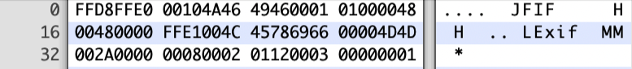

파일 시그니처(File Signature, File Magic Number)는 파일의 포맷(형식)을 식별하는 고유한 바이트입니다.

파일의 처음에 존재하는 시그니처는 헤더(Header), 파일의 마지막에 존재하는 시그니처는 푸터(Footer)라고 하며 이미지의 시작과 끝이라고 해서 Start Of Image(SOI), End Of Image(EOI)라고도 합니다.

예를 들어 한 이미지 파일이 있을 때 `FFD8FFE0`으로 시작하고 `FFD9`로 끝나기 때문에 해당 파일이 JPEG라는 것을 식별할 수 있습니다. 

파일 시그니처는 포렌식과 악성코드 분석에서 자주 쓰입니다.

예를 들어 파일 카빙(File Carving)은 파일 자체의 바이너리 데이터를 이용해 디스크의 비활당 영역에서 파일을 복구하는 방식으로, 여러 방식 중에 파일 시그니처를 기반으로 복구하는 방식이 있습니다.

또한 헤더와 푸터 시그니처가 다른 형식일 경우에 조작된 파일일 가능성이 있으며, 확장자를 변경한 은닉 파일 탐지 등에 사용됩니다.

Windows 악성코드 분석에서 대부분을 차지하는 파일은 PE(Portable Executable)파일이며 확장자가 .exe, .dll, .pif, .drv, .qtx, .qts, .ocx, .sys인 경우가 많고, 해당 파일 시그니처는 `45 5A(MZ)`입니다.

