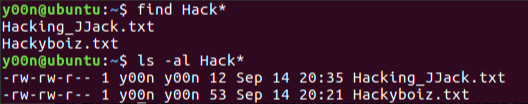
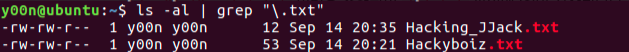

Linux의 Command Injection 공격에서는 여러 metacharacters를 사용할 수 있습니다.

- 다중 명령어를 실행할 수 있는 metacharacters

한 줄에 여러 명령어를 실행할 수 있으며 앞의 명령어부터 차례대로 실행되지만 각각의 규칙이 있습니다.

`;` (Command sequence) : 앞의 명령어의 성공 여부와 상관 없이 다음 명령어를 실행합니다.

`cat Hacking_JJack.txt ; cat Hackyboiz.txt` 명령어로 `Hacking_JJack.txt` 파일을 출력한 후 이어서 `Hackyboiz.txt` 파일을 출력합니다.

`&&` (AND conditional execution) : 앞의 명령어가 실패하면 다음 명령어를 실행하지 않습니다.

`cat Hacking_JJack.txt && cat Hackyboiz.txt` 명령어를 실행하면 차례대로 실행되지만, 존재하지 않는 `fake.txt` 파일로 `cat fake.txt && cat Hackyboiz.txt` 명령어를 실행하면 `cat fake.txt`를 실행할 수 없으며 이후의 명령도 실행하지 않습니다.

`||` (OR conditional execution): 앞의 명령어가 성공하면 다음 명령어를 실행하지 않습니다.

`cat Hacking_JJack.txt || cat Hackyboiz.txt` 명령어를 실행하면 `cat Hacking_JJack.txt` 명령이 실행된 이후 종료됩니다. 존재하지 않는 `fake.txt` 파일로 `cat fake.txt || cat Hackyboiz.txt` 명령어를 실행하면 앞의 명령이 실패된 이후에 `cat Hackyboiz.txt` 명령을 실행합니다.

`&` (Run command in the background) : 앞의 명령을 백그라운드로 실행하고 다음의 명령어가 실행됩니다.

`mkdir yoon & cd yoon` 명령어를 실행하면 `mkdir yoon` 명령이 백그라운드로 실행됨과 동시에 `cd yoon` 명령이 실행됩니다. `cd yoon` 명령이 실행될 때 아직 디렉터리가 만들어지지 않았기 때문에 실패하고 이후에 해당 디렉터리가 만들어집니다.

- 파일의 전체 이름을 알지 못해도 유추하여 사용할 수 있는 와일드카드 metacharacters

`*` (File substitution wildcard; zero or more characters) : 파일 이름의 일부를 `*`로 대체하여 명령할 수 있습니다.

`?` (File substitution wildcard; one character) : 파일 이름의 한 글자를 `?`로 대체하여 사용할 수 있습니다.

- 앞의 명령어의 실행 결과를 다음 명령어로 전달하는 metacharacters

`|` (Pipe) : 앞의 명령어의 실행 결과가 다음 명령어의 입력으로 사용됩니다.

`ls -al | grep "\\.txt"` 명령어를 실행하면 `ls -al` 명령어의 출력이 `grep` 명령의 입력으로 사용되어 `.txt` 형식의 파일 목록을 볼 수 있습니다.

`>` (Output redirection) : 앞의 명령어의 실행 결과를 뒤에 입력되는 파일로 저장합니다.

`echo "lol" > lol.txt` 명령을 수행하면 `lol.txt` 파일에 lol이 저장됩니다.

`>>` (Output redirection; append): 앞의 명령어의 실행 결과를 뒤에 입력되는 파일이 없다면 생성하고(`>`과 동일) 있다면 마지막에 추가합니다.

