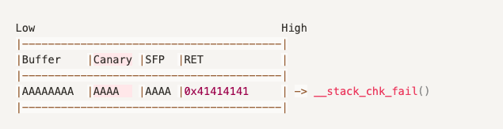

메모리 보호 기법은 취약점 자체를 보완하는 것이 아닌 취약점을 통한 공격(exploit)을 막는 방법입니다. 

`checksec.sh` 또는 `checksec` 명령어로 바이너리에 설정된 보호 기법을 확인할 수 있습니다. 

- **RELRO(RELocation Read-Only)**

RELRO에는 `Partial RELRO` , `FULL RELRO` 설정이 있으며 ELF 바이너리 / 프로세스의 데이터 영역에 Read-Only 권한을 설정해 Write 할 수 없게 하여 메모리가 변경되는 것을 막는 보호 기법입니다.

결론적으로 Partial RELRO일 때는 GOT Overwrite가 가능하고, FULL RELRO일 때는 GOT Overwrite가 불가능합니다.

**Partial RELRO**는 `.ctors(.init_array)`, `.dtors(.fini_array)`, `.jcr`, `.dynamic` 영역이 Read-Only며, `.got.plt`, `.data`, `.bss` 영역에는 Write 할 수 있습니다.

**Full RELRO**는 `.data`, `.bss` 영역을 제외한 모든 영역이 Read-Only로 GOT Overwrite가 불가능합니다.

- **Stack Canary**

Stack Canary는 함수의 프롤로그에서 SFP(Stack Frame Pointer)이전에 삽입되고, 에필로그에서 해당 값이 변조되는지 검사하여 Return Address가 변조되는 것을 막는 보호 기법입니다.

해당 그림은 Stack Buffer Overflow 공격을 요약한 것으로 실행 흐름 변경을 위해 Return Address 주소를 변경하기 위해서 Buffer ~ SFP까지 값을 채울 때 Canary 값이 변경될 수 있습니다.

Canary 값이 변경되면 `__stack_chk_fail()` 함수를 호출하여 "stack smashing detected" 오류 메시지 출력 후 프로그램이 강제 종료됩니다.

대표적으로 우회하는 방법은 메모리에 저장된 Canary값을 Leak할 수 있다면 해당 값을 그대로 Canary에 입력하여 변조되지 않은 것처럼 할 수 있습니다.

- **NX(No-eXecute)**

실행할 수 있는 메모리 영역에서만 코드가 실행되게 하는 보호 기법으로, 스택, 힙 등 실행할 수 있는 메모리 영역이 아닌 영역에서는 코드를 실행시킬 수 없습니다.

예시로 Stack Buffer Overflow에서 스택 영역에 쉘 코드를 삽입하고 해당 주소를 Return Address에 삽입하여 실행 흐름을 변경시켜 쉘 코드를 실행할 수 있었던 것은 해당 스택에 실행 권한이 있었기 때문입니다. NX가 설정되면 실행 권한이 없으므로 쉘코드를 실행할 수 없습니다.

NX를 우회할 수 있는 가장 대표적인 방법은 ROP(Return Oriented Programming)입니다.

- **ASLR(Address Space Layout Randomization)**

매번 바이너리가 실행될 때마다 데이터 영역(스택, 힙, 라이브러리 등)의 주소를 랜덤으로 변경하여 정해진 주소를 직접적으로 참고하는 공격을 막는 방법입니다.

`cat /proc/sys/kernel/randomize_va_space` 명령어로 확인할 수 있으며 0은 ASLR 해제, 1은 스택, 라이브러리 랜덤화, 2는 스택, 라이브러리, 힙 랜덤화입니다.

대표적으로 Buffer OverFlow 공격을 수행할 때 Return Address에 Shellcode를 저장한 곳의 주소를 저장하려고 할 때, 해당 주소가 매번 변경되어 직접적으로 주소를 참고하여 공격하기 어렵게 합니다.

하지만, base address만 변경되고 Offset은 변하지 않기 때문에, 변경된 base address를 알아낸다면 Offset을 더하여 주소를 구해 공격할 수 있습니다.

**PIE(Position Independent Executable)**은 데이터 영역뿐만 아니라 코드 영역에도 ASLR이 적용됩니다.