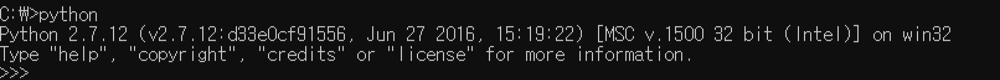

Windows에서 파일을 찾아 실행할 때 가장 먼저 찾는 곳은 현재 디렉터리입니다.

현재 디렉터리가 `C:\Users\Photo`라면 `C:\Users\School` 위치에 있는 `SejongUniv.exe` 파일을 찾아 `SejongUniv.exe` 명령으로 실행할 수 없지만, 기본적으로 절대경로와 상대경로를 사용하여 실행할 수는 있습니다. 예를 들면, 절대경로는 `C:/Users/School/SejongUniv.exe`, 상대 경로는 `../School/SejongUniv.exe`로 실행할 수 있습니다.

하지만 절대경로와 상대경로도 아닌 파일 이름을 입력했을 때, 현재 디렉터리에서 찾을 수 없다면 Windows는 `%PATH%` 환경 변수에서 해당 파일을 찾게 됩니다. `%PATH%` 환경 변수는 어떤 디렉토리에서도 실행할 수 있는 파일들을 찾기 위한 경로가 저장되어 있습니다. python의 경로를 설정해 놓으면 아래 사진처럼 어디서든 python을 입력하여 실행할 수 있습니다.

그렇다면 만약에 `test.txt` 파일을 가지고 있는 두 디렉터리 모두 `%PATH%`에 설정되어 있다면, `text.txt`를 검색할 때 어디에 있는 파일을 실행하게 될지 의문을 가지게 됩니다. `%PATH%`의 왼쪽에서 오른쪽으로 확인하기 때문에 먼저 확인된(왼쪽에 존재하는) 경로에 있는 파일을 실행하게 됩니다. `C:\Users\82104\Desktop\second`, `C:\Users\82104\Desktop\first` 순서대로 설정되어 있을 때, 두 디렉터리 모두 가지고 있는 `test.txt`를 입력하면 second 디렉터리에 있는 `test.txt` 파일이 실행됩니다.

마지막으로는 `%WINDIR%` 등의 시스템 위치를 확인하며, 보통 WINDIR의 경로는 `C:\Windows` 입니다.

